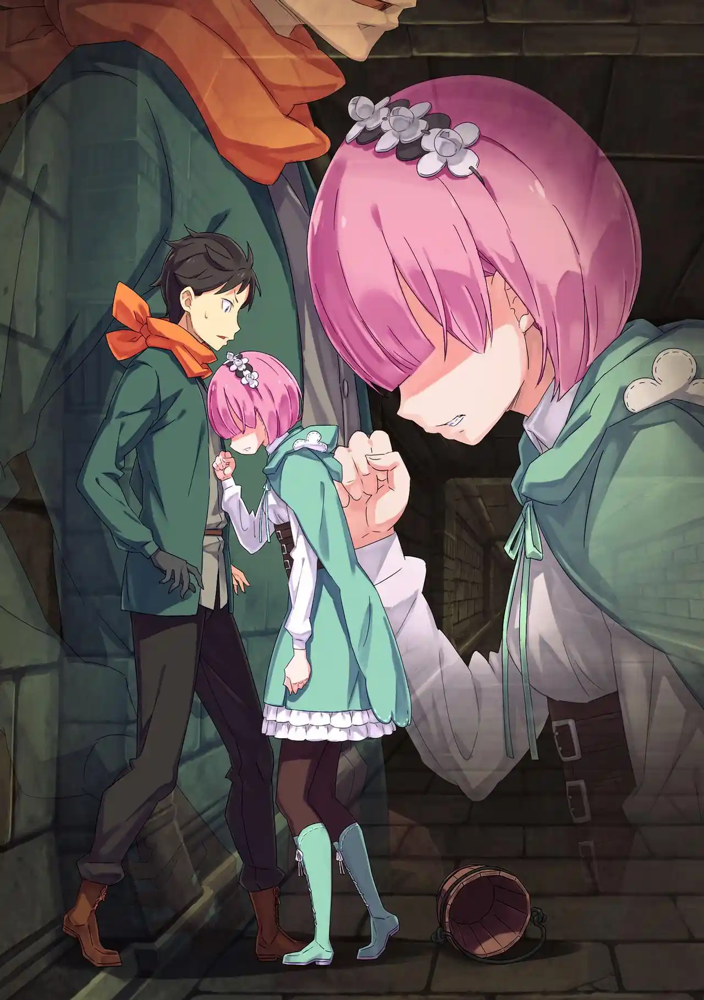
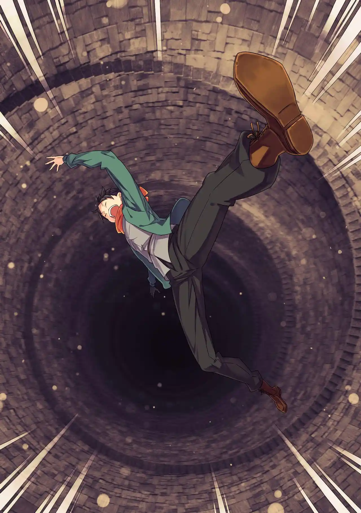

สุบารุกลับไปเป็นพระเอกต่างโลกผู้ไร้เดียงสาแบบ Arc 1 ใหม่ เขานึกว่าเอมิเลียกับเบียทริซเป็น NPC ที่อัญเชิญเขามา แต่ก็แปลกใจที่ทั้งสองดูจะรู้จักเขามานานแล้ว (สุบารุยังคงหลงเอมิเลียมากๆเหมือนเคยเพราะตรงสเปค)

สุบารุ: ขอแนะนำตัวอีกครั้งนะ ชั้นชื่อว่านัตสึกิ สุบารุ! ผู้ถูกสายลมอมตะของเทพและปีศาจพัดพามาที่นี่ทั้งที่ยังไม่รู้ประสีประสาอะไร! ถึงจะเป็นแค่คนเร่ร่อนที่เซ่อซ่าแต่ก็ยินดีที่ได้พบ!

เขาแนะนำตัวแบบเบียวๆพร้อมท่าโพสต์ประจำตัว หลังทั้งสามปรับความเข้าใจกันสุบารุก็ทราบสถานการณ์ว่าเขาความจำเสื่อมไป ล่าสุดเขาจำได้แค่ว่ากำลังออกจากร้านสะดวกซื้อมา แต่ตอนนี้ร่างกายของเขาดูแข็งแรงกว่าแต่ก่อนแถมแขนขวาก็มีรอยประหลาดสีดำอีก

เอมิเลียกับเบียทริซพาสุบารุมาเจอทุกคนที่โต๊ะอาหารและอธิบายสถานการณ์ให้ฟัง สุบารุแปลกใจที่ทุกคนในต่างโลกหน้าตาดีไปหมดทั้งชายหญิง แต่คนโปรดก็ยังเป็น "เอมิเลียจัง" อยู่ดี

เมื่อทราบข่าวเรื่องอาการของสุบารุแต่ละคนมีรีแอคชั่นต่างกันไป เอมิเลียกับเบียทริซช็อคมากแต่ก็ทำใจได้ แรมนึกว่าสุบารุแกล้งเล่นแบบไม่รู้เวลา ชอล่าไม่ต่างจากเดิม เมลี่ดูจะไม่แคร์มาก ส่วนยุลิอุสหน้าซีดและพูดไม่ออก

ด้านอนาสตาเซียก็ตอบสนองอย่างใจเย็นและบอกว่าเธอมีเรื่องสำคัญจะเปิดเผยเหมือนกัน (เรื่องที่ว่าเธอคือเอคิดน่า) แต่แรมขัดขึ้นมาและขอยืมตัวสุบารุไปช่วยตักน้ำก่อน

สุบารุเห็นว่ายุลิอุสดูต้องการเวลาทำใจเพิ่มเลยยอมตามแรมไป เขานึกว่าตัวเองเป็นคนใช้และยังไม่ค่อยเข้าใจความสัมพันธ์ระหว่างเขากับทุกคนเท่าไหร่ สุบารุรับถังน้ำมาจากเอมิเลียแล้วเดินตามแรมไป

พอเดินมาได้สักพักแรมก็สั่งให้สุบารุเลิกแสดงแล้วเล่าความจริงมา เธอหวังจากใจจริงว่าเรื่องความจำเสื่อมนี้จะเป็นแค่ส่วนหนึ่งของแผนการที่สุบารุคิดขึ้นมา แต่เขาก็ทำได้แค่ขอโทษ

แรมกระชากคอเสื้อสุบารุแล้วยันเขากับกำแพงและพูดด้วยน้ำเสียงสั่นเทา

แรม: บอก...ความจริงมา....ได้โปรด....ถ้ากระทั่งบารุสุก็ลืมเธอล่ะก็ แรมก็จะ....เรม...เด็กคนนั้นก็จะ....

แรมไม่ได้หลั่งน้ำตา ความเศร้าของเธอไม่มีที่จะไป ความรุนแรงที่ใส่ไปในข้อมือมันก็อ่อนแรงลงอย่างเห็นได้ชัด เธอได้แต่ซบหน้าผากบนอกสุบารุอย่างเงียบงันและยอมรับความจริงว่าไม่เหลือใครที่จำเรมได้ในโลกนี้อีกแล้ว

ทั้งสองตักน้ำและกลับมารวมที่โต๊ะประชุม เอคิดน่าเปิดเผยเรื่องที่เธอใช้ร่างกายของอนาสตาเซียอยู่ให้ทุกคนทราบ สุบารุตามพล็อตเรื่องไม่ทันเลยยิ่งมึนหัวไปใหญ่ เขายังไม่ทันรู้จักอนาสตาเซียดีก็กลายเป็นว่าเธอเป็นคนอื่นไปซะแล้ว

เอคิดน่าติดใจคำว่า "ต่างโลก" ที่สุบารุพูดขึ้นมาและขอให้ขยายความ แต่กลายเป็นว่าในโลกนี้ไม่มีคอนเซ็ปต์ของต่างโลกอยู่เลย ทุกคนเข้าใจว่าสุบารุมาจากอีกฝั่งของ "น้ำตกใหญ่" ที่ปกติมีแค่มังกรเท่านั้นที่เข้าออกได้ เขาแอบสงสัยว่าทำไมสุบารุคนเก่าไม่เคยพูดถึงเรื่องนี้ให้คนอื่นฟัง

(อนึ่ง บทสนทนาเรื่องต่างโลกนี้ถูกตัดออกจาก LN ทั้งหมดเลย ไม่ทราบเหตุผลเช่นกัน)

เอมิเลียกับเบียทริซเล่าว่าพวกเธอเจอสุบารุสลบอยู่ในห้องสมุดไทเกต้าชั้น 3 เมื่อเช้านี้ ดังนั้นต้นเหตุของอาการความจำเสื่อมน่าจะมาจากที่นั่น

ทุกคนตัดสินใจมาสำรวจห้องสมุดไทเกต้าเพื่อหาสาเหตุที่สุบารุความจำเสื่อม แต่ตัวสุบารุก็ไร้ประโยชน์เพราะลืมวิธีอ่านอักษรของโลกนี้ไปแล้ว เขาจึงถูกสั่งให้นั่งรออยู่กับชอล่าและเมลี่

แต่การค้นหาเบาะแสของพวกเอมิเลียก็ล้มเหลว การเรียงหนังสือของที่นี่จะเปลี่ยนไปทุกครั้งที่เข้ามาใหม่ แถมเอาหนังสือมาเรียงบนพื้นก็ไม่ได้เพราะอาจจะผิดกฏ

เอคิดน่าตั้งทฤษฎีว่าสุบารุอาจจะเผลอไปแหกกฏของห้องสมุดจนความทรงจำถูกหอคอยดูดเข้าไปเป็นการลงโทษและวิธีที่จะได้คืนคือต้องเดินหน้าหาทางเคลียร์การทดสอบต่อเท่านั้น

สุบารุถูกกีดกันจากการสู้กับเรด เขาเลยใช้เวลาว่างพยายามหาว่าตัวเองได้รับพลังโกงสไตล์พระเอกต่างโลกอะไรมาอยู่คนเดียว แต่แรงก็ไม่เยอะ ใช้เวทก็ไม่ได้ แส้ก็ลืมวิธีใช้ หรือจะลองท่าแปลงร่างก็ไม่เวิร์ค

สุบารุเดินเล่นมาเจอบันไดวนที่เชื่อมจากชั้น 4 ลงไปชั้น 5 และในระหว่างที่ยืนเหม่ออยู่หน้าบันไดนั่นเองใครบางคนก็ผลักเขาตกลงไป สุบารุดิ่งเวหาเอาหัวลงไปกระแทกพื้นชั้น 5 ตายโดยที่ยังไม่ทันเข้าใจอะไร

Death Counts: 4

