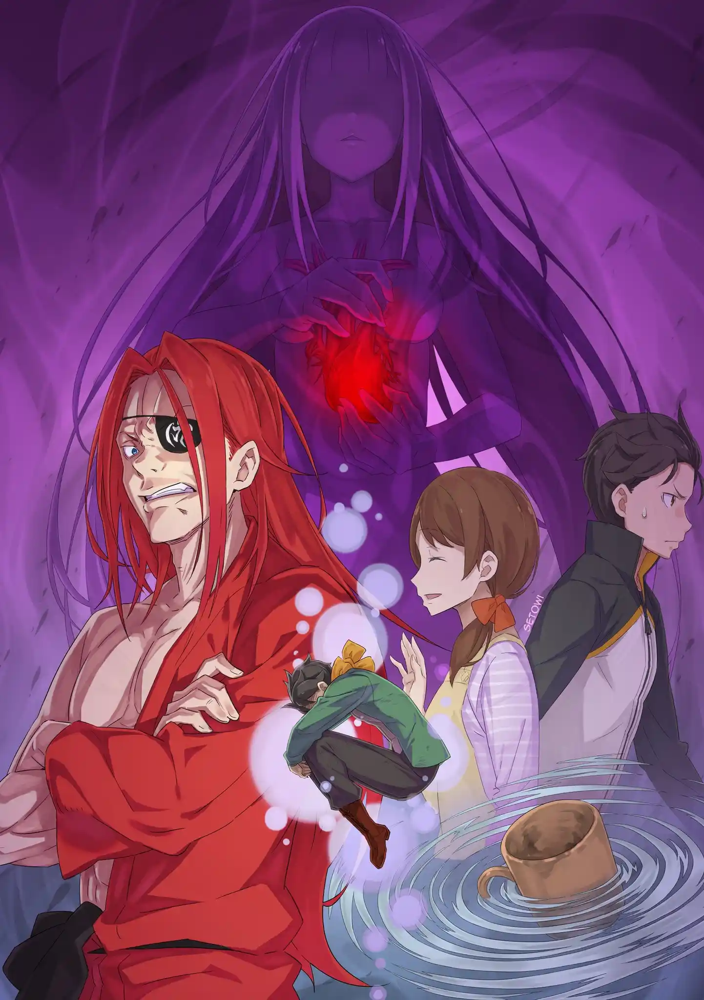
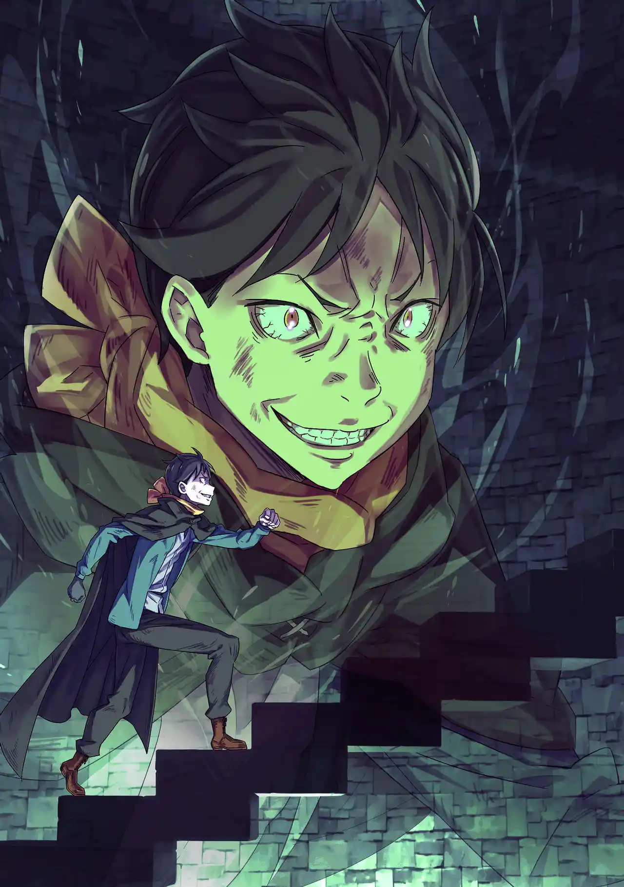

จุดเซฟอยู่ที่ห้องเขียวหลังสุบารุความจำเสื่อมไปแล้ว เขาตื่นมาเจอเอมิเลียกับเบียทริซเหมือนเมื่อเช้า สุบารุสับสนเพราะไม่เข้าใจพลังของตัวเอง เขาเข้าใจผิดว่าพลังต่างโลกของเขาคือ "นิมิตเห็นอนาคต" หรือ "ฝันบอกเหตุ"

เพราะความช็อคและความกะทันหันตอนที่ร่วงลงไปตาย ความทรงจำช่วงท้ายของสุบารุเลยค่อนข้างเลือนลาง แต่เขาก็พยายามดำเนินเหตุการณ์ให้เป็นไปตามนิมิตที่เห็นและสงสัยตัวเองคนเก่าว่าทำไมไม่เคยบอกพลังนี้กับคนอื่น

สุบารุ: ....นายคิดอะไรอยู่กันนะ นัตสึกิ สุบารุ?

เหตุการณ์ช่วงมื้อเช้าดำเนินไปเหมือนเดิมแทบทุกอย่าง ทั้งรีแอคชั่นของทุกคน แรมกระชากคอเสื้อ เอคิดน่าเปิดเผยความลับของเธอ มีแตกต่างเล็กน้อยตรงที่เอคิดน่าแอบสงสัยว่าสุบารุรอบนี้ดูใจเย็นผิดปกติ

ตอนที่ทุกคนค้นห้องสมุดไทเกต้าเองก็มีความแตกต่างเล็กน้อยอยู่ ชอล่าในลูปนี้รุกหนักกว่าเดิม ถึงขั้นกดสุบารุติดกำแพงด้วยท่า "คาเบะด้ง" แล้วพยายามจะขโมยจูบ แต่สุบารุก็ได้เมลี่มาดึงผมชอล่าช่วยไว้ก่อน

หลังทุกคนแยกตัวไปท้าทายบททดสอบที่ชั้น 2 สุบารุก็เดินคิดเรื่องเงื่อนไขพลังนิมิตอยู่คนเดียวเรื่อยเปื่อยจนไปแอบได้ยินบทสนทนาของคนอื่นเข้า กลายเป็นว่าทุกคนนอกจากเอมิเลียกับเบียทริซเชื่อว่าสุบารุเป็นบ้าไปแล้วเพราะเขาเพ้อเรื่อง "ต่างโลก"

สุบารุเดินจากมาเงียบๆด้วยความเจ็บใจ รู้ตัวอีกทีเขาก็มาโผล่ที่หน้าบันไดวนเชื่อมชั้น 4 และชั้น 5 ความรู้สึกเดจาวูทำให้เขาขนลุก แล้วตอนนั้นเองใครบางคนก็ผลักเขาอีกครั้ง

คราวก่อนเขาดิ่งลงกระแทกพื้นตายคาที่ไม่ทันเจ็บปวด แต่รอบนี้ร่างของสุบารุร่วงไปกระแทกเข้ากับบันไดจนร่างซีกขวาพังยับเยินทันที แต่มันยังไม่จบ ร่างของเขาหล่นลงไปกระแทกบันไดขั้นที่ต่ำกว่าซ้ำแล้วซ้ำเล่า ทุกครั้งกระดูกจะแตกเพิ่มหรือไม่อวัยวะก็จะฉีกขาดเพิ่ม

"เจ็บ เจ็บ เจ็บ เจ็บ เจ็บ เจ็บ เจ็บ เจ็บ เจ็บ เจ็บ"

นัตสึกิ สุบารุติดอยู่ในลูปนรกแห่งความทุกข์ทรมาน ร่างกายของเขากระแทกขั้นบันไดจนกระทั่งกลายเป็นแค่เศษเนื้อไม่เหลือเค้าโครงเดิม

Death Counts: 5

.

กลับจุดเซฟมาครั้งนี้สุบารุหล่นจากเตียงและร้องตะโกนสุดเสียงด้วยความสะเทือนใจค้างจากลูปก่อน พอเห็นเขาอาเจียนออกมาเอมิเลียก็ช่วยลูบหลังให้ แต่การลูบหลังเป็นการไปกระตุ้น PTSD ของลูปก่อนที่เขาโดนผลักหลังออกมา สุบารุเลยแตกตื่นวิ่งหนีออกห้องไป

ตอนนี้เขากลัวไปเสียทุกอย่าง มือที่สัมผัสหลัง ฟันแหลมของพาทรัช เขากลัวตาย ถ้าอยู่เฉยๆเขาจะต้องตาย สุบารุเลยออกวิ่งอย่างไร้จุดหมายไปเรื่อยๆ รู้ตัวอีกทีเขาก็ขึ้นมาเจอเรดที่ชั้นอิเล็กตร้า

เรดใช้ตะเกียบแทงสุบารุจนล้มหงายหลังหัวฟาด ความรู้สึกตอนหัวกระแทกพื้นกระตุ้น PTSD ขึ้นมาอีกครั้งจนสุบารุร้องลั่น เรดรำคาญเลยเอาตะเกียบแทงทะลุอกผ่านกระดูกซี่โครงไปเขี่ยอวัยวะภายในของสุบารุเล่น

เมื่อพอใจแล้วเรดก็ไล่สุบารุด้วยการเตะเขากระเด็นกลับไปทางบันไดที่ขึ้นมา PTSD กำเริบอีกรอบสุบารุจึงรีบคว้าขั้นบันไดไว้จนเล็บมือฉีก สุบารุได้แต่นั่งสิ้นหวังว่าทำไมเขาต้องมาเจออะไรแบบนี้ ไม่กี่ชั่วโมงก่อนเขายังใช้ชีวิตเป็นนีทไร้เป้าหมายที่บ้านตัวเองอยู่เลย

เขาคิดถึงพ่อกับแม่ เขาเสียใจที่ไม่ได้ตอบกลับคุณแม่ไปว่า "ไปก่อนนะครับ" เขาเสียใจที่ไม่ได้ล้างแก้วในอ่างล้างจาน เขาจะตายอยู่ที่นี่โดยที่ไม่ได้ตอบแทนบุญคุณพ่อแม่ที่เลี้ยงดูเขามา เขาจะตาย เขาจะตาย เขาจะตาย

สุบารุเห็นภาพหลอนของความตายในรูปลักษณ์ของเงาดำที่กำลังหัวเราะเยาะเขา ใบหน้าของเงาดำเป็นใบหน้าที่เขาคุ้นเคยแต่นึกไม่ออกว่าใคร

สุบารุ: หยุดหัวเราะนะ! ชั้นจะตาย แต่ไม่ใช่เพราะแก! ชั้นจะไม่โดนแกฆ่า ชั้นจะตายแน่ๆ! ชั้นจะตาย! ชั้นตาย! ชั้นตายไปแล้ว! ชั้นตายและกลับมาที่นี่แต่ว่าชั้นจะ---

ทันใดนั้นห้วงเวลาก็หยุดลง ทั้งตัวเขาและเงาดำตรงหน้าต่างหยุดนิ่ง สิ่งเดียวที่เคลื่อนไหวได้คือ "ความมืด" ในรูปลักษณ์หญิงสาว เธอสวมชุดที่เหมือนชุดแต่งงานสีดำและมีผ้าคลุมปิดใบหน้าไว้

ซาเทล่า: ฉันรักคุณ

หญิงสาวล้วงมือเข้ามาลูบคลำหัวใจของสุบารุและบอกรักเขาซ้ำๆ เมื่อเวลาเดินต่อสุบารุก็เข่าทรุดลง น้ำตาไหลพรากและฉี่แตกเลอะบันได เงาดำกลับมาหัวเราะเยาะเขาต่อ สุบารุได้แต่ร้องไห้และภาวนาในใจว่า "ฆ่าชั้นที"

เอมิเลียกับคนอื่นๆตามมาเจอสุบารุและเอาตัวเขาไปพักที่ห้องเขียว ทุกคนเข้าใจสถานการณ์ว่าสุบารุความจำเสื่อมเช่นเคย ส่วนตัวเขาเองก็เข้าใจแล้วว่าพลังต่างโลกที่ได้มาคือ "ตายแล้วกลับมา" ทุกคนตัดสินใจให้สุบารุพักคนเดียวไปก่อน แรมไม่ไว้ใจเขาจนอุ้มเรมหนีไปไว้ห้องอื่น

หลังนั่งรออยู่หลายชั่วโมงให้เลยช่วงเวลาที่เขาโดนผลักตกบันไดสุบารุก็ตัดสินใจหนี เขาแวะรวบรวมน้ำ อาหารกับผ้าคลุมกันทรายและลงบันไดเวียนมาชั้น 5 ได้อย่างปลอดภัยในรอบนี้

สุบารุผลักประตูใหญ่ออกได้อย่างง่ายดายจนตัวเขาก็ประหลาดใจ ตอนนี้เป็นเวลากลางคืน เขาเลือกที่จะเสี่ยงภัยเดินฝ่าทะเลทรายเข้าเมืองดีกว่าอยู่ในหอคอยนี้ แต่ยังไม่ทันจะไปไหนได้ไกลหนอนทรายยักษ์ก็โผล่ขึ้นมาจากพื้นทราย

ถึงจะหลบการโจมตีได้ 2-3 ครั้งจากความคล่องตัวของร่างกาย สุดท้ายสุบารุก็โดนหนอนทรายเอาหางหวดกระเด็นขึ้นฟ้า แต่ก่อนจะโดนมันเขมือบกระสุนลำแสงของชอล่าก็กระหน่ำยิงหนอนทรายยักษ์จนเละ สุบารุที่ร่วงลงพื้นจมลงไปในทรายดูดที่เกิดจากการเคลื่อนไหวของหนอนยักษ์

สุบารุฟื้นขึ้นมาที่ถ้ำใต้ดิน ทั้งน้ำและอาหารเสียไปหมด เขาต้องคลำทางในความมืดโดยใช้ "กลิ่น" นำทางไป เขาคลานไปจนเจอทางแยกและเลือกตามกลิ่นไปทางขวา ระหว่างทางเขาเจอประตูเหล็กที่พอแตะแล้วมันก็หายไป

รอบนี้สุบารุผ่านประตูเหล็กได้ "4" บาน (จากครั้งก่อนแค่ 3) กลิ่นสาบแม่มดฉุนขึ้นเรื่อยๆทุกครั้งที่ผ่านประตู จนกระทั่งสุบารุมาติดประตูบานที่ 5 เขาหงุดหงิดที่เปิดมันไม่ได้จนเอาโขกประตูรัวๆ ทันใดนั้นก็มีแสงสีขาวห่อหุ้มตัวเขา มันวาร์ปเขากลับไปโผล่ที่ชั้น 5 ที่มีประตูใหญ่อยู่

ความสันโดษตอนอยู่ใต้ดินถูกช่วงชิงไป สุบารุกลับมาอยู่ในหอคอยที่มีคนคิดจะฆ่าเขา แต่รอบนี้เขาเลิกที่จะหนีและเลือกเผชิญหน้าแทน ในเมื่อทุกคนคือผู้ต้องสงสัยสุบารุก็จะฆ่าพวกมันให้หมด ความกลัวของเขาถูกแทนที่ด้วย "โทสะ"

"เพื่อจะรักษาชีวิตตัวเองนั้น การฆ่าย่อมไม่ผิดอะไร"

