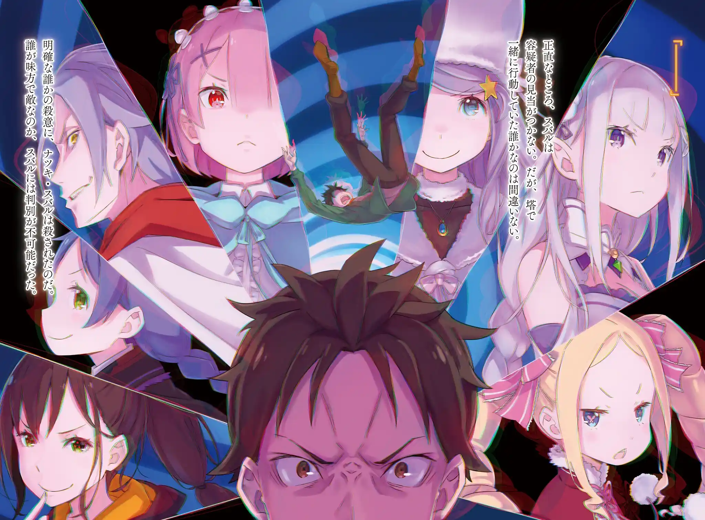
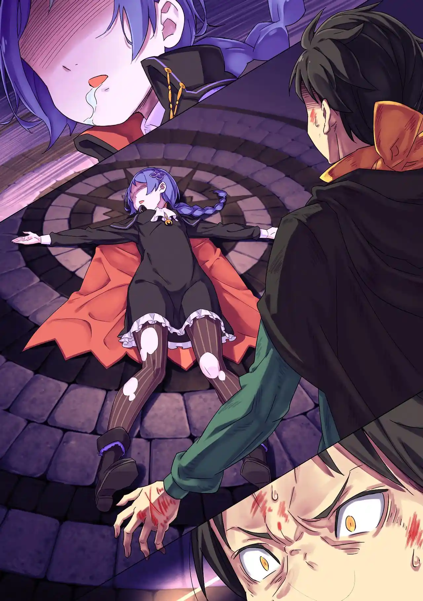
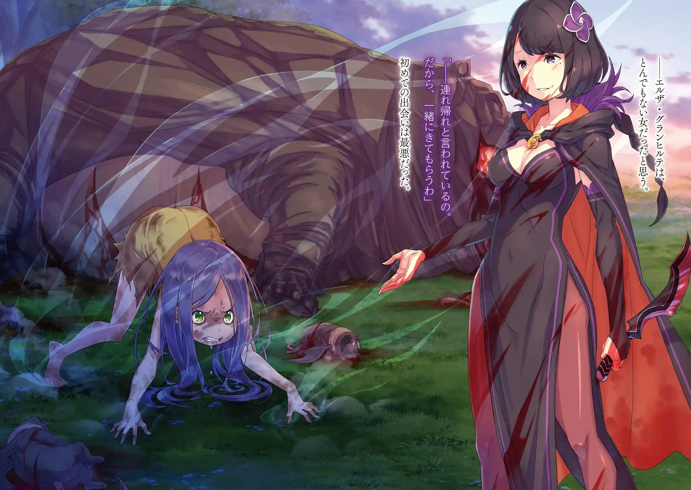

สุบารุที่ดมกลิ่นสาบแม่มดมาจนบ้าเดินขึ้นบันไดมาด้วยความตั้งใจที่จะฆ่าทุกคน แต่สิ่งแรกที่เขาเจอเมื่อขึ้นมาถึงชั้น 4 ก็คือศพของชอล่าในสภาพใบหน้าเละเหมือนโดนหวดด้วยค้อนยักษ์ เขาอดไม่ได้ที่จะอ้วกรดศพไร้หน้าและไร้แขนของชอล่า

ชั้น 4 เต็มไปด้วยร่องรอยการต่อสู้ พอเดินลึกเข้าไปต่อเขาก็เจอศพของเอคิดน่าที่ถูกฟันสะพายแล่ง เจอศพของแรมที่ช่วงอกถูกยิงทะลุเป็นรูจากด้านหลัง เจอศพของเมลี่ที่ถูกปาดท้องกับศพของยุลิอุสที่มีบาดแผลเต็มตัวและแขนซ้ายหายไปนอนตายอยู่ใกล้กัน

นอกจากชอล่าแล้วศพทุกคนถูกคลุมผ้าและปิดเปลือกตาให้เหมือนไว้อาลัย สุบารุเจอศพแล้วศพเล่า อ้วกซ้ำแล้วซ้ำเล่า แต่เขาก็ยังหาศพของเอมิเลียกับเบียทริซไม่เจอ (ไม่เจอศพเรมด้วย แต่สุบารุลืมคิดถึงไป) เขากลับไปที่ห้องเขียวและพบว่าพาทรัชยังมีชีวิตอยู่

สุบารุรำคาญพาทรัชที่ตามมาเลยใช้ดาบหักๆที่เก็บมาจากข้างศพยุลิอุสแทงมัน พาทรัชไม่ว่าอะไรเจ้านายแถมยังช่วยคาบไหล่เขาหนีเพราะอยู่ดีๆเงาดำของแม่มดริษยาก็โจมตีหอคอย

เงาดำในรูปร่างมือไล่หลังทั้งคู่มา พาทรัชวิ่งไปที่บันไดวน แต่เนื่องจากชั้นล่างถูกเงาดำยึดไว้หมดมันจึงคาบสุบารุวิ่งไต่กำแพงเพราะตอนนี้เงาถล่มหอคอยจนเอียงไปแล้ว พาทรัชโยนสุบารุไปที่ระเบียงของชั้น 4 ก่อนที่มันจะถูกเงาดำกลืนเข้าไป

เขายืนเดียวดายอยู่ที่ระเบียงกับฝูงนก มองดูหอคอยถูกเงาดำกลืนไปเรื่อยๆ อีกไม่นานก็จะถึงคิวเขาอยู่ดี แต่ตอนนั้นเองสุบารุก็รู้สึกว่ามีคนอยู่ข้างหลัง ไม่ใช่นก ไม่ใช่พาทรัช และไม่ใช่เงาดำ

???: รอบหน้าก็ลองทายดูนะว่าใครเอ่ย~ วีรชน

พอสิ้นเสียงที่เขาไม่เคยได้ยินมาก่อนนั้น นัตสึกิ สุบารุก็ถูกใครบางคนตัดคอจนหัวขาดกระเด็น

Death Counts: 6

.

กลับจุดเซฟมารอบนี้สุบารุไม่ไว้ใจใครทั้งสิ้น ใครเป็นคนฆ่าเขา? ใครเป็นคนที่ฆ่าทุกคนในหอคอย? สุบารุระแวงจนเกือบบีบคอเอมิเลียเพราะกลัวที่เขาหาศพเธอไม่เจอ แต่เพราะมีเบียทริซอยู่ด้วยเลยยั้งมือไป ตอนนี้สุบารุเชื่อใจแค่พาทรัชที่เสี่ยงชีวิตช่วยเขาไว้ในลูปก่อน

รอบนี้สุบารุลองวิธีใหม่ เขาลองไม่บอกทุกคนเรื่องที่ตัวเองความจำเสื่อมดูและเนียนว่ายังเป็นสุบารุคนเดิมไป เขาตั้งทฤษฎีว่าคนร้ายอาจจะเป็นคนที่ไม่อยากให้ความทรงจำของเขากลับมาหรือเปล่า?

ก่อนมื้อเช้าสุบารุลองทดสอบพละกำลังของเอมิเลียด้วยการงัดข้อกัน ซึ่งลงเอยด้วยการที่เขาแพ้ยับ หัวข้อหลักการสนทนาที่โต๊ะอาหารเปลี่ยนจากเรื่องของสุบารุไปเป็นเอคิดน่าแทน สุบารุสังเกตเห็นว่ายุลิอุสดูหลบตาแปลกๆ เขาเลยแอบนัดคุยกับยุลิอุสลับๆและสั่งให้ชอล่าแอบรอช่วยถ้าสถานการณ์บานปลาย

สุดท้ายสุบารุก็เข้าใจผิดไปเอง "เรื่องเมื่อคืน" ที่ทำให้ยุลิอุสหลบตาก็คือเรื่องเอคิดน่า เขาไม่เกี่ยวกับการที่สุบารุไปโผล่ที่ห้องสมุด แต่จากการสนทนาทำให้สุบารุทราบเรื่อง "การสมคบคิดระหว่างนัตสึกิ สุบารุกับเอคิดน่า" ทำให้ยิ่งไม่ไว้ใจตัวเองคนเก่าไปอีก

สุบารุ: แก... แกทำอะไรลงไปและใครกันที่อยากฆ่าแก "นัตสึกิ สุบารุ"?

สุบารุกอดขอบคุณชอล่าและแยกทางออกมา เขากะจะไปน้วยพาทรัชให้ใจเย็นลงแต่ก็ไปเจอเข้ากับเมลี่ระหว่างทาง

เมลี่คุยเรื่อยเปื่อยกับสุบารุ เธอเล่าถึงเอลซ่าจอมไร้ระเบียบและคุณแม่ผู้เคร่งครัด ก่อนที่จะถามเขาว่า "เรื่องที่คุยกันเมื่อคืนน่ะพูดจริงหรือเปล่าคะ?" หลังคำพูดนั้นสติของสุบารุก็เลือนลางไป

พอรู้ตัวอีกทีตรงหน้าสุบารุก็มีศพของเมลี่ที่ถูกบีบคอจนตาย แถมที่ข้อมือของเขามีรอยข่วนจากการขัดขืนของเธออยู่ สุบารุที่แตกตื่นพยายามทำ CPR แต่มันก็สายไปเสียแล้ว หลักฐานแวดล้อมมัดตัวแน่นว่าเขาเป็นคนร้ายแต่เขากลับจำอะไรไม่ได้เลย

สุบารุรู้สึกเจ็บเลยถกแขนเสื้อข้างซ้ายดู ที่แขนข้างนั้นมีรอยแผลถูกข่วนด้วยเล็บของเขาเองสลักเป็นคำว่า "นัตสึกิ สุบารุมาที่นี่แล้ว" ในภาษาญี่ปุ่น เขามึนงงไปหมด สิ่งเดียวที่คิดได้คือตอนที่เขาหมดสติไป "นัตสึกิ สุบารุ" คนเก่ากลับมาเข้าร่างและฆ่าเมลี่ทิ้ง

สุบารุลากศพเมลี่ไปกองมุมห้องแล้วเอาผ้าขาวคลุมปิดไว้ลวกๆ พอออกห้องไปเขาเจอเข้ากับเอมิเลียทันที เขาพยายามอ้างจะไปเข้าห้องน้ำเพื่อสลัดเธอทิ้ง แต่เอมิเลียก็ตามตัวติดแจ

พอเห็นสุบารุท่าทางแปลกๆไปเอมิเลียก็เอาสองมือประกบหน้าและพูดเรียกสติเขาไปที สุบารุเกือบจะสารภาพทุกอย่างออกไป แต่ตอนนั้นเองแรมก็วิ่งมาแจ้งข่าวว่าเบียทริซเจอหนังสือคนตายที่มีชื่อ "เมลี่ โพทรูท" บนปก

ถือเป็นโชคดีของสุบารุที่ยังไม่มีใครกล้าเปิดหนังสืออ่าน เขาเลยอาสาเป็นคนอ่านมันเอง ไหนๆตัวเขากับยุลิอุสก็เคยอ่านหนังสือคนตายมาก่อนแล้ว

.
นักฆ่าผู้เยาว์วัย

.
ตั้งแต่ที่เมลี่จำความได้เธอก็ใช้ชีวิตอยู่กับเหล่าสัตว์ปีศาจเพราะถูกพ่อแม่ทอดทิ้ง เธอเป็นดั่งราชินีของพวกมัน เมลี่ใช้ชีวิตตามใจชอบเยี่ยงสัตว์ป่าจนกระทั่งเอลซ่ามาพบเธอเข้า เอลซ่าฆ่าฝูงสัตว์ปีศาจของเมลี่และพาตัวเธอกลับไปที่องค์กรมือสังหารด้วยกัน

เมลี่ได้รับการปลูกฝังความกลัวจาก "หม่าม้า" หัวหน้าองค์กรมือสังหารให้มีชีวิตอยู่เพื่อตัวคุณแม่เท่านั้น เมลี่เริ่มเรียนรู้การใช้ชีวิตแบบมนุษย์จากเอลซ่ามาเรื่อยๆ เธอชอบและนับถือวิถีชีวิตของเอลซ่า แต่แล้ววันหนึ่งเอลซ่าก็ตายจากไป เธอถูกเผาเป็นเถ้าถ่านในซากคฤหาสน์

เธอเกลียดชังคนที่ฆ่าเอลซ่าหรือเปล่า? เธอเศร้าโศกที่เสียเอลซ่าไปหรือเปล่า? แม้แต่ตัวเมลี่เองก็ยังหาคำตอบที่แน่ชัดไม่ได้ ตลอดชีวิตเธอได้แต่เลียนแบบหรือทำตามคำสั่งคนอื่น พอเสียเอลซ่าไปแล้วเธอควรจะต้องทำอย่างไรต่อไปดี?

เพื่อหาคำตอบนั้น ในคืนที่สุบารุเสียความทรงจำไปเมลี่ก็ย่องไปตามหาหนังสือคนตายของเอลซ่าที่ห้องสมุด เมลี่เจอสุบารุกำลังหาหนังสืออยู่ เขาบอกเธอว่า "อย่านอนดึกล่ะ" เมลี่รู้สึกละอายเลยเดินจากไป แต่เธอก็เปลี่ยนใจและย่องกลับเข้ามา

แต่พอกลับมารอบสองสุบารุก็ดูแปลกๆไป

สุบารุ (?): เธอนี่มันตื้นเขินจริงๆ อย่ามาทำหน้าตาสำรวมนะ ยัยตุ๊กตาจอมว่าง่าย นี่เธอจะทำเป็นเมินความปรารถนาในหัวใจตัวเองเหรอ? รับฟังความปรารถนานั้นซะ แล้วเธอจะเข้าใจว่าตัวเองอยากทำอะไร ---นั่นแหละ ต้องหน้าแบบนี้สิ

วันถัดมาเมลี่ถามสุบารุอีกครั้งว่า "เมื่อคืนพูดจริงหรือเปล่า?" สุบารุขอเปลี่ยนที่ จากนั้นเขาก็ผลักเธอลงพื้น เขาแสยะยิ้มน่ารังเกียจออกมาและเริ่มบีบคอเธอ

สุบารุ (?): ถามกันตรงๆมันผิดกฏนะ "คราวนี้" เธอแพ้เพราะแหกกฏ ชั้นหวังว่า "คราวหน้า" เธอจะกล้ากว่านี้ ---นี่มันกลายเป็นเรื่องน่าสนใจไปแล้วสิ.... "คดีฆาตกรรมของนัตสึกิ สุบารุ"

สุบารุกลับออกจากหนังสือคนตายในสภาพแตกตื่น เขาดำดิ่งในความทรงจำของเมลี่มากเกินไปจนตัวตนของทั้งคู่ผสมปนเปกัน เขาสับสนกระทั่งสรรพนามที่ใช้เรียกตัวเอง

สุบารุ: ชะ ชั้น....อา เอมิเลีย เบียทริซ.....ชั้นยังเป็นตัวชั้นอยู่ใช่ไหม? ไม่ใช่ "ฉัน" แต่เป็น "ชั้น"....ไม่ได้มีเอลซ่าอยู่ด้วย เอ่อ....

.

ตัวตนของ "นัตสึกิ สุบารุ" กับ "เมลี่ โพทรูท" ปนกันหยุ่งเหยิงในหัวของเขา สุบารุโกหกไปว่าไม่เห็นความทรงจำตอนที่เมลี่ตาย เอมิเลียจึงสั่งให้ทุกคนแยกกันตามหาศพของเมลี่และฝากเบียทริซดูแลสุบารุ

ชอล่าถามสุบารุว่าอยากให้เธอทำอะไร สุบารุต่อต้านความรู้สึกของเมลี่ในหัวและเลือกสั่งว่า "ฝากจัดการเรื่องเมลี่ด้วย" ชอล่ากระซิบข้างหูเขาว่า "รับทราบแล้วค่ะ" แล้วเดินจากไป

สุบารุไม่เข้าใจว่าทำไมทุกคนถึงรักและเชื่อใจ "นัตสึกิ สุบารุ" ขนาดนั้น หมอนั่นเป็นฆาตกรโหดร้าย มันฆ่าเมลี่ มันฆ่าเอลซ่า พอสงสัยเช่นนั้น เสียงกระซิบของเมลี่ในหัวและหนังสือคนตายที่กุมอยู่ในมือก็ทำให้เขาเกิดไอเดีย

"ถ้าลองฆ่าเบียทริซแล้วอ่านหนังสือคนตายของเธอดู ชั้นจะเข้าใจเรื่องนั้นมากขึ้นไหมนะ?"

ด้วยวิธีนี้เขาจะเข้าใจได้หมดว่าใครคือมิตรหรือศัตรู ด้วยวิธีนี้เขาจะเข้าใจว่านัตสึกิ สุบารุคนเก่าเป็นคนยังไง สุบารุเริ่มเห็นภาพหลอนของเมลี่โผล่มาเป็นผีคุยด้วย เขาประเมินพวกพ้องแต่ละคนว่าใครฆ่าง่ายฆ่ายากและตัดสินใจว่าต้องฆ่ายุลิอุสที่เป็นอุปสรรคมากที่สุดก่อน

เบียทริซสังเกตเห็นรอยแผลที่เขาโดนเมลี่ข่วนที่ข้อมือ แต่เธอเข้าใจผิดว่านั่นคือ "แผลทำร้ายตัวเอง" ที่สุบารุคนเก่าแอบทำเป็นประจำ เธอเริ่มร่ายเวทฮีลและกำชับให้สุบารุเลิกนิสัยเสียแบบนี้ ถ้าเอมิเลียรู้เข้าจะเสียใจ

(เป็นการเฉลยว่าสุบารุแอบทำร้ายตัวเองด้วยการข่วนผิวหนังจนเป็นแผลตั้งแต่หลัง Arc 4 มา )