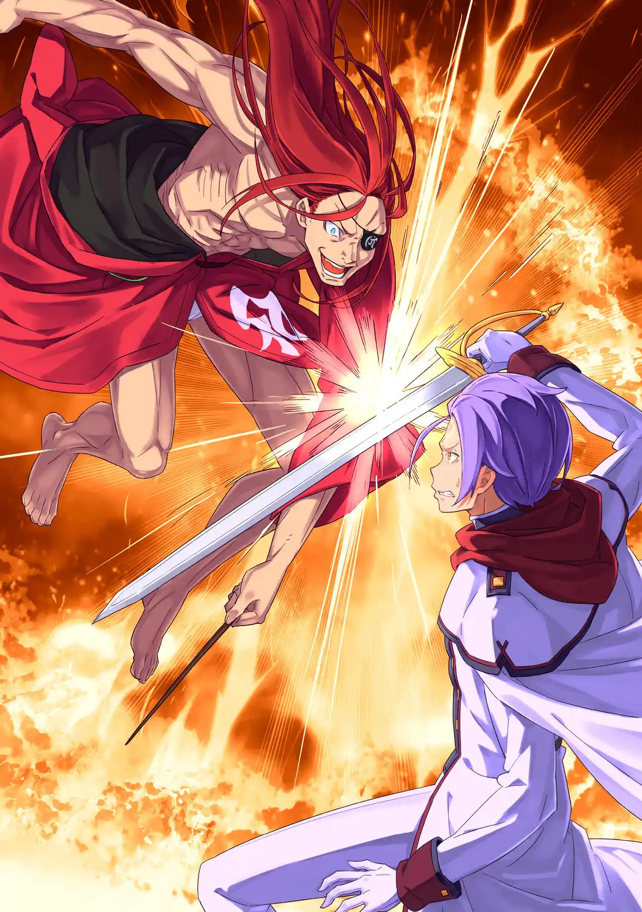
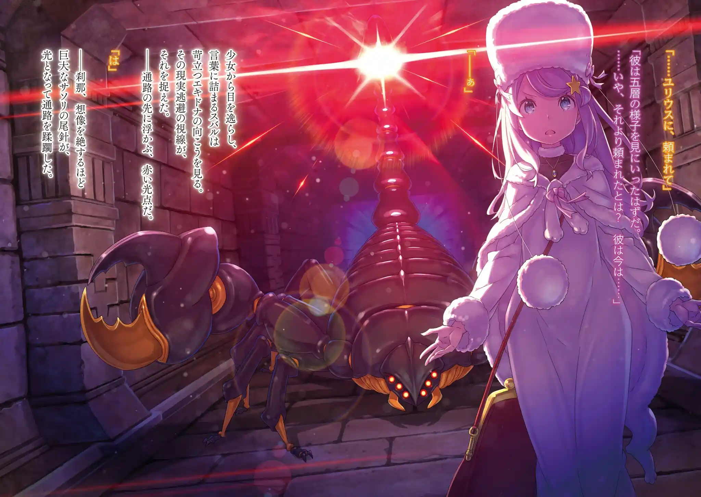

เบียทริซพาสุบารุมาพักที่ห้องเขียว บาดแผลที่เป็นหลักฐานบนตัวเขาถูกฮีลหายไป ผีเมลี่ชวนเขาฆ่าเรมที่เป็นเป้าหมายง่าย แต่สุบารุจัดอันดับความสำคัญเธอไว้ลำดับสุดท้ายเพราะต้องฆ่าคนที่น่าจะเป็นปัญหาก่อน

เย็นวันนั้นพวกเขารวมตัวกันที่โต๊ะอาหาร พวกเอมิเลียหาศพเมลี่ไม่เจอทั้งที่สุบารุซ่อนไว้แบบงานลวกๆ เอคิดน่าเสนอให้เลิกตามหาเมลี่และโฟกัสการพิชิตหอคอยต่อเพราะเรื่องอาหารที่จำกัด และเพราะโอโดของอนาสตาเซียที่เสียไปเรื่อยๆ

คืนนั้นสุบารุรอให้ทุกคนหลับ เขาส่งสัญญาณมือให้พาทรัชเงียบไว้และออกห้องเขียวมา เขามุ่งหน้าไปยังห้องที่ซ่อนศพเมลี่ไว้เหมือนฆาตกรที่กลับมาดูที่เกิดเหตุ แต่เขากลับไม่พบศพของเมลี่อยู่ที่นั่น

แรม: ดึกดื่นป่านนี้หาอะไรอยู่น่ะ บารุสุ? ....ไม่สิ คงต้องเรียกแกว่าไอ้ตัวปลอมสินะ--- ของปลอมไร้ค่าที่้อ้างตัวเป็นบารุสุ....เป็นนัตสึกิ สุบารุ

แรมใช้เนตรพันลี้มองผ่านตาของพาทรัชเลยรู้ว่าเขาแอบออกมา การแสดงเป็นสุบารุคนเก่าของเขาไม่เนียนพอจนแรมดูออก ดังนั้นสุบารุจึงต้องปิดปากเธออย่างไม่มีทางเลือก ผีเมลี่ช่วยบอกว่าจุดอ่อนของแรมอยู่ที่บาลานซ์ฝั่งซ้าย ผลักเธอให้ล้มไปฝั่งนั้นแล้วเอาหัวโขกกำแพงก็เรียบร้อย

แต่แรมไม่ได้มาคนเดียว เอมิเลียที่แอบรออยู่สร้างกรงน้ำแข็งขังสุบารุไว้ เธอพูดด้วยความเสียใจว่าอยากให้แรมคิดผิด

แรมคิดว่าสุบารุเป็นคาเปลล่าปลอมตัวมาเลยอยากทรมานเพื่อรีดข้อมูล แต่เอมิเลียคิดต่างเลยขัดแย้งกัน

สุบารุสารภาพว่าเขาความจำเสื่อม แต่แรมไม่เชื่อและฉวยจังหวะร่ายเวทลมน็อคหัวเขากระแทกกรงน้ำแข็งจนหมดสติไป เมื่อได้สติขึ้นมาก็เหลือแค่เขาคนเดียวอยู่ในห้องที่ถูกสลักคำว่า "นัตสึกิ สุบารุมาที่นี่แล้ว" เต็มไปหมด

.

สุบารุยังคงอยู่ในห้องเดิมที่เขาเคยซ่อนศพเมลี่ไว้ กรงน้ำแข็งก็ยังอยู่แต่ว่าเขาไม่ได้อยู่ในกรงแล้ว

หลักฐานแวดล้อมบ่งบอกว่าตอนที่เขาหมดสติไป "นัตสึกิ สุบารุ" มาสิงร่างเขา จากนั้นก็ถอดข้อไหล่จนลอดออกกรงน้ำแข็งมาได้และสลักข้อความทั่วกำแพง

ระหว่างที่ตกตะลึงอยู่ก็มีเรื่องให้ประหลาดใจเพิ่มขึ้น "เรด แอสเทรีย" เดินผ่านมาหน้าห้องชิวๆทั้งๆที่เขาไม่ควรจะลงมาจากชั้น 2 ได้ ผ้าปิดตาของเรดเปลี่ยนข้างไปจากเดิมเพราะเขาแค่ใส่ไว้ประดับ ไม่ได้ตาบอดหรืออะไร

พอเรดเห็นว่าสุบารุข้อไหล่หลุดอยู่เขาก็ดันมันกลับเข้าเบ้าให้แบบไม่บอกกล่าว เรดบอกว่าเขาจะไปจากที่นี่แล้วเพราะพึ่งได้รับ "อิสระ" มา การทดสอบอะไรนั่นก็เรื่องของพวกเอ็งไม่เกี่ยวกับตูแล้ว แต่ก็ก่อนจะไปเขาอยากสะสางกับยุลิอุสเสียหน่อย

ตอนนั้นเองทั้งหอคอยก็สั่นเหมือนมีแผ่นดินไหว สุบารุเดินตามเรดไปถึงบันไดเชื่อมชั้น 4 กับชั้น 5 ที่ด้านล่างนั่นมีฝูงกาบาโอราว 20 ตัววิ่งวนอยู่ในหอคอยเป็นภาพที่เหมือนนรก และยุลิอุสกำลังสู้กับพวกมันอยู่

สุบารุลังเลว่าเขาเป็นห่วงยุลิอุสหรืออยากให้เขาตายจะได้อ่านหนังสือกันแน่ ตอนนั้นเองเรดก็กระโดดจากชั้น 4 ดิ่งลงไปเหยียบกาบาโอเละไปตัวนึง เรดหยิบตะเกียบมาฟาดฟันทั้งสัตว์ปีศาจและยุลิอุส เริ่มการทดสอบต่อแบบไม่สนสถานการณ์

สำหรับเรดฝูงสัตว์ปีศาจไม่ต่างอะไรจากฝน แต่ยุลิอุสลำบากที่ต้องสู้ท่ามกลางความโกลาหลจนพลาดท่าหวิดตายไปหลายที ถึงเรดจะฆ่าพวกมันไปหลายสิบตัว แต่ฝูงกาบาโอก็โผล่ออกมาจากชั้นใต้ดินเรื่อยๆไม่หยุดหย่อน

สุบารุตะโกนเตือนยุลิอุสที่มัวเหม่อจนเกือบโดนกาบาโอเผาตาย เขาไม่เข้าใจว่าตัวเองเตือนไปทำไม เขาอยากได้หนังสือคนตายไม่ใช่เหรอ? ยุลิอุสลังเลอยู่ชั่วครู่ก่อนจะตะโกนบอกสุบารุเพื่อฝากให้เขาดูแลเอคิดน่า/อนาสตาเซียด้วย

.

สุบารุวิ่งไปเจอเบียทริซกับเอคิดน่าที่โถงทางเดินของชั้น 4 ระหว่างที่เขาสลบไปทุกคนรู้สถานการณ์เกี่ยวกับตัวเขาหมดแล้ว ยุลิอุสถึงได้ดูลังเลและเอคิดน่าถึงได้มองเขาด้วยสายตาระแวง มีก็แต่เบียทริซกับเอมิเลียที่ไม่ลังเลจะเข้าข้างเขา

เอคิดน่าชี้นิ้วเตรียมยิงเวทเข้าใส่ เธอคิดว่าสุบารุเป็นพวกลัทธิบูชาแม่มดที่มาเพื่อปลดปล่อยแม่มดริษยา แต่สุบารุไม่มีอารมณ์จะเถียงแล้ว สถานการณ์ในลูปนี้มันวุ่นวายเกินจะแก้ สำหรับเขาหอคอยนี้จบสิ้นแล้ว

พอพวกเขากำลังจะแยกทางกันนั้นแมงป่องยักษ์สีดำก็โผล่ออกมายิงกระสุนลำแสงออกจากหางถล่มทางเดินเสียยับ ทั้งสามรอดมาได้ด้วยเวท "EMT ฉบับไม่สมบูรณ์" ของเบียทริซที่สร้างโล่หักล้างมานาขึ้นมาป้องกัน

การยิงถล่มของแมงป่องยักษ์ทำให้พื้นถล่มจนเอคิดน่าเกือบร่วงลงไปแต่สุบารุก็ช่วยดึงมือเธอไว้ได้ทัน เบียทริซรีบใช้มูรัคโดดถอยให้พ้นระยะก้ามของแมงป่อง ส่วนเอคิดน่าก็ยิงเอล ซิวัลด์สวนเข้าไปจนแมงป่องถอยทัพหนี

เนื่องจากทางด้านหลังถล่มยับพวกเขาจึงต้องเดินหน้าต่อ แต่พอเดินผ่านก้ามแมงป่องที่ตกอยู่บนพื้นมันก็ระเบิดใส่ทั้งสามเต็มๆ เบียทริซปกป้องสุบารุจนสลายเป็นมานาตายไป ส่วนเอคิดน่าก็เสียขาสองข้างไปและอยู่ในสภาพปางตาย

สุบารุที่บาดเจ็บน้อยที่สุดลากร่างของเอคิดน่าไปตามทางทั้งที่เปล่าประโยชน์ เอคิดน่าที่เจ็บปวดทรมานขอให้สุบารุช่วยเอาหินทุบหัวเธอให้มันจบๆไป แต่ท้ายที่สุดสุบารุก็ใจอ่อนเกินจะฆ่าคนได้

เอคิดน่าเสียเลือดถึงตายไปพร้อมกับร่างกายของอนาสตาเซีย คำพูดสั่งเสียของเธอคือคำขอโทษที่สงสัยในตัวสุบารุ