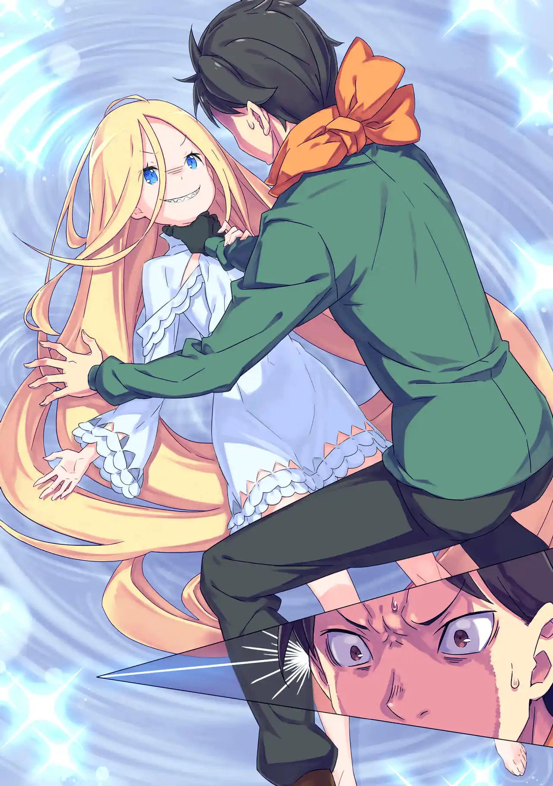
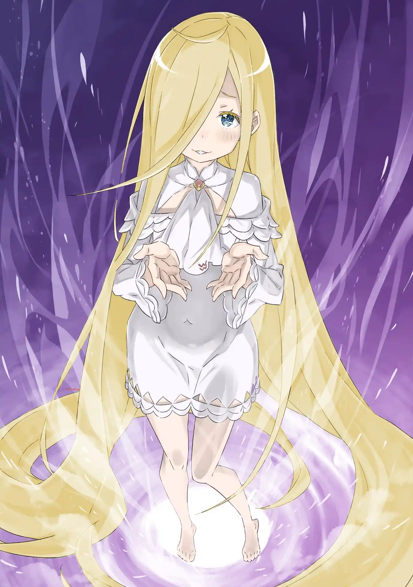

แทนที่จะได้ดูความทรงจำของเรด วิญญาณของเขากลับถูกดึงเข้ามาในโลกสีขาวที่ว่างเปล่าและคนที่รอต้อนรับเขาอยู่ก็คือเด็กสาวคนหนึ่งที่สุบารุไม่รู้จัก

รุย: ตายจริง คุณพี่ชายกลับมาอีกรอบละเหรอ?

สุบารุ: เธอเป็นใคร? แล้วที่นี่มันที่ไหนกัน?

รุย: แดนสีขาวอันเปล่าเปลี่ยวแห่งนี้คือจุดหมายปลายทางของดวงวิญญาณ ใจกลางของโอโด ลากูน่า--- "ห้องโถงแห่งความทรงจำ" ค่ะ และพวกฉันก็คือบิชอปมหาบาปตะกละ "รุย อาร์เน็บ" เองค่ะ

เนื่องจากตอนนี้หอคอยเพลอาเดสกำลังใช้หนังสือคนตายของเรดในการสร้างร่างจำลองของเขาขึ้นมาเป็นผู้คุมสอบ การอ่านหนังสือที่ว่างเปล่าของเรดจึงส่งวิญญาณของสุบารุมาที่นี่แทน

ถ้าโอโด ลากูน่าคือสถานที่ที่มานาในโลกถูกส่งมาหมุนเวียนแล้ว "ห้องโถงแห่งความทรงจำ" ก็คือสถานที่ที่วิญญาณของทุกสิ่งมีชีวิตถูกส่งมาชำระล้างเพื่อนำกลับไปใช้ใหม่ และความทรงจำกับประสบการณ์ของวิญญาณที่ถูกแยกออกนั้นก็ถูกบันทึกไว้ในรูปแบบ "หนังสือคนตาย" (โดยกลไกของห้องสมุดที่ฟลูเกลสร้าง)

รุยรู้ทุกอย่างเกี่ยวกับสุบารุเหมือนกับว่ามีความทรงจำของเขาอยู่ เธอเล่าว่าลัทธิบูชาแม่มดคือศูนย์รวมของผู้ถูกโลกชิงชัง และที่จริงบิชอปมหาบาปก็ไม่ได้ต่างอะไรจากแม่มด ทั้งสองกลุ่มต่างเป็นผู้ถือครองปัจจัยแม่มดที่มีชื่อเรียกต่างกันไปตามยุคสมัยเท่านั้น

สุบารุ: ....คนที่ขโมยความทรงจำทุกอย่างของชั้นจนถึงเมื่อวานไปคือเธอใช่ไหม?

รุย: ใช่แล้วค่า ทำไมเหรอคะ?

บารุคนเก่าเองก็มาที่นี่เมื่อวานและถูกรุยชิงความทรงจำไป รุยถามว่าสุบารุตายไปกี่ครั้งกว่าจะกลับมาที่นี่ได้

....รุยรู้เรื่อง "ตายแล้วกลับมา" ซึ่งถือเป็นการแหกกฏของแม่มดอย่างชัดเจน แต่เธออ้างว่าตราบใดที่ข้อมูลนี้ไม่ได้เล็ดลอดไปภายนอกแม่มดก็จะไม่ทำอะไร

(แต่นางอาละวาดไปแล้วสองลูป)

พอสุบารุบอกว่าตายไปแล้ว 4 ครั้ง ความอยากอาหารที่รุนแรงเหมือนความหื่นกระหายของรุยก็พลุ่งพล่าน เธอจับกดสุบารุพร้อมเลียคอไปที แต่สุบารุก็ฉวยจังหวะพลิกกลับเป็นฝ่ายขึ้นคล่อมแล้วบีบคอเด็กสาวไว้ เขาขู่ให้คืนความทรงจำมา สุดท้ายแล้วรุยก็รู้ดีว่าสุบารุจะฆ่าเธอไม่ลง

รุยพูดปั่นหัวเพิ่มว่าถ้าหากความทรงจำของสุบารุคนเก่ากลับมา ตัวตนของสุบารุคนปัจจุบันก็อาจจะถูกทับซ้อนและต้องสูญสลายไป ไม่ต่างอะไรจากความตาย จะดีแล้วจริงเหรอแบบนั้น? นัตสึกิ สุบารุคนเก่าเป็นคนดีขนาดยอมตายแทนได้เหรอ? ตอนนี้สุบารุคนปัจจุบันก็ทำหน้าที่แทนสุบารุคนเก่าได้แล้วนี่?

รุยจับมือของสุบารุเพื่อวางมันลงบนลำคอเรียวบางของเธอและมอบตัวเลือกอันโหดร้ายให้กับเขา

จะยอมตายเพื่อเอาสุบารุคนเดิมกลับมา?

หรือจะผิดคำปฏิญาณของตัวเองแล้วใช้ชีวิตใหม่นี้แทนที่สุบารุคนเก่า?

รุย: ....เอาล่ะ จะเลือกแบบไหนดีคะ? คุณพี่ชาย

ถ้าบีบคอเธอจนตายเขาจะได้ความทรงจำของทุกคนรวมถึงความทรงจำของนัตสึกิ สุบารุคืนมาไหม? ถ้าได้ความทรงจำของสุบารุคนเดิมกลับมา สุบารคนปัจจุบันจะต้องสูญสลายไปจริงหรือเปล่า?

คำตอบของคำถามเหล่านั้นแม้แต่ตัวรุย อาร์เน็บเองก็ไม่ทราบ สุบารุต้องชั่งใจระหว่างตัวเลือกอันโหดร้ายนี้ด้วยตัวคนเดียว

สัญญาที่ให้ไว้กับแรม คำสาบานที่จะปกป้องเมลี่ คำให้อภัยของเอคิดน่า ใจต่อสู้ที่เรียนรู้จากยุลิอุส ความเชื่อใจที่ได้จากเบียทริซ ความรักที่มีต่อเอมิเลีย--- สุบารุไม่อยากจะให้สิ่งเหล่านั้นหายไป สุบารุอยากใช้เวลากับคนเหล่านั้นนานกว่านี้

ตอนนั้นเองร่างกายของสุบารุก็เริ่มเกิดรอยร้าวขึ้นมา เหมือนเป็นสัญญาณว่าตัวเขากำลังจะหายไป รุยกล่อมเพิ่มว่านี่มันก็เหมือนกับ "เก้าอี้ดนตรี" มีสุบารุแค่คนเดียวเท่านั้นจะได้นั่งต่อและคนๆนั้นควรเป็นตัวเขา

เป้าหมายของรุย อาร์เน็บก็คือการ "แยกสุบารุคนใหม่ออกจากสุบารุคนเก่า" ทำให้ทั้งสองกลายเป็นคนละคนโดยสมบูรณ์เพื่อที่เธอจะได้กินเขาอีกรอบ แต่ก่อนที่แผนของเธอจะสำเร็จสุบารุก็เห็นเงาบุคคลที่สามโผล่ขึ้นมา น้ำตาที่เอ่อล้นทำให้เขาเห็นหน้าอีกฝ่ายไม่ชัดเจน

สุบารุ: ....แกโผล่ออกมาเพราะกลัวชั้นเหรอ "นัตสึกิ สุบารุ"? ชั้นจะ...ไม่ยอมหายไป ชั้นจะไม่ยอมตาย ชั้นอยากอยู่กับทุกคน ชั้นรักทุกคน เพราะงั้น...ชั้นไม่ใช่คนเดียวกับแก ชั้นกับแกเป็นคนละคน.....

รุย: ....คุณพี่ชาย... คุยอยู่กับใครน่ะ? ---ไม่มีใครตรงนั้นนี่ แล้วคุณพี่ชายคุยอยู่กับใคร? นี่มันถิ่นของพวกฉัน.... ใครกันที่มาขวางได้ หยุดนะ คุณพี่ชายเป็นของพวกฉัน....

เรม: ทำไมถึงได้คิดว่ามีแค่สองตัวเลือกล่ะคะ? ลุกขึ้นมาสิ!! ลุกขึ้นมา นัตสึกิ สุบารุ! ลุกขึ้นมา! วีรบุรุษของเรม!

เรมสั่งให้สุบารุลุกขึ้นมาสู้และไปช่วยพวกพ้องทุกคน ถึงจะยากลำบากเพียงไหนเธอก็เชื่อมั่นว่าวีรบุรุษคนนี้จะทำได้

เสียงตะโกนของเรมปลุกพลังของปัจจัยโลภะในตัวสุบารุให้ตื่นขึ้นมา สุบารุตั้งชื่อมันตรงนั้นเลยว่า "คอร์ ลีโอนิส (หัวใจสิงห์)"

สุบารุปล่อยมือจากคอของรุยและลุกขึ้นยืน พอมองไปดูที่เดิมเรมก็หายไปแล้ว ความโลภที่ตื่นขึ้นมาทำให้เขาไม่หวั่นไหวกับการพูดปั่นหัวของรุยอีกต่อไป จะสุบารุคนเก่าหรือสุบารุคนใหม่ก็คือคนๆเดียวกัน ไม่มีความจำเป็นต้องมองแยกทั้งนั้น

รุยบอกว่าเป้าหมายของเธอก็คือต้องการ "มีความสุข" เธอไม่พอใจที่เกิดมาติดอยู่ในโอโด ลากูน่าโดยไม่มีร่างกายและชีวิตเป็นของตัวเอง รุยถึงได้เสาะหาชีวิตที่ดีที่สุดจากบรรดาความทรงจำที่พี่ชายทั้งสองหามาให้

ด้วยเหตุนี้รุยถึงได้ถูกใจสุบารุเป็นพิเศษ เขาเป็นของแปลกใหม่ที่มีประสบการณ์เรื่อง "ความตาย" และเธออยากได้พลัง "ตายแล้วกลับมา" ของสุบารุซึ่งเป็นอุดมคติในการมีชีวิตที่ดีที่สุดสำหรับเธอ ว่าแล้วรุยก็ยื่นมือออกมาและออดอ้อนขอกินสุบารุเพื่อเติมเต็มความอยาก

พอสุบารุปฏิเสธ รุยก็ประกาศสงครามกับเขา เธอแจ้งที่อยู่ของพวกสุบารุให้กับพี่จ๋าและท่านพี่(ไรกับรอย)ไปตั้งแต่เมื่อคืนแล้ว อีกไม่นานทั้งสองก็จะมาถึงหอคอยเพลอาเดสแห่งนี้ สุบารุชูนิ้วกลางใส่รุยและโดดหนีออกไปทางรอยแตกที่เกิดขึ้นมาเพื่อกลับไปยังโลกเดิม

รุย : อา อา อา เวรเอ๊ย! ไม่หันกลับมามองด้วยซ้ำ! ไม่ยกโทษให้แน่ ไม่ปล่อยให้หนีแน่ อย่าคิดนะว่ามันจบแค่นี้ นัตสึกิ สุบารุ! ....ชีวิตของแกเป็นพวกฉัน!