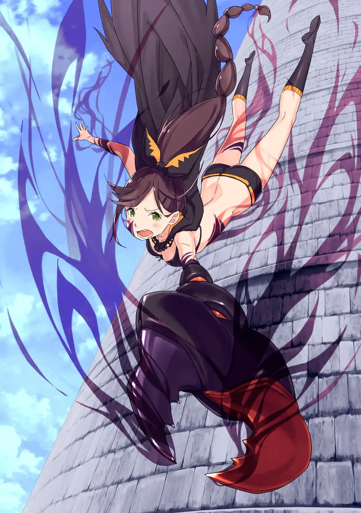

กลับจุดเซฟมารอบนี้ สุบารุเลือกมานัดคุยเรื่องสำคัญกับชอล่ากันสองต่อสอง

สุบารุ: ชอล่า....ถ้าชั้นขอให้เธอตาย เธอจะยอมตายไหม?

ชอล่า: ....? ถ้าท่านอาจารย์สั่งให้ตาย ฉันก็จะตายจริงๆนะคะ?

ชอล่าตอบเหมือนไม่ให้ความสำคัญกับชีวิตตัวเอง เธอสงสัยแค่ว่าจังหวะเวลานี้จะเหมาะให้เธอตายเหรอ เพราะหอคอยกำลังวุ่นวายอยู่ นั่นเป็นคำตอบที่สุบารุเจ็บปวดที่สุด เขาจะทำใจได้ง่ายกว่าถ้าที่ผ่านมาเธอแค่เล่นละครหลอกพวกเขา

ชอล่ายอมรับว่าเธอสามารถกลายร่างเป็นแมงป่องยักษ์ได้ แต่ไม่ชอบทำเพราะเธอชอบดีไซน์ร่างคนที่ "ท่านแม่" กับ "ท่านอาจารย์" ออกแบบให้ แต่เธอจะแปลงร่างโดยอัตโนมัติยามที่มีคนแหกกฏ

สุบารุจับไต๋ได้ว่าหอคอยนี้มีกฏข้อที่ 5 ที่ชอล่าปกปิดไว้อยู่ เนื่องจากชอล่าอยู่เฝ้าหอคอยอย่างเดียวดายมานานถึง 400 ปี สำหรับเธอ "2 วัน" ที่ได้อยู่กับท่านอาจารย์มันเลยไม่เพียงพอ เธอถึงไม่อยากให้พวกสุบารุรีบผ่านการทดสอบของหอคอย เพื่อการนั้นเธอจึงได้ปกปิดกฏข้อที่ 5 ไว้

ทันใดนั้นชอล่าก็รับรู้ได้ว่ามีใครบางคนแหกกฏ ดวงตาของเธอแยกออกเป็นสามดวงและเปลี่ยนเป็นสีแดง เธอกำลังจะกลายร่างเป็นแมงป่องยักษ์ที่จะไล่ฆ่าทุกคน แต่ชอล่าไม่ได้ต้องการแบบนั้น เธอไม่อยากจะฆ่าท่านอาจารย์

ชอล่า: ตอนนี้ยังทันอยู่นะคะ.... ได้โปรดสั่งให้ฉันตายเถอะค่ะ....

แต่สุบารุเลือกถามกฏข้อที่ 5 แทน เขาให้สัญญาว่าหลังเธอบอกกฏแล้วเขาจะยอม "ออกคำสั่ง" ให้ เพราะเวลาที่กระชั้นชิดเข้ามาชอล่าเลยต้องยอมเฉลย

ชอล่า: กฏข้อที่ 5 การทำลาย "การทดสอบ" ไม่ใช่เรื่องต้องห้ามค่ะ....

สุบารุขอโทษที่เขาโกหกเพื่อล้วงข้อมูลจากเธอแล้วกระโดดถอยหลังลงระเบียงหอคอยไป ชอล่ารีบกระโดดตามลงมาเพื่อกะช่วยสุบารุ ร่างกายของเธอเริ่มเปลี่ยนแปลงเป็นแมงป่องยักษ์ทีละส่วนๆ

สุบารุ: ขอสัญญา จะช่วยเธอให้ได้เลย

นัตสึกิ สุบารุปฏิเสธที่จะถูกชอล่าฆ่าตาย เขาไม่อยากเห็นเธอเศร้าโศกเพราะถูกบังคับให้ฆ่าคนสำคัญ เขาจึงเลือกจบชีวิตในลูปนี้ลงด้วยการกระโดดหอคอยสูงหลายร้อยเมตรลงไปกระแทกพื้นทรายจนตาย

Death Counts: 10