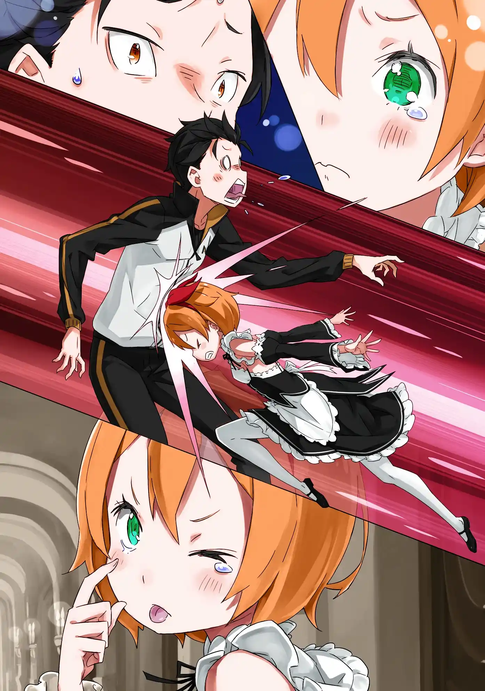
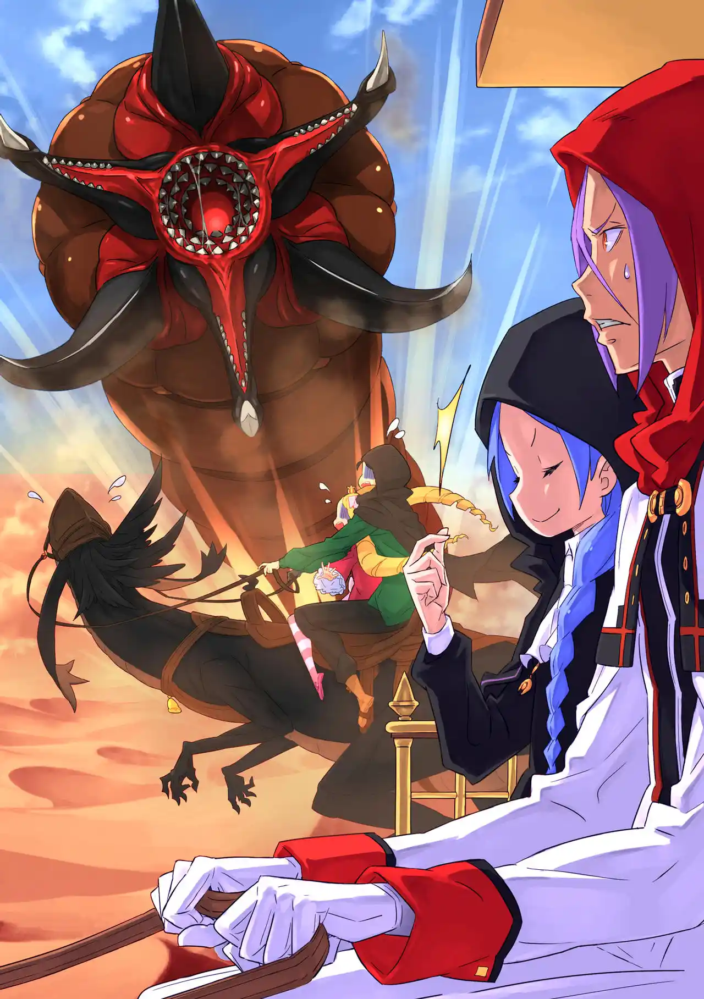
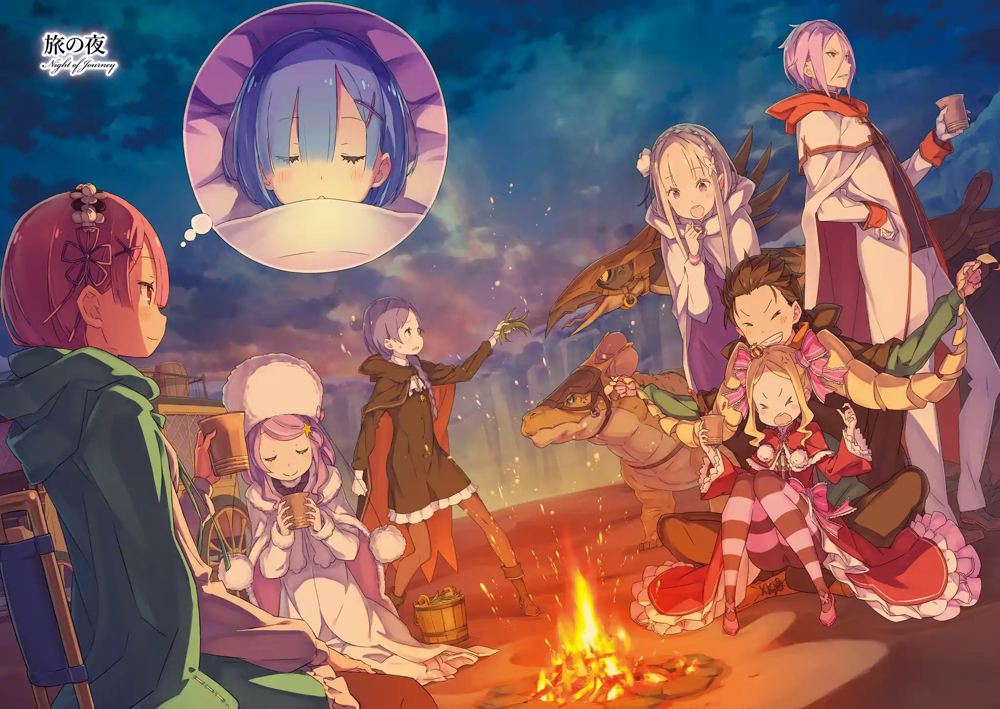
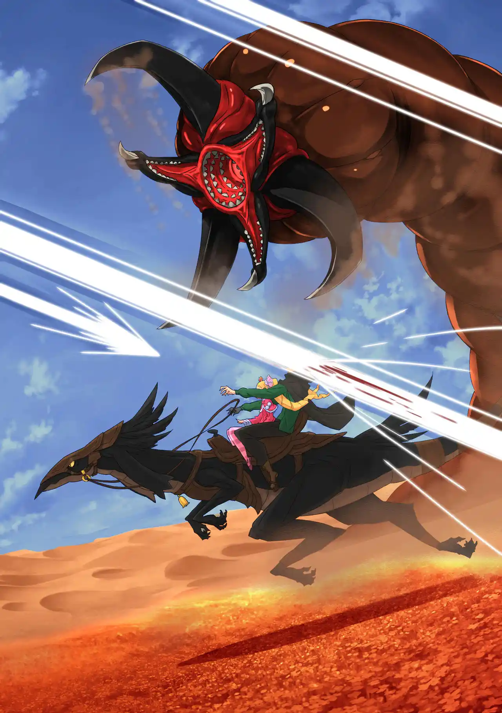

แรมขอติดตามไปด้วย รอสวาลเลยจะฝากให้ยุลิอุสช่วยดูแลปัญหาขาดมานาของแรม แต่ยุลิอุสถูกกินชื่อไปจนเขาติดต่อกับวิญญาณทั้ง 6 ไม่ได้อีกแล้ว (แปลว่าใช้เวทไม่ได้ละ) เอมิเลียกับเบียทริซเลยจะรับหน้าที่เติมมานาให้แรมแทนรอสวาล

รอสวาลแอบพูดปั่นเอมิเลียว่าพอเรมตื่นเมื่อไหร่เธออาจจะแย่งความสนใจของสุบารุไป แต่เอมิเลียไม่แคร์ เธอเป็นคนยืนกรานให้เขาพาเรมไปด้วยซ้ำ เอมิเลียมองว่าสิ่งสำคัญคือการปลุกเรมและต่อให้เป็นแบบที่รอสวาลว่า เธอก็จะทำให้สุบารุกลับมาสนใจเธอเอง

เพทร่าเอาหัวโหม่งสุบารุไปสองรอบ เธอโมโหด้วยความเป็นห่วงที่สุบารุเอาตัวไปเผชิญอันตรายไม่หยุดหย่อน แต่ถึงอย่างไรสุบารุก็จะต้องไปอยู่ดี

สุบารุประดิษฐ์เก้าอี้ติดล้อเข็นมาช่วยให้เคลื่อนย้ายเรมได้สะดวก กลุ่มพิชิตหอสังเกตการณ์เพลอาเดสทั้ง 8 คน สุบารุ เอมิเลีย เบียทริซ แรม เรม เอคิดน่า ยุลิอุส เมลี่และมังกรดินอีกสองตัวเริ่มออกเดินทางไกลที่กินเวลานานถึง 20 วัน

.

นักปราชญ์ชอล่าประจำการอยู่ที่หอสังเกตการณ์เพลอาเดสซึ่งตั้งอยู่ที่สุดขอบโลกทางทิศตะวันออก ที่นั่นเป็นเหมือนป้อมปราการไว้ปกป้องศาลเจ้าผนึกแม่มดริษยาที่น้ำตกใหญ่ ก่อนจะไปถึงหอคอยได้ก็ต้องฝ่าอาณาเขตที่เรียกว่า "เนินทรายออกุเรีย" ก่อน

คณะเดินทางมาถึงเมือง "มิรูล่า" เมืองสุดท้ายก่อนถึงเขตทะเลทราย สุบารุกับเอมิเลียสวมเครื่องแบบกันพายุทรายไปถามข้อมูลจากบาร์แห่งหนึ่ง เจ้าของบาร์ผู้มีประสบการณ์ให้ข้อมูลเกี่ยวกับทุ่งสังหารของ "หมีดอกไม้" และเล่าว่าเขาเคยเห็นนกบินไปที่หอคอย

พาทรัชเป็นมังกรดินสายพันธุ์ "ไดอาน่า" ที่เดินทางได้ทุกแห่ง แต่ชาคนาร์ของยุลิอุสไม่เหมาะกับการเดินทางนี้จึงต้องทิ้งไว้ที่เมือง แต่พวกเขาได้ "โจเซฟ" มังกรดินสายพันธุ์ "อกาเรส" สำหรับลุยทะเลทรายมาแทน

ตัวรถลากเองก็ถูกปรับแต่งให้เหมาะกับการเดินทาง เหล่าคณะออกตลุยทะเลทรายโดยมีสุบารุกับเบียทริซขี่พาทรัชดูต้นทาง ส่วนยุลิอุสและเมลี่ก็คุมบังเหียนรถคันหลัก พวกเขามองเห็นหอคอยสูงตระหง่านชัดแต่ไกล แต่พายุทรายและวงกตทรายบริเวณนี้นี่แหละที่ทำให้ผู้คนไปไม่ถึงมัน

พายุทรายรุนแรงจนกลบรอยเท้าของมังกรดิน แต่เอมิเลียก็คอยสร้างหอคอยน้ำแข็งเป็นแลนมาร์คกันหลงทางไว้ ทะเลทรายที่โลกนี้ไม่ได้ร้อนเหมือนโลกเดิมสุบารุเลยคิดวิธีนี้ขึ้นมาได้

ระหว่างการเดินทางเมลี่คอยขับไล่สัตว์ปีศาจต่างๆให้ รวมไปถึง "หนอนทรายยักษ์" ที่โผล่มาทำสุบารุกับเบียทริซสะดุ้ง ขณะเดียวกันพวกเขาก็ไม่รู้เลยว่าหอคอยน้ำแข็งของเอมิเลียถูกกระสุนแสงยิงทำลายทิ้งจนหมด

หลังตะวันตกดินคณะเดินทางก็ตั้งแคมป์พัก เอมิเลียสร้างกำแพงน้ำแข็งมากันลมและทรายไว้ให้ การเดินทางกลางคืนตอนที่พายุทรายและกลิ่นสาบแม่มดรุนแรงนั้นอันตราย

การสัมผัสกลิ่นสาบแม่มดซึ่งเป็นเหมือนมานาที่ปนเปื้อนมากเกินไปจะไม่ดีต่อร่างกาย พวกสุบารุจึงเริ่มอ่อนแรงกัน มีก็แต่เอมิเลียกับเมลี่ที่ดูกระฉับกระเฉงกว่าเดิม

เอมิเลียกับเบียทริซทำการเติมมานาให้แรมประจำวัน สองหนุ่มเลยโดนไล่ออกมา (เพราะแรมจะคราง) เอคิดน่าตามมาคุยเรื่องการเดินทาง เธอถามว่าสังเกตเห็นอะไรแปลกๆไหม?

ปรากฏว่าถึงเดินทางมาทั้งวันระยะห่างของหอคอยมันก็ไม่ได้ดูเปลี่ยนไปเลย เหมือนเดิมกับตอนที่เห็นที่เมืองมิรูล่าด้วยซ้ำ เอคิดน่าเฉลยว่าพื้นที่บริเวณหอคอยนั้นมี "มิติบิดเบี้ยว" ที่เป็นผลจากกลิ่นสาบแม่มดปริมาณสูง ด้วยเหตุนี้กระทั่งไรน์ฮาร์ตถึงฝ่าเข้าไปไม่ได้

เอคิดน่าบอกเคล็ดลับว่าช่วงที่มีพายุทรายเข้า มิติซักที่น่าจะเปิดออกให้ผ่านเข้าไปได้ พวกสุบารุใช้เวลาสองสามวันตามหาทางเข้าที่ว่านั่น เมลี่พยายามใช้พรมองหาสัตว์ปีศาจที่ผ่านทะลุพายุทรายแล้วให้แรมเชื่อมต่อ แต่ความถี่ที่ไม่เข้ากันก็ทำให้เป็นเรื่องยุ่งยาก

ในที่สุดเอคิดน่าก็สังเกตเห็นนกบินไปทางทิศหอคอย แรมใช้ "เนตรพันลี้" เชื่อมต่อกับนกจนหาทางเข้าเจอในที่สุด และคณะเดินทางก็ฝ่าพายุทรายเข้าไปได้สำเร็จด้วยพละกำลังของโจเซฟ

พอพ้นพายุทรายมาได้ทั้งลมและฝุ่นทรายก็หายไปหมดเหมือนอยู่คนละที่กัน เบื้องหน้าพวกเขาเห็นหอคอยชัดขึ้นแต่ก็มีทุ่งดอกไม้ประหลาดแพร่ขยายไปทั่วบริเวณ เมลี่สั่งให้สุบารุที่อยากฉลองเงียบไว้ เพราะที่นี่คือถิ่นของ "หมีดอกไม้"

หมีดอกไม้เป็นสัตว์ปีศาจจากคารารากิ ชอบล่อเหยื่อโดยการอาศัยดอกไม้ปรสิตที่โตบนตัวของพวกมัน เมลี่บอกว่าเธอคงจะควบคุมหมีดอกไม้ได้มากสุด 100 ตัว แต่ที่นี่มีเยอะกว่านั้นอีก

คณะตัดสินใจเดินหน้าต่อ พวกหมีดอกไม้ส่วนใหญ่หลับอยู่ ตัวที่ตื่นขึ้นมาเมลี่จะคอยสั่งให้เดินออกไป กระทั่งมีหมีตัวหนึ่งยืนขวางหน้ารถไม่ยอมฟังคำสั่ง จนเมลี่ต้องเดาะลิ้นดัง "จุ๊ๆๆ" เพื่อไล่มันออกไป

ทุกคนลืมคิดไปว่าสถานการณ์ตึงเครียดนี้ไม่ได้ส่งผลต่อแค่มนุษย์ มังกรดินโจเซฟเองก็ตื่นกลัวหมีดอกไม้ตรงหน้ากับทนกลิ่นหอมชวนเวียนหัวไม่ไหวจนแตกตื่นและส่งเสียงร้องที่หันเหความสนใจฝูงหมีเข้ามา เอมิเลียเปิดฉากยิง "เอล ฮิวม่า" ฆ่าหมีตัวแรกแล้วสุบารุก็สั่งให้วิ่งฝ่าเข้าไปเลย

เอมิเลียรับหน้าที่โจมตีระยะไกลอยู่บนหลังคา ส่วนแรมก็ออกมาคุมบังเหียนแทนเพื่อให้ยุลิอุสไปเกาะข้างรถลากและใช้วิชาดาบป้องกันระยะประชิด เบียทริซบนตักสุบารุเองก็เริ่มใช้เวทมีเนียช่วยยิงสนับสนุน

ด้านเมลี่ก็เรียกหนอนทรายยักษ์มาช่วยเสริมทัพ เขมือบหมีดอกไม้จำนวนมากเข้าไป พอหนอนยักษ์ตัวแรกโดนรุมทึ้งตาย เมลี่ก็เรียกหนอนทรายตัวเล็กกว่าเดิม 6 ตัวมาช่วยแทน

แล้วตอนนั้นเองสุบารุก็เห็นอะไรบางอย่างบนหอคอย แต่ยังไม่ทันดูออกว่ามันคืออะไร กระสุนแสงก็พุ่งมาระเบิดหัวของเขาจนแหลกเละ มันไม่จบแค่นั้นกระสุนอีกหลายนัดพุ่งมาตาม โดนเข้าที่หัวของทุกคนที่สู้อยู่

สุบารุ เบียทริซ เอมิเลีย ยุลิอุส เมลี่ แรม พาทรัชและโจเซฟกลายเป็นศพหัวหาย รถลากมังกรล้มลงทับศพของใครบางคนจนแหลก (น่าจะเป็นยุลิอุส) กลุ่มพิชิตหอคอยเพลอาเดสถูกทำลายล้างจนสิ้น

Death Count: 1

.
