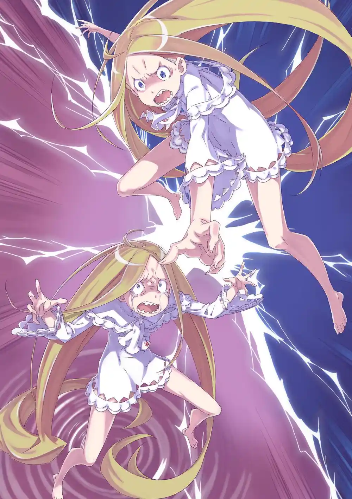

สุบารุเปิดหนังสือคนตายอ่านแล้วได้เห็นความทรงจำตั้งแต่ตอนมาถึงต่างโลกยันความตายลูปแรกสุดที่ตัวเขาคนเก่าถูกปาดท้องตายพร้อมเอมิเลีย พอได้สติกลับมาสุบารุก็เปิดคอร์ ลีโอนิสแล้วเจอเล่มต่อ เขาไล่อ่านหนังสือคนตายจนได้เห็นชีวิตต่างโลกของสุบารุคนเก่าครบทุกลูป

เขาเฝ้าหา "บางอย่าง" ที่เปลี่ยนแปลงสุบารุคนเก่าให้เป็นสุบารุที่ผู้คนรอบตัวเชื่อใจและอยากพึ่งพา แต่กลับไม่เจออยู่เลย "การบอกรักของเรม" ไม่ใช่ "กำปั้นเตือนสติของออตโต้" ไม่ใช่ "การที่เขาได้บอกรักเอมิเลีย" ไม่ใช่ "การที่เขาได้บอกลาพ่อแม่" ก็ยังไม่ใช่

"บอกชั้นมานะ [นัตสึกิ สุบารุ] อะไรกันที่เปลี่ยนนายไป! อะไรที่ทำให้นายพิเศษ มันต้องมีอะไรซักอย่างสิ! ต้องมีอะไรที่ทำให้นายต่างจากตัวชั้นที่อ่อนแอและน่าสมเพช!"

รู้ตัวอีกทีตัวเขาก็เข้ามาอยู่ในห้องโถงแห่งความทรงจำอีกครั้งและที่นั่นก็มี "สุบารุ" คนเก่ารออยู่

"สุบารุ": ว่าไงตัวชั้นอีกคนนึง

สุบารุ: "นัตสึกิ สุบารุ" ทำไมนายถึงมาอยู่ที่นี่!?

"สุบารุ": --นี่คือหลักฐานว่านายตามทันทุกอย่างแล้ว ชีวิตต่างโลกของชั้น ทุกอย่างที่นายไม่เคยรู้ก่อนหน้านี้ นายได้สัมผัสมันผ่าน "หนังสือคนตาย" หมดแล้ว

สุบารุปฏิเสธความจริง เขาไม่อยากยอมรับว่าได้รู้ทุกอย่างแล้ว เขานึกว่า "สุบารุ" ที่ทุกคนเชื่อใจจะต้องเก่งกล้ากว่านี้ มีพลังมากกว่านี้ "สุบารุ" ตรงหน้าเขานี้ต้องเป็นรุยปลอมตัวมาแน่ๆ ....แต่สุดท้ายเขาก็รู้ตัวว่ากำลังปฏิเสธความจริง

สุดท้ายเขาก็ต้องยอมรับว่าสาเหตุที่ "สุบารุ" ไม่ยอมแพ้เสียทีเพราะว่าเขารักเพื่อนพ้องทุกคน หลังโดนเรมให้กำลังใจ หลังโดนออตโต้ต่อย หลังได้รับรู้ความรักของพ่อแม่ มีเหรอที่เขาจะยอมแพ้? เขารักเอมิเลีย อยากอยู่เคียงกายเธอ อยากปกป้องเธอ เขาอยากอวดเด็กสาวผู้กลัวความเกลียดชังคนนี้ให้โลกรู้ว่าเธอน่ารักขนาดไหน เขาอยากทำให้เบียทริซมีความสุขให้มากเท่าช่วงเวลาที่เธอเคยเจ็บปวด

สุบารุ: "นัตสึกิ สุบารุ" นายนี่มันอ่อนแอ กระจอก โง่เง่าเหลื่อเชื่อจริงๆ

"สุบารุ": ก็ไม่ผิดหรอก

สุบารุ: แต่ว่า.... นายนี่ก็สุดยอดไปเลยนะ "นัตสึกิ สุบารุ"

สุบารุที่มองโลกในแง่ลบและเกลียดชังตัวเองยิ่งกว่าใครสารภาพจากใจจริงเป็นครั้งแรกว่าตัวเขาเองที่ได้เห็นผ่านหนังสือคนตายนั้นเป็นคนที่สุดยอดขนาดไหน

"สุบารุ" คนเก่าบอกว่าหนังสือคนตายของนัตสึกิ สุบารุนี้เป็นจุดเชื่อมเดียวที่ทำให้พวกเขาทั้งคู่มาเจอกันได้ ในเมื่อโอกาสได้กลับมาเจอกันไม่น่าจะหาง่ายๆเขาเลยอยากลองรวมความทรงจำของสุบารุทั้งสองเป็นหนึ่งเดียวดู เนื่องจากฝ่ายใดฝ่ายหนึ่งอาจจะต้องหายไปจากผลลัพธ์นี้ ทั้งสองจึงพูดความในใจทุกอย่างออกมาให้ไม่เหลืออะไรติดค้าง

สุบารุ: ก่อนอื่นก็เมลี่ เธออาจจะเป็นเหมือนระเบิดเวลาแต่ถ้าได้คุยกันก็จะเข้าใจ คุยกับเธอให้มากๆนะ // "สุบารุ": อื้ม ได้สิ

สุบารุ: แมงป่องยักษ์ที่อยู่ข้างนอกนั่น เธอคือชอล่าล่ะ เธอไม่ได้อาละวาดเพราะอยากทำ.... ช่วยเธอให้ได้ด้วยล่ะ // "สุบารุ": อื้ม ได้สิ

สุบารุ: เกือบลืมไปเลย ตอนเจอรุยชั้นได้เรมช่วยไว้ด้วยล่ะ ตอนนั้นชั้นยังจำเธอไม่ได้เลย ....แต่สมกับเป็นเรมของชั้นจริงๆเลยนะ // "สุบารุ" : เรมของชั้นโว้ย

สุบารุ: แรมบอกว่าพอหิมะละลายสิ่งที่ซ่อนไว้ก็โผล่ออกมาให้เห็นล่ะ...สมกับเป็นเธอจริงๆ // "สุบารุ": อื้ม จริงด้วยนะ

สุบารุ: ส่วนยุลิอุส เจ้าหมอนั่น.... คงไม่ต้องพูดอะไรก็ได้จริงไหม? หมอนั่นไว้ใจได้อยู่แล้ว ไม่ต้องบอกอะไรเพิ่มหรอก // "สุบารุ": อื้ม เห็นด้วยเลย

สุบารุ: ขอบคุณนะที่ขอโทษคุณพ่อกับคุณแม่ // "สุบารุ": อ่าฮะ

สุบารุ: ขอบคุณที่ช่วยออตโต้กับการ์ฟีลไว้นะ // "สุบารุ": อื้ม

สุบารุ: ขอบคุณที่ช่วยเพทร่า เฟรเดริก้าและทุกคนจากหมู่บ้านอารัมไว้ // "สุบารุ": อื้ม

สุบารุ: ขอบคุณที่พาเบียทริซออกมาและคอยจับมือเธอไว้ // "สุบารุ": ....

สุบารุ: เอมิเลีย.... ขอบคุณที่ตกหลุมรักเอมิเลียนะ ชั้นเองก็รักเธอมาก รักเธอที่สุดเลยล่ะ // "สุบารุ": อื้ม ชั้นเข้าใจดี

สุบารุ: นัตสึกิ สุบารุ ชั้นรู้ดีว่านายเป็นคนที่สุดยอดมาก ถ้าเป็นนายจะต้องไม่เป็นไรแน่ ถ้าเป็น "พวกเรา" จะต้องไม่เป็นไรแน่ // "สุบารุ": อื้ม ดูเหมือนว่าเวลาพักร้อนของชั้นจะหมดลงแล้วสินะ

หลังทั้งสองจับมือกัน การรวมความทรงจำเป็นหนึ่งก็เสร็จสมบูรณ์ ที่แห่งนั้นเหลือสุบารุยืนอยู่แค่คนเดียวและจุดที่สุบารุความจำเสื่อมเคยยืนอยู่ก็มี "รุย อาร์เน็บ" ล้มอยู่แทน

สุบารุ: เป็นไงล่ะ ได้เห็นสิ่งที่แกอยากเห็นหรือยัง? รุย อาร์เน็บ

ความจริงแล้วเมื่อคืนก่อนที่สุบารุคนเก่าเข้ามาเจอรุยนั้นเขาพลาดท่าถูกรุยกินความทรงจำเข้าไป แต่สุบารุกลับต้านทานอำนาจได้ หลังถูกกินเขาไม่ได้เสียความทรงจำ รุยเลยคิดแผนใหม่ขึ้นมา เธอกักวิญญาณของสุบารุคนเก่าไว้ที่ห้องโถงแห่งความทรงจำนี้ แล้วแบ่งร่างตัวเองเป็นสองด้วยการแบ่งครึ่งปัจจัยแม่มดตะกละของเธอและแอบฝังส่วนหนึ่งไว้ในร่างกายของสุบารุเพื่อทดแทนวิญญาณของเขา

สุบารุที่ถูกปัจจัยแม่มดของรุยสิงอยู่เลยกลายเป็นสุบารุความจำเสื่อม ครึ่งหนึ่งของรุยที่แอบมาสิงเขานั้นก็มารับรู้ประสบการณ์ร่วมกันและแทรกแซงยึดร่างเป็นบางครั้ง อย่างเช่นตอนที่บีบคอฆ่าเมลี่และขีดเขียนกำแพง นั่นคือฝีมือรุยทั้งหมด และนี่คือสาเหตุที่ประตูเปิดได้ 4 บานตอนสุบารุเข้าไปที่อุโมงค์ใต้ดิน

รุย อาร์เน็บทำอย่างนี้ไปเพราะว่าเธอ "อยากมีความสุข" เธอกำเนิดมาในโอโด ลากูน่าไม่มีร่างกายของตัวเองอย่างพี่ชายทั้งสอง เธอจึงพยายามตามหาชีวิตที่ดีที่สุด แต่ไม่ว่าพี่ชายทั้งสองจะแข่งกันหาความทรงจำมาโอ๋น้องสาวขนาดไหน หรือเธอจะลองสิงร่างพี่ชายเป็นครั้งคราวก็ยังหาความสุขที่แท้จริงไม่เจอเสียที

พอได้เจอกับสุบารุที่รู้จักผ่านความทรงจำของเรมนั้นเธอถึงถูกใจความแปลกใหม่ของเขา รุยโยนความทรงจำของเรมที่คลั่งสุบารุจนน่ารำคาญทิ้ง และคิดแผนการยึดครองสุบารุกับอำนาจ "ตายแล้วกลับมา" มาเป็นของเธอเอง พลังที่เปลี่ยนแปลงชะตากรรมได้ตามใจชอบนั้นช่างวิเศษและตรงกับอุดมคติ "ชีวิตที่ดีสุด" ของรุย ถึงสุบารุจะเตือนว่าพลังนี้ไม่ได้ดีขนาดนั้น รุยก็มองว่าเขาแค่พูดไร้สาระแบบขี้แพ้ชวนตี

ตามแผนการ ครึ่งหนึ่งของเธอจะรวมเป็นหนึ่งเดียวกับเขาและค่อยๆแย่งชิงตัวตนมาจากภายใน แล้วพอสุบารุกลายเป็นคนใหม่แล้วกลับมาที่นี่ รุยอีกครึ่งที่เหลือที่รออยู่ก็จะกลืนกินสุบารุคนใหม่อีกรอบ แต่แผนก็ล้มเหลวเพราะความทรงจำของเรมที่โยนทิ้งไปมาขัดก่อน

และตอนนี้พอได้สัมผัสประสบการณ์ความตายร่วมกับสุบารุความจำเสื่อมไปต่อเนื่อง 15 รอบรวมกับอ่านหนังสือคนตายของ "สุบารุ" คนเก่าไปอีก 20 กว่าเล่มรุย อาร์เน็บก็สติแตก เธอไม่เคยคิดมาก่อนว่าความตายมันจะน่ากลัวและทรมานขนาดนี้

รุย: ม่าาาาาาย!! ไม่อยากตาย ไม่อยากตาย ไม่อยากตาย ไม่อยากตาย ไม่อยากตาย ไม่อยากตาย ไม่เอาแล้ว เกลียด เกลียด เกลียด เกลียดความรู้สึกนี้ คนที่ทนมันได้ไม่ใช่มนุษย์แล้ว สัตว์ประหลาด! แกเป็นสัตว์ประหลาดชัดๆ!

สุบารุ: ชั้นบอกไปก่อนที่แกจะแย่งร่างชั้นแล้วไง.... ว่า "แกจะได้เสียใจแน่"

รุย อาร์เน็บที่สติแตกไม่คิดจะคืนความทรงจำของเหยื่อให้ เธอกลัวสุบารุสุดขีด รู้ว่าถ้าคืนให้เมื่อไหร่เธอต้องตายแน่ สุบารุไม่คิดจะยกโทษให้และสงสารเธออยู่แล้ว รุยที่กลัวสุดขีดจึงขับไล่สุบารุออกไปกะให้พี่ชายทั้งสองจัดการเขาแทน

หลังสุบารุจากไป "รุยที่ได้สิงสุบารุ" ก็ได้เจอกับอีกครึ่งหนึ่งของเธอ "รุยที่รออยู่ในห้องโถงแห่งความทรงจำ" แต่ตอนนี้รุยคนแรกขี้กลัวจนกลัวกระทั่งตัวเองอีกคน รุยคนที่สองจึงเข้าใจผิดว่ารุยคนแรกอยากเก็บประสบการณ์ "ตายแล้วกลับมา" ไว้คนเดียวไม่ยอมแบ่งให้เธอ

"รุย": นี่คิดจะยึดอำนาจ "ตายแล้วกลับมา" ไว้ใช้คนเดียวเหรอ? ไม่ตลกนะ นั่นมันเครื่องมือที่จะทำให้พวกฉันมีความสุข! ไม่คิดมาก่อนเลยว่าพวกฉันจะถูกหักหลัง!

รุย: เข้าใจผิดแล้ว! เข้าใจผิดแล้ว! พวกเธอไม่เข้าใจพวกฉันเลย! ไม่อยากตาย! ไม่อยากตาย! ไม่อยากตาย! ไม่อยากตาย! ไม่อยากตายแล้ว!

"รุย": อย่ามาโกหกกันหน้าด้านๆ ไม่อยากตายเหรอ? ถ้าไม่ต้องการก็ส่งมันมาให้พวกฉันสิ! นัตสึกิ สุบารุเป็นของพวกฉัน ยัยหัวขโมย! ให้พวกฉันลิ้มลองมั่งสิ!

ท่ามกลางห้องโถงแห่งความทรงจำศึกระหว่างรุยทั้งสองคนก็เริ่มขึ้น ผลลัพธ์ของศึกที่ไร้ความหมายนั้นไม่มีใครทราบได้

