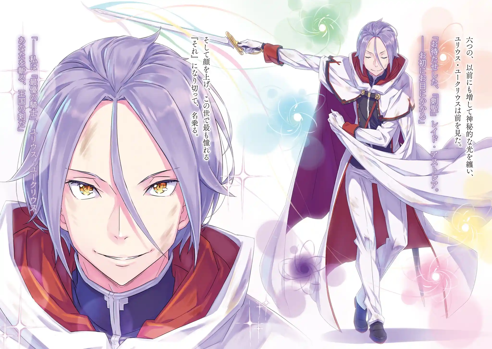
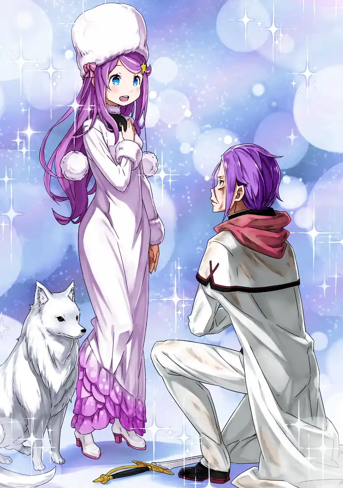

พอกลับมาสู่โลกภายนอกสุบารุตรงดิ่งมาหาว่าที่ภรรยา No.1 ก่อน เอมิเลียที่สู้กับบิชอปไรเพียงลำพังถูกกินชื่อเข้าไปแล้ว เอมิเลียรีบเตือนสุบารุว่าเธอไม่ใช่ศัตรูถึงแม้ว่าเขาอาจจะจำเธอไม่ได้ก็ตาม ไม่ต้องห่วงเธอ ไปที่อื่นได้เลย

สุบารุ : ไม่ต้องห่วงหรอก เอมิเลียตัน ---ชื่อของชั้นคือนัตสึกิ สุบารุ อัศวินหนึ่งเดียวของเอมิเลียตันเองครับ

แค่ถูกเรียกด้วยชื่อเล่นที่คุ้นเคยเป็นสัญญาณว่าความทรงจำของเขากลับมาแล้ว เอมิเลียก็วิ่งเข้ามากอดสุบารุทันที หลังหวานกันแบบไม่เห็นหัวศัตรูสุบารุก็ล่อให้ไรหัวร้อนเข้ามาโจมตีด้วยการพูดถึงรุย เอมิเลียเสริมน้ำแข็งที่ฝ่าเท้าและเตะสวนจนไรฟันหัก แถมยังร่ายเวทน้ำแข็งเข้าซ้ำอีก

ไรฉวยจังหวะหนีไปได้ แต่สุบารุมั่นใจว่าซิสค่อนอย่างเขาจะไม่รีบออกจากหอคอยจนกว่าจะรู้ว่ารุยเป็นตายร้ายดียังไงบ้าง อีกทั้งมีโอกาส 50/50 ที่แม่มดริษยาจะไม่โจมตีในลูปนี้เพราะรุยออกไปจากตัวเขาแล้ว สุบารุจึงวางแผนจะพิชิตหอคอยให้ได้ในคราวเดียว เพราะถ้าหากตายแล้วรีเซ็ตจะยุ่งยากเนื่องจากรุยจะกลับมาอยู่ในตัว

สุบารุเปิดใช้คอร์ ลีโอนิสตามหาพวกพ้องจนเจอเกือบทุกคน (นอกจากเมลี่ เอคิดน่า ชอล่าที่ไปรับมือที่ระเบียงและยุลิอุสที่สู้กับเรดที่ชั้นสองอยู่แล้ว) จากนั้นเขาก็ไล่เรียงอุปสรรค 4 อย่างที่เหลือและแจกแจงหน้าที่

1. เรด แอสเทรียที่แย่งร่างกายรอย อัลฟาร์ดมา => ปล่อยให้ยุลิอุสจัดการ

2. บิชอปไร บาเทนไคทอส => ให้แรมจัดการ (สุบารุจะแบกรับความเสียหายโหมดโอนิให้เธอเต็มที่)

3. ชอล่าร่างแมงป่องยักษ์และฝูงสัตว์ปีศาจ => สุบารุและเบียทริซจะไปช่วยเสริมทัพกับเมลี่

4. บททดสอบที่ชั้น 1 ไมอา => ส่งเอมิเลียขึ้นไปเคลียร์เพื่อแก้ไขกฏของหอคอย

ที่ระเบียงชั้น 4 ชอล่าและเมลี่กำลังรับมือสัตว์ปีศาจที่บินได้กับไต่กำแพงขึ้นมาอยู่ กว่าพวกสุบารุจะมาถึงก็มีคนแหกกฏไปแล้ว ชอล่าขอให้สุบารุสั่งให้เธอตายเหมือนเคย แต่สุบารุขอปฏิเสธโชคชะตา เขาจะไม่ปล่อยให้ 400 ปีที่เดียวดายของชอล่าจบลงตรงนี้

ชอล่า: รักนะคะ....ท่านอาจารย์

หลังคำบอกรักชอล่าก็กลายร่างเป็นแมงป่องยักษ์ เอมิเลียกระโดดถีบชอล่าจนปลิว คอมโบกับเวทมูรัคของเบียทริซและการพลีชีพของสัตว์ปีศาจตุ่นมีปีกที่เมลี่ควบคุม ทั้งสามส่งชอล่าร่วงลงไปทะเลทรายด้านล่างสำเร็จ

เอมิเลียพาเอคิดน่ามุ่งหน้าขึ้นชั้นสอง ส่วนสุบารุ เบียทริซและเมลี่ตัดสินใจเปลี่ยนสนามรบ พวกเขาขี่หลังสัตว์ปีศาจราชันม้าผู้หิวโหยวิ่งไต่กำแพงลงไปยังทะเลทรายเบื้องล่าง แผนการของสุบารุคือการสู้ถ่วงเวลาจนกว่าเอมิเลียจะแก้ไขกฏของหอคอยสำเร็จ นั่นคือการตีความกฏข้อที่ 5 ของเขา "การทำลายการทดสอบไม่ใช่เรื่องต้องห้าม"

ในระหว่างนั้นเองบิชอปไรก็กำลังบ่นว่าเขาใช้พลังของเอมิเลียที่ขโมยมาได้ไม่คุ้มค่า(เพราะเปลืองมานา)อยู่ที่บันไดวนระหว่างชั้น 4 กับชั้น 5 และแรมก็มาดักรอเขาอยู่แล้ว

แรม: ได้ยินว่าแกนี่แหละคือคนที่แย่งชิงความสัมพันธ์พี่น้องระหว่างแรมกับเรมไป ---ช่วยส่งเสียงร้องเหมือนหมูแล้วตายไปให้พ้นหน้าซะ

สนามรบทั้ง 4 แห่งถูกเตรียมไว้พร้อมแล้ว

เอมิเลียอุ้มเอคิดน่าขึ้นมาถึงชั้นสองที่ยุลิอุสกำลังดวลเดือดกับเรดอยู่ เรดใช้ตะเกียบฟันมิติเป็นรูโหว่ เกิดช่องว่างแห่งลมดูดยุลิอุสที่อุตส่าห์โดดหลบกลับเข้ามาในระยะโจมตี แต่ก็ได้เอมิเลียช่วยไว้ด้วยการดร็อปภูเขาน้ำแข็งใส่หัวเรด เวทของเอมิเลียที่ได้บัฟกำลังใจจากสุบารุมาเต็มที่รุนแรงพอจะทำลายตะเกียบแท่งที่เรดยกมาป้องกันเลย

เอมิเลียที่ผ่านการทดสอบที่ 2 ไปแล้วสามารถมุ่งหน้าขึ้นชั้น 1 ได้ฉลุย ยุลิอุสจะเป็นคนจัดการเรดเอง เอคิดน่าเลือกอยู่ให้กำลังใจยุลิอุสแทนที่อนาสตาเซีย เธอหวังจะเป็นกำลังให้เขาอย่างที่สุบารุเป็นกำลังใจให้เอมิเลียฮึดขึ้นมาได้

ยุลิอุสดวลกับเรดที่ใช้แค่ตะเกียบอันเดียวกับมือเปล่า เรดบ่นว่าตราบใดที่ยุลิอุสยังไม่เลิกยึดติดกับวิถีอัศวินก็จะไม่มีวันชนะเขาได้ ยุลิอุสเข้าใจเสียทีว่าที่เรดดูยึดติดกับการสั่งสอนเขาก็คงเป็นเพราะเรดเห็นตัวเองสมัยก่อนในยุลิอุสตอนนี้

ถึงยุลิอุสจะเลิกเป็นอัศวินไร้นามแต่เขาจะไม่มีวันเลิกเป็นอัศวิน เพราะนั่นคืออุดคติที่เขายึดถือ ยุลิอุสที่เลิกเกรงกลัวการถูกลืมเรียกวิญญาณประจำตัวทั้ง 6 ออกมา เขาฉีกสัญญากับพวกวิญญาณทิ้ง จากนั้นก็ขอทำสัญญาใหม่ทันที

พวกวิญญาณตอบตกลงพร้อมเพรียง การสานสัมพันธ์ใหม่อัปเกรดพวกเธอจากระดับวิญญาณเตรียมแปรสภาพขึ้นไปเป็นระดับ "วิญญาณแท้" อัศวินวิญญาณยุลิอุส ยูคริอุสกล่าวแนะนำตัวอีกครั้ง ตอนนี้เขาพร้อมท้าสู้กับเรด แอสเทรียด้วยพลังที่สูงกว่าที่เคยมีมา

ยุลิอุส: ยินดีที่ได้พบนามของกระผมคือยุลิอุส ยูคริอุส "ยอดอัศวิน" ....ดาบศักดิ์สิทธิ์เรด แอสเทรีย ในฐานะดาบแห่งราชอาณาจักรกระผมจะขอปราบคุณลง

"สัญญาครั้งใหม่ของอัศวินวิญญาณ"

พอเห็นยุลิอุสท้าทายแบบนั้นเรดก็ประกาศว่า "ข้าจะทำให้แกร้องไห้เอง ไอ้เด็กขี้มูกโป่ง" เขาทิ้งตะเกียบแล้วหยิบ "ดาบแห่งการคัดเลือก" ที่ปักอยู่บนพื้นขึ้นมาใช้แทน แต่ยุลิอุสไม่หวั่นไหว เขาดีใจที่ได้ดวลดาบกับระดับตำนาน แถมยังคิดว่าจะไปดวลกับไรน์ฮาร์ตหลังจากนี้อีก

ยุลิอุสยิงลำแสงสีรุ้งจากเวท "อัล คลาวเซเรีย" เขาคำนวณล่วงหน้าว่าเรดจะไม่หลบและฟันทิ้งหน้าด้านๆเลยซ่อนตัวหลังลำแสงเข้าประชิด ยุลิอุสคอมโบเวท 6 ธาตุเปลี่ยนสนามรบให้กลายเป็นกลางอากาศ เรดที่ดิ่งเวหาลงมาฟันผ่ามิติเข้าสวน มันเป็นวิชาดาบผ่ามิติที่จะตัดทุกอย่างที่ขวางหน้าให้ขาด

ยุลิอุสรอดตัวมาได้ด้วยแค่แผลเป็นที่แก้ม เขาเคลือบดาบเป็นสีรุ้งด้วยเวท "อัล คลาริสต้า" แล้วฟันสวนจนผ้าปิดตาของเรดขาด เรดไร้บาดแผลจากการแลกดาบนั้นแต่เขายอมรับว่าถ้านี่ยังเป็น "การทดสอบ" อยู่คงให้ยุลิอุสผ่านไปแล้ว แต่ตอนนี้มันกลายเป็นเรื่องส่วนตัวไปแล้ว นี่คือการดวลของนักดาบกับอัศวินจนกว่าจะตายไปข้างนึง

เรดฟันประกายแสงสีขาวออกมา ยุลิอุสเคลือบทั้งร่างเป็นเกราะกำบังสีรุ้งด้วยเวทใหม่ "อัล ครานเวล" ลำแสงสีขาวกับสีรุ้งเข้าปะทะกันอย่างดุเดือด ยุลิอุสทุ่มเทวิชาดาบที่สั่งสมมาทั้งชีวิตเข้าสู้แต่อีกฝ่ายแค่ตะวัดดาบธรรมดา

เอคิดน่า: ยุลิอุส.... ลุยเลยอัศวินของเรา

แต่เสียงเชียร์จากเอคิดน่าที่ได้ยินก็ทำให้เขาไม่ยอมแพ้ แล้วทันใดนั้นแสงสีขาวก็หายไป ดาบของยุลิอุสเลยพุ่งตามโมเมนตั้มเข้าปักทะลุหน้าอกของเรด

ทั่วร่างของเรดเกิดรอยแตกคล้ายแก้วขึ้นมา สุดท้ายร่างกายของบิชอปรอยก็เป็น "ภาชนะ" ที่ไม่ดีพอจะเก็บตัวตนของเรด แอสเทรียไว้ได้นาน ทีแรกยุลิอุสดูจะไม่พอใจกับผลลัพธ์นี้ ดาบของเขาอาจจะไม่มีวันไปถึงถ้าเป็นเรดตัวจริง แต่สุดท้ายเขาก็แสดงความนับถือต่อเรดก่อนจากกัน

เรด: ข้าไม่สนใจคำชมของแกหรอก--- ศึกนี้ข้าชนะนะโว้ย ยุลิอุส

ยุลิอุส: ครับ จนถึงที่สุดแล้ว คุณก็เป็นฝ่ายชนะ เรด แอสเทรีย

เรด: เหอะ! สีหน้าดูดีเชียวนะ ไอ้หมาขี้แพ้

ในที่สุดวีรบุรุษในตำนานก็ยอมจำชื่อเขาเป็นครั้งแรก รอยแตกขยายไปทั่วร่างของเรดจนเขาสลายหายไป เหลือไว้เพียงร่างของรอย อัลฟาร์ดที่นอนสาหัสและหมดสติอยู่

ที่จริงเอคิดน่ารู้สาเหตุที่อนาสตาเซียหมกตัวอยู่ในโอโดของตัวเองไม่ยอมออกมาอยู่แล้ว เนื่องจากโอโดเป็นเหมือนมิติที่แยกออกมา ภายในนั้นแม้แต่อำนาจบาปตะกละก็ไม่มีผล และอนาสตาเซียคือเด็กสาวจอมโลภ เธอถึงไม่อยากจะลืมยุลิอุสอัศวินของเธอ

"อนาสตาเซีย โฮชินกลัวที่จะสูญเสียยุลิอุส ยูคริอุสไป"

เหตุผลมันก็ง่ายๆเพียงนั้นที่เธอปล่อยให้เอคิดน่าใช้ร่างและกลัวโลกภายนอก เอคิดน่าที่เป็นวิญญาณประดิษฐ์ใช้ชีวิตอย่างไร้เป้าหมายมาหลายร้อยปีได้ปณิธานในการใช้ชีวิตใหม่ เธออยากจะเป็นสะพานเชื่อมสัมพันธ์ให้นายบ่าวคู่นี้ใหม่

เอคิดน่า: ถ้ายังเอาแต่แอบอยู่ เธอจะอดดูอัศวินของเธอในช่วงเวลาที่เขาเท่ที่สุดเอานะ

หลังเรดสลายหายไป ยุลิอุสก็เก็บดาบและเดินกลับมา ที่ตรงนั้นมีทั้งร่างกายของอนาสตาเซียและวิญญาณประดิษฐ์รูปร่างจิ้งจอกเคลื่อนไหวอยู่พร้อมกัน ยุลิอุสเข้าใจถึงความหมายของเรื่องนี้ได้ทันที เขาถึงได้คุกเข่าลงต่อหน้าผู้เป็นนาย

ยุลิอุส: ยินดีที่ได้พบขอรับ

อนาสตาเซีย: เราคือ....เราคืออนาสตาเซีย โฮชิน ....เราต้องการทุกสิ่งทุกอย่างในโลกใบนี้ เธอชื่ออะไรเหรอ คุณพี่ชายสุดเท่?

ยุลิอุส: นามของผมคือยุลิอุส ยูคริอุส อัศวินหนึ่งเดียวของคุณ ....คุณอาจจะไปลืมแล้ว แต่ว่าตัวผมได้อุทิศดาบให้แก่คุณ เพื่อคุณแล้วผมจะทำทุกอย่างๆเต็มกำลังเพื่อสนับสนุนอุดมการณ์นั้นให้เป็นจริง

อนาสตาเซีย: จริงเหรอเนี่ย? เราจำไม่ได้จริงๆน่ะแหละ แต่ว่า..... ได้เห็นคุณแค่ครั้งเดียว เราก็คิดไว้แล้ว ว่าต้องทำให้คุณกลายมาเป็นของเราให้ได้

ถึงจะลืมเลือนกันไปแล้ว แต่นายบ่าวก็สานสัมพันธ์ใหม่ขึ้นมา ยุลิอุส ยูคริอุส มอบดาบของตนให้แก่ “ความโลภ” นั้นอีกครั้ง

