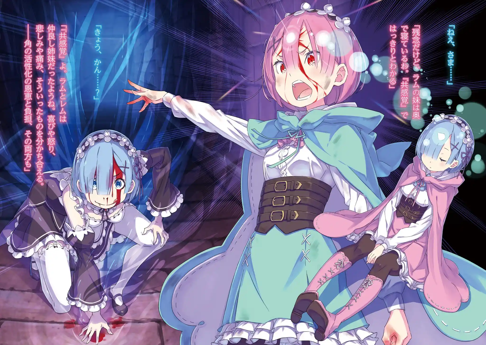
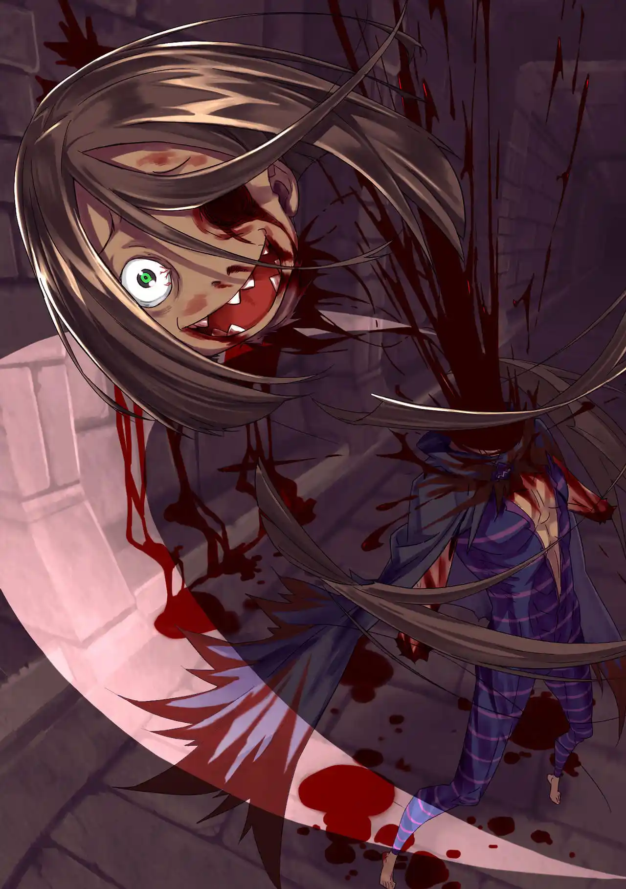

แรมกับไร บาเทนไคทอสดวลเดือดกันอยู่ที่บันไดวน ถึงแรมจะเล็งโจมตีอย่างไร้ปรานี ไรก็หลบได้หมดด้วยความทรงจำของเรม แต่ไรลืมคิดไปถึงไปว่า 1 ปีมานี้แรมเก่งขึ้นกว่าในความทรงจำของเรมแล้ว แถมยังมีคอร์ ลีโอนิสของสุบารุช่วยบัฟอีก ความประมาทนั้นทำให้เขาได้แผลที่แก้มมา 1 แผล

ปกติแล้วแรมที่ใส่ลิมิตที่คล้ายโซตร่วนไว้ในจิตสำนึกไม่ให้ใช้พลังมากเกินไป

> ยามทำงานเป็นสาวใช้ แรมล็อคโซ่ตรวนทุกเส้นไว้แน่นหนา

> ยามฉุกเฉินต้องสู้ แรมสามารถปลดโซ่ตรวนออกขั้นหนึ่งเพื่อใช้เวทมนตร์ได้

> ยามคับขันกว่านั้น แรมสามารถปลดโซ่ตรวนอีกขั้นเพื่อใช้พลัง 20% ได้ (อย่างตอนที่ใช้สู้การ์ฟีลและรอสวาลใน Arc 4)

ถ้าเป็นเมื่อก่อนแรมคงปลดโซ่ตรวนได้แค่สองขั้น แต่ตอนนี้มีการซัพพอร์ทจากสุบารุอยู่ เธอจึงปลดโซ่ตรวนขั้นที่สามออกเป็นครั้งแรกในรอบ 10 ปี แรมหวังว่าสุบารุจะไม่ตายจากการรับแรงสะท้อนนี้

แรมเคลือบทั้งร่างด้วยสายลมแล้วพุ่งเข้าไปหักแขนและต่อยหน้าไรก่อนที่เขาจะทันตั้งตัว ไรงัดวิชาเตะผ่ามิติของชิโนบิคนหนึ่งมาใช้ เขาใช้มันหนีวนไปตามบันไดแต่แรมก็ใช้เนตรพันลี้ดักทางมาเตะสะกัดไว้ได้ ไรร่วงไปชนกับดักผ่ามิติของตัวเอง แถมแรมยังกระทืบซ้ำรัวๆตลอดทาง

ไรยอมงัด "สุริยุปราคา" มาใช้ทั้งที่ไม่ชอบ เขาแปลงเป็นดอร์เคลแล้วโดดข้ามมิติหนีไปตั้งหลัก แรมเจรจาให้คืนความทรงจำของทุกคนมาแล้วจะยอมฆ่าทิ้งแบบสบายๆไม่ทรมาน แต่การเจรจาก็ล้มเหลวแถมไรยังโดดข้ามมิติหนีไปเล็งเรมแทนอีก เพราะเขารู้ว่าแรมต้องถึงขีดจำกัดเร็วๆนี้แน่

ตอนนั้นเองการเชื่อมต่อจากสุบารุก็อ่อนลง ทางนั้นคงเกิดอะไรขึ้นบางอย่างแต่แรมไม่มีทางเลือกนอกจากไล่ตามไรไป เธอแฟลชแบ็คถึงเหตุการณ์ที่หมู่บ้านโอนิถูกโจมตี แรมไม่เคยแคร์พวกโอนิคนอื่นแต่แรกอยู่แล้ว เธอเกลียดพวกผู้ใหญ่ทุกคนที่ยัดเยียดบท "ร่างจุติของเทพโอนิ" มาให้เธอ เรมคือแหล่งยึดเหนี่ยวจิตใจเดียวที่ไม่ทำให้แรมถลำลึกทางนั้นไป

เลือดของเทพโอนิในตัวมันทำให้แรมกระหายการทำลายล้าง ตอนที่เข่นฆ่าพวกลัทธิแม่มดเองเสียงในหัวของเธอมันก็เรียกร้องให้เธอฆ่าเพิ่มอีก แรมถึงได้ยินดีอย่างมากตอนที่เขาของเธอถูกฟันจนขาด การที่เผ่าโอนิล่มสลายและเสียเขาไปไม่ได้ทำให้เธอเสียใจเลย ความสำคัญของคืนนั้นมีเพียงการที่เธอปกป้องเรมไว้ได้และได้เจอกับรอสวาล

พาทรัชช่วยแบกเรมหนีสุดชีวิตจนเจ็บหนักไปหลายแผล ไรแอบเสียดายที่เขากินชื่อมังกรดินไม่ได้เลยตัดใจเตรียมปิดฉากพาทรัชกับเรม แต่ก็โดนแรมโดนถีบขาคู่ขัดไปก่อน จากนั้นแรมก็สั่งให้พาทรัชพาเรมไปซ่อน

การต่อสู้กับแรมเมื่อครู่ทำให้ตัวเขาเติบโตจนใช้สุริยุปราคาได้คล่องแล้ว เขาจึงเลือกแปลงร่างเป็นเรมรอต้อนรับท่านพี่ แต่ร่างแปลงของไรก็ผิดพลาดจนออกมาหน้าตาเหมือนส่วนผสมของมนุษย์หลายๆคน กลายเป็นตัวอัปลักษณ์ที่พูดจาเหมือนเรม แรมที่ทนดูไม่ได้อยากปิดฉากโดยเร็ว

แต่แล้วตอนที่กำลังจะปั่นหน้าอีกฝ่ายให้เละ ใบหน้าและเสียงของไรก็ลอกเลียนเรมได้สมบูรณ์ขึ้นมา ความลังเลทำให้แรมโดนปีศาจที่หน้าตาเหมือนเรมกระหน่ำชกจนยับเยิน

ไร: ร้องไห้สิคะ โมโหสิคะ หัวเราะสิคะ ทรมานสิคะ ยิ้มสิคะ เจ็บปวดสิคะ ทำหน้าบึ้งสิคะ ตื่นเต้นหน่อยสิคะ ประหม่าหน่อยสิคะ หลับสิคะ เขินอายหน่อยสิคะ โกรธเคืองสิคะ ตกใจหน่อยสิคะ หวังดีหน่อยสิคะ

ไร: ท่านพี่ ท่านพี่ ท่านพี่ ท่านพี่ ท่านพี่ ท่านพี่ ท่านพี่ ท่านพี่ ท่านพี่ ท่านพี่ ท่านพี่ ท่านพี่ ท่านพี่ ท่านพี่ ท่านพี่ ท่านพี่ ท่านพี่ ท่านพี่ ท่านพี่ ท่านพี่ ท่านพี่

การซัพพอร์ทจากสุบารุขาดหายไปเพราะเรื่องไม่คาดฝัน พลังของเธอไม่เพียงพอจะต่อกรกับปีศาจตนนี้ เธอเสียใจสุดซึ้งที่ไม่ยอมฆ่าไรตอนที่มีโอกาส แรมโดนเตะทะลุกำแพงเข้าไปเจอพาทรัชกับเรมที่ซ่อนตัวอยู่สุดทางเดิน

แรมรู้สึกย้อนแย้งที่ที่ผ่านมาไม่เคยคิดถึงเขาโอนิเลย แต่ตอนนี้กลับอยากได้มันคืนมา แต่แล้วเธอก็นึกถึงท่านรอสวาลขึ้นมาว่าทำไมเขาต้องอุตส่าห์ตามไปเก็บเขาของเธอมาทำเป็นไม้คทาให้ด้วย กลายเป็นว่าไม้คทาไม่ได้ทำมาจากเขา แต่ "มีเขาซ่อนอยู่ในไม้คทา" ต่างหาก

บิชอปไรที่แปลงร่างเป็นเรมได้อย่างสมบูรณ์เดินฝ่าฝุ่นควันเข้ามาเจอเรมมีเขางอกอยู่ ระหว่างที่ตกใจไรก็โดนแรมซัดหน้าซะปลิวเพราะเธอจะไม่ลังเลอีกแล้ว ตอนนี้สัมผัสเชื่อมระหว่างแฝดของเรมกับแรมตื่นขึ้นมา เรมที่กำเขาของแรมอยู่เปิดโหมดโอนิและแบกรับพลังของพี่สาวแม้จะยังหลับไหล

แรม: สัมผัสเชื่อมของแฝด.... เพราะแรมและเรมเป็นพี่น้องที่ใกล้ชิดกันมาก เราจึงแบ่งปันทั้งความสุขหรือความโกรธ ความเศร้าหรือความเจ็บปวด อะไรจำพวกนั้น.... แม้กระทั่งการใช้งานเขาที่หักไปแล้วและการรับภาระของมันด้วยเช่นกัน

แรม: "ร่างจุติของเทพโอนิ" ถึงแรมจะไม่เคยชอบมันเลย แต่แค่วันนี้เท่านั้นจะยอมรับบทนั้นให้--- ไอ้ตัวปลอมของน้องสาวผู้น่ารักของแรมเอ๋ย คราวนี้แหละจะขอฉีกแกเป็นชิ้นๆ

แรมเข้าใจเสียทีว่าทำไมคืนนั้นรอสวาลถึงช่วยมาทั้งเธอและน้องสาวไว้ รอสวาลต้องการให้เรมรับหน้าที่เขาสำรองของแรมในการฆ่ามังกรแต่แรกแล้ว บางทีการที่แรมจะตระหนักรู้ถึงความลับนี้ระหว่างการเดินทางก็เป็นส่วนหนึ่งในแผนการของรอสวาลเช่นกัน

แรมอารมณ์ดีสุดๆพอคิดว่ารอสวาลเชื่อมั่นในตัวเธอและท้าทายให้บิชอปไรโจมตีเธอก่อน 3 รอบ ไรผสานศิลปะการต่อสู้จากทั่วโลกเข้าด้วยกันเพื่อโจมตี แต่เขาก็ล้มเหลวต่อเนื่องทั้งสามรอบ แรมในตอนนี้แข็งแกร่งถึงเพียงนั้นแล้ว

ระหว่างที่กระทืบบิชอปไร แรมก็หวนคิดว่าเธอได้ไอเดียการใช้สัมผัสเชื่อมของแฝดมาจากคอร์ ลีโอนิสของสุบารุ เธอเคยอ่านทฤษฎีจากหนังสือในคลังต้องห้ามว่าแฝดจากครรถ์มารดาเดียวกันอาจจะเกิดมามีโอโดเชื่อมต่อกันได้ เป็นที่มาของสัมผัสเชื่อมนี้

ไรพยายามใช้วิชาโดดข้ามมิติเข้าสู้แต่แรมก็ดักทางด้วยเนตรพันลี้และหักนิ้วมือของเขาทิ้งหมดมือ และถึงจะสวมใบหน้าของเรมอยู่แต่แรมก็ใช้ดาบสายลมปั่นใบหน้าของน้องสาวตัวปลอมให้เละได้อย่างไม่ลังเล

จะแข่งความเร็วก็แพ้ จะแข่งพละกำลังก็แพ้ แม้แต่จะเน้นป้องกันอย่างเดียวแรมก็ยังอัดผิวหนังแสนทนทานของไรจนแหลกเละได้ จะใช้ความสามารถของเหยื่อคนไหนก็ไม่อาจจะวัดกับเทพโอนิได้ ในที่สุดไรก็กลับคืนร่างดั้งเดิมในสภาพยับเยิน

ไรเหมือนจะยอมแพ้และขอร้องว่าอย่าทำอะไรน้องสาวเขา แต่พอเห็นแรมลังเลเขาก็ใช้ช่องว่างนั้นโดดข้ามมิติหนีไป ไรรู้ตัวดีว่าสู้แรมไม่ได้ เขาอยากหนีไปเตรียมความพร้อมมากกว่านี้ แรมเป็นเหยื่อที่วิเศษที่สุดที่ไรเคยเจอมาจนเขาตกหลุมรัก ทั้งขั้นว่าเหยื่อที่ผ่านมากลายเป็นอาหารขยะถ้าเทียบกับแรม

ไร: อยากกินสิ่งนั้น... อยากกิน อยากกิน อยากกิน อยากกิน อยากกิน อยากกิน ....รักนะ รักนะ ใช่แล้ว! รักนะ! ท่านพี่ ไม่สิ แรม! พวกเรารักเธอ--

แต่หนีไปได้ไม่ไกลบิชอปไรก็ไปติดกับดักดาบสายลมที่แรมสร้างดักทางไว้เพราะเธอใช้เนตรพันลี้ดูผ่านตาขวาข้างเดียวที่เขาเหลืออยู่ ไรตัดสินใจใช้ช่วงเวลาสุดท้ายของชีวิตเพื่อบอกรัก เขาทำลายแขนสองข้างทิ้งแล้วใช้มันเขียนกำแพงบอกรักแรมและให้เธอดูคำที่เขาเขียนผ่านเนตรพันลี้

ไร: ความรู้สึกของเรา จงรับไป! มองดูความปรารถนาของเราซะสิ! อา รักนะ--

บิชอปไร บาเทนไคทอสจบชีวิตลงด้วยการถูกดาบสายลมของแรมตัดคอขาดกระจุย

แรมได้เห็นพฤติกรรมประหลาดของบิชอปตั้งแต่ต้นจนจบ แต่เธอไม่สนใจคำบอกรักของคนบ้าอย่างนั้น แรมเดินมาดูอาการของเรมที่ต้องแบกรับโหมดเทพโอนิให้เธอ เพราะสัมผัสเชื่อมของแฝดแรมเลยมั่นใจกว่าที่ผ่านมาว่าเรมคือน้องสาวของเธอ เมื่อเรมฟื้นขึ้นมาเธออยากจะเติมเต็มช่วงเวลาที่ขาดหายไปร่วมกัน

แรม: พี่รักเธอนะ เรม