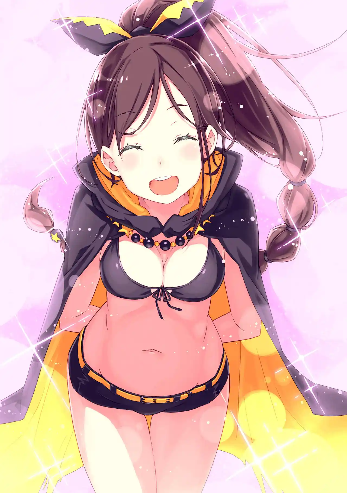
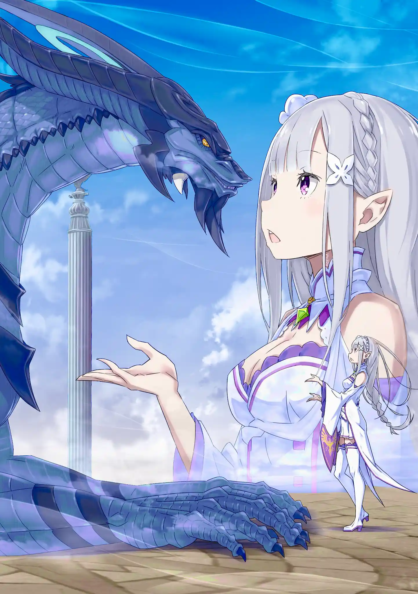

ทางพวกสุบารุเน้นการสู้ถ่วงเวลากับแมงป่องยักษ์ด้วยฝูงสัตว์ปีศาจของเมลี่ การแบกรับภาระของแรมทำให้สุบารุเหนื่อยล้า แถมตอนเอมิเลียขึ้นไปชั้นไมอาการเชื่อมต่อก็ขาดหายไปจนเขาใจหาย สุบารุถามเมลี่ว่าจบศึกนี้มาเป็นลูกสาวเขาไหม (ปักเดธแฟล็กให้น้องอีก)

ระหว่างที่ใช้พรควบคุมสัตว์ปีศาจจนเหนื่อยล้าเมลี่ก็คิดขึ้นมาว่าตั้งแต่มาที่หอคอยนี้เธอทำตัวไม่สมกับเป็นตัวเองเลย เธอเคยเป็นนักฆ่าที่ทำเป็นแต่เชื่อฟังคำสั่ง แต่เธอกลับอยากตามหาหนังสือคนตายของเอลซ่าด้วยความตั้งใจของตัวเอง แถมตอนนี้เธอก็อยากทำผลงานน่าพึงพอใจให้พวกสุบารุเห็นอีก

เมลี่ใช้หนอนทรายยักษ์เป็นเหยื่อล่อแล้วเรียกกาบาโอสามตัวขึ้นมารุมแทงชอล่าด้วยหอกเพลิง แต่ตอนนั้นเองชอล่าก็เปลี่ยนเข้า "โหมดดุร้าย" สีเปลือกของแมงป่องเปลี่ยนจากสีดำเป็นสีแดงเลือด กระสุนลำแสงของชอล่าเป่ากาบาโอสามตัวจนระเหย ลูกหลงของกระสุนสร้างคลื่นกระแทกมาโดนหลังของเมลี่จนเธอตกอยู่ในสภาพปางตาย

สุบารุตัดการแบกรับโหมดโอนิจากแรมเพื่อมาช่วยแบ่งเบาบาดแผลให้เมลี่แทน พอไม่มีเมลี่คอยควบคุม ฝูงสัตว์ปีศาจก็ไม่นับทั้งสามเป็นพวก สุบารุต้องคอยอุ้มเมลี่หนี เขาดูดเลือดในลำคอออกให้เธอกลับมาหายใจได้ เบียทริซเริ่มทำการร่ายเวทรักษาแล้วบอกสุบารุว่าไม่ว่าเขามีแผนอะไรเธอก็พร้อมช่วยเต็มที่

สุบารุจึงเปิดโหมด "เซคันด์ชิฟต์" ของคอร์ ลีโอนิส เขาแบ่งความเจ็บปวดของเมลี่ไปให้เบียทริซช่วยแบกรับ จากหารสองเป็นหารสาม จากนั้นก็ร่ายเวท EMM เพื่อตั้งรับกระสุนแสงของชอล่า แต่เพราะร่ายทั้ง EMM กับเวทฮีลมันเปลืองมานามาก พวกเขาจึงต้องปลด EMM ออกแล้วหาจังหวะวิ่งหนี

เขางัดทุกอย่างที่มีมาใช้ทั้งเรียกแม่มดเพื่อให้กลิ่นสาบล่อฝูงสัตว์ปีศาจไปตีกับชอล่าและใช้เวท EMT ป้องกันกระสุนแต่มันก็ยังไม่พอ สุบารุคิดถึงเวทบทที่สามก็ยังไม่สมบูรณ์ มันมีความเสี่ยงที่ถ้าหากใช้แล้วพลาดขึ้นมา พวกเขาได้ติดอยู่ในพื้นที่จินตภาพแน่ๆ ตอนที่สิ้นหวังอยู่นั้นเองยุลิอุสก็โผล่มาช่วย

เบียทริซยืม "คูอา" วิญญาณธาตุน้ำของยุลิอุสมาช่วยฮีลเมลี่ จากนั้นสองอัศวินวิญญาณก็ยืนประจันหน้ากับแมงป่องสีเลือดชอล่าและฝูงสัตว์ปีศาจ นั่นเป็นจังหวะเดียวกับที่สุบารุสัมผัสได้ว่าสัญญาณของแรมขาดหายไป (เพราะแรมขึ้นไปชั้นไมอาเหมือนเอมิเลีย)

หลังเอมิเลียเคลียร์การทดสอบชั้นไมอาไป พายุทรายก็โหมกระหน่ำจนชอล่าล้มหงายหลังไป สัตว์ปีศาจทั้งหลายก็ยืนเรียงรายไม่เข้ามาโจมตีอีกต่อไป กฏควรจะถูกแก้ไขแล้ว ชอล่าควรจะเป็นอิสระไปแล้วจากที่สุบารุคิดไว้ แต่เธอกลับยังไม่คืนร่างและเข้ามาโจมตีพวกเขาต่อ

สำหรับสุบารุ ชอล่าก็เหมือนเบียทริซ เธอถูกฟลูเกลทิ้งให้เดียวดายที่หอคอยนี้ถึง 400 ปี เขาถึงอยากช่วยเธอให้เป็นอิสระ การรักษาเมลี่เสร็จสิ้นแล้วยุลิอุสเลยเรียกรวมวิญญาณทั้ง 6 แล้วเข้าไปลุยแนวหน้า ดาบของเขาผ่าทะลุเกราะหนาของชอล่าได้ แถมยังเคลือบร่างด้วยเกราะสีรุ้งกันกระสุนได้สบาย

ชอล่าเร่งความร้อนในตัวฉาบก้ามเป็นสีแดงเดือดจนเกิดเป็นไอร้อนมัวๆขึ้นมา เธอพุ่งผ่านยุลิอุสเข้ามาเล็งสุบารุกับเบียทริซที่คอยสนับสนุนระยะไกลแทน สุบารุเลยเกี่ยวแส้ที่หางแล้วโหนหนีด้วยเวทมูรัคของเบียทริซ ชอล่ากับยุลิอุสเข้าปะทะกันอย่างสูสี แต่ถ้าปิดฉากไม่ได้เสียทียุลิอุสคงเป็นฝ่ายแพ้

สุบารุตัดสินใจใช้ไพ่ที่มีอยู่ทุกใบเพื่อพิชิตชอล่า เขาเหวี่ยงแส้ไปเกี่ยวหางเธอแล้วให้เบียทริซร่ายเวท "เอล วีต้า" เพิ่มแรงโน้มถ่วงให้เขาหนักขึ้น และด้วยคอร์ ลีโอนิส เซคันด์ชิฟต์ สุบารุให้มังกรดินโจเซฟเพื่อนพ้องคนสุดท้ายช่วยแบกรับอาการบาดเจ็บแทนเมลี่จนเธอลุกขึ้นสู้ต่อได้ ฝูงสัตว์ปีศาจเข้ามาช่วยสุบารุในศึกชักเย่อกับแมงป่องยักษ์

สุบารุ: จบแค่นี้แหละ เธอแพ้แล้วชอล่า!

พอชอล่าถูกยกจนขาหน้าลอย ยุลิอุสก็เข้าไปตัดหางและทำลายก้ามทั้งสองข้างทิ้ง สัตว์ปีศาจเข้ามาตรึงขาของชอล่าที่หงายหลังล้มลง เมลี่พยายามคุยกับชอล่าที่อ่อนแอจนเธอกลับมาพูดจาได้

แต่มันก็สูญเปล่าอยู่ดี ร่างกายของชอล่าค่อยๆสลายเป็นฝุ่นไป เบียทริซมองว่าคงเป็นเพราะเธอหมดหน้าที่ในฐานะผู้คุมกฏของหอคอยแล้ว สุบารุได้แต่โทษตัวเองและกอดส่วนหัวของแมงป่องยักษ์จนกลั้นน้ำตาไว้ไม่อยู่

สุบารุ: ชอล่า...

ชอล่า: ว่าไงคะ ท่านอาจารย์?

สุบารุ: ชอล่า... ชอล่า... ชอล่า...

ชอล่า: เรียกฉันเหรอคะ ท่านอาจารย์?

สุบารุ: ชอล่า...ชอล่า...

ชอล่า: โธ่ ท่านอาจารย์รักฉันขนาดนั้นเลยเหรอคะ นี่ฉันเผลอไปทำอะไรเข้ารึเปล่าเนี่ย?

สุบารุนั่งอยู่อย่างเดียวดายบนผืนทราย เมื่อเขาหลับตาลงเขาได้ยินเสียงตอบกลับของเธอ แต่ว่าร่างของชอล่าไม่ได้อยู่ตรงนั้นแล้ว.... สิ่งเดียวที่ผุดขึ้นมาจากกองฝุ่นสีดำบนผืนทรายก็คือสัตว์ปีศาจแมงป่องน้อยสีแดงตัวเท่าฝ่ามือ

สุบารุ: ยัยบ้าเอ๊ย...

"400 ปีน่ะก็ไม่ต่างกับวันมะรืนหรอกค่ะ"

"แม้แต่ช่วงเวลาที่รออยู่ฉันก็ยังรักนะคะ"

"ท่านอาจารย์คะ ซักวันหนึ่ง ไว้เจอกันใหม่นะคะ"

"คราวนี้น่ะ ถึงตาท่านอาจารย์เป็นคนรอฉันบ้างนะคะ ขอฉันลองเป็นผู้หญิงที่ถูกท่านอาจารย์ไล่ตามบ้าง”

"เจอกันครั้งหน้าก็อย่าลืมนะคะ"

"รักนะคะ ท่านอาจารย์"

.

สุดท้ายสุบารุก็ปกป้องชอล่าไว้ไม่ได้ แถมเมลี่ยังบอกว่าแมงป่องน้อยตัวนั้นเป็นสัตว์ปีศาจธรรมดาไม่ใช่ชอล่า สาเหตุที่เขาไม่ยอมรีเซ็ตใหม่ก็เพราะในตอนท้ายชอล่าไม่ได้ร้องขอให้ช่วย แต่เธอมั่นใจว่าพวกเขาจะได้เจอกันอีก

แมงป่องน้อยหนีบหูสุบารุจนเลือดไหล เมลี่เลยอาสาเอามาเลี้ยงเอง (วางไว้บนหัวด้วย น่ารักดี) พอเอมิเลียตามมาสมทบสุบารุก็สังเกตว่าทุกคนจำเธอได้แล้วเลยถามว่ามีใครจำเรมได้หรือยัง? แต่ว่าทั้งเรมและยุลิอุสก็ยังถูกทุกคนลืมอยู่ดี

ยุลิอุสพาทุกคนกลับไปดูที่รถลากมังกร เขาจับเป็นบิชอปรอย อัลฟาร์ดไว้ด้วยเวทผนึกมารแบบเดียวกับที่ใช้ผนึกซาเทล่า มันเป็นเวทชามัคประเภทหนึ่งจะแยกสติของผู้ถูกผนึกออกจากร่างตลอดเวลา

สุบารุใจร้อนถามว่าจะเก็บรอยไว้เป็นๆทำไม แต่เสียงส่วนใหญ่เห็นตรงกันว่าถ้าฆ่ารอยไปพวกเขาอาจเสียแหล่งข้อมูลในการช่วยเหยื่อตะกละไปตลอดกาล ทุกคนห้ามไม่ให้สุบารุอ่านหนังสือคนตายของบิชอปตะกละด้วย เดี๋ยวถูกแย่งตัวตนไปอีก ฝ่ายอนาสตาเซียอาสารับหน้าที่ควบคุมตัวรอยไปสอบปากคำที่เมืองหลวงเอง

สุบารุเหนื่อยล้าทั้งกายและใจจนถึงขีดจำกัด ก่อนจะหมดสติไปเอมิเลียเข้ามากอดและบอกให้เขาพักผ่อนเสีย หลังตื่นขึ้นมาเธอมีเรื่องอยากบอกเขาเต็มไปหมด เอมิเลียพาสุบารุไปพักที่ห้องเขียวและพาคนที่ว่างขึ้นไปพบวอลคานิก้า

ทุกคนแตกตื่นกันหมดที่ได้เจอวอลคานิก้าโดยเฉพาะยุลิอุสที่เก็บความแฟนบอยไว้ไม่อยู่ แต่ก็ต้องผิดหวังที่วอลคานิก้ากลายเป็นตาแก่เลอะเลือนพูดได้แค่สองประโยค แต่เบียทริซที่เป็นวิญญาณมองออกว่าสาเหตุจริงๆคือ "วิญญาณของวอลคานิก้ามันว่างเปล่าอยู่ถึง 90%"

เอมิเลียรู้สึกขนลุกที่เธอสู้กับมังกรเทพในสภาพเหมือนคนละเมอไปแทบตาย จากนั้นเธอก็ดีใจว่าถ้ามีเลือดของวอลคานิก้าเธอก็ช่วยพี่น้องเอลฟ์ในป่าได้แล้วสิ แต่เบียทริซอธิบายเสริมว่าเลือดมังกรที่เก็บอยู่ในปราสาทราชวงศ์นั้นเป็น "เลือดจากหัวใจมังกรที่ตายไปแล้ว"

"โลหิตที่ไหลออกมาจากเสียงเต้นหัวใจสุดท้ายถูกบรรจุลงภาชนะเป็นเลือดหัวใจมังกร มันคือเลือดมังกรที่แท้จริงที่ถูกเก็บไว้ในปราสาทเพื่อเป็นหลักฐานของสนธิสัญญาระหว่างมนุษย์และมังกร"

นั่นคือความรู้ที่เบียทริซได้มาจากบันทึกของแม่มดเอคิดน่า มันทำให้เกิดคำถามว่าหากไม่ใช่เลือดวอลคานิก้าแล้ว เลือดมังกรในปราสาทเป็นของใคร?

แต่อย่างน้อยทุกอย่างก็ไม่สูญเปล่า เลือดที่ขอจากวอลคานิก้านิดเดียวน่าจะเพียงพอในการช่วยเหยื่อของบาปราคะได้แล้ว แต่พอเอมิเลียกำลังจะขอร้องวอลคานิก้านั่นเอง เขาและเธอก็รับรู้ได้ถึงการบุกรุกจากทางทิศตะวันออก ที่ตั้งของศาลเจ้าผนึกแม่มดริษยา