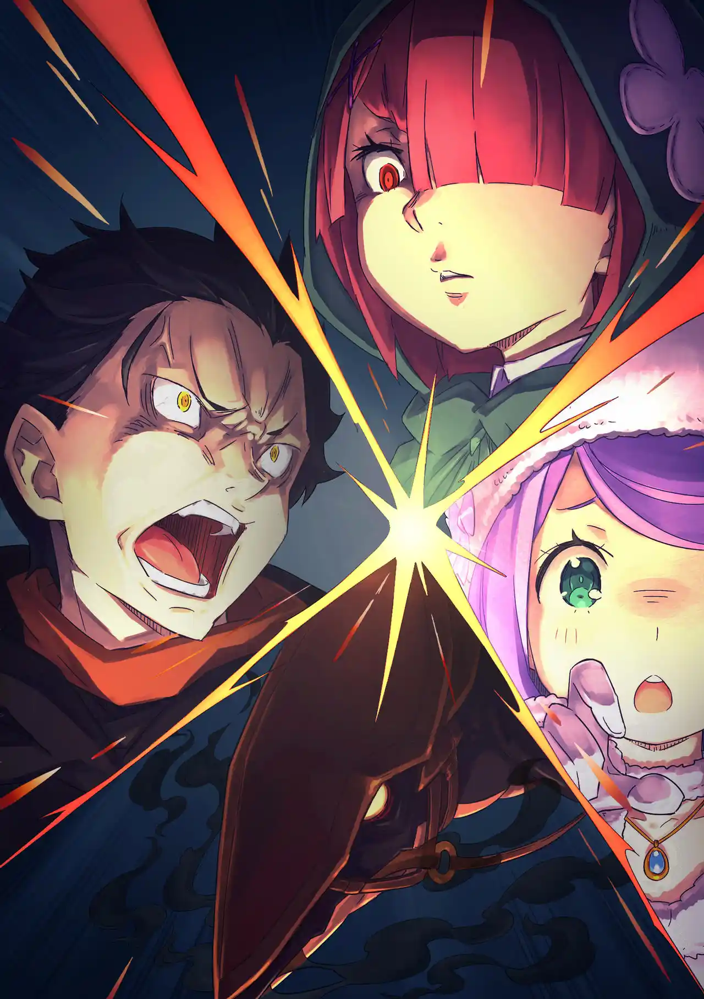
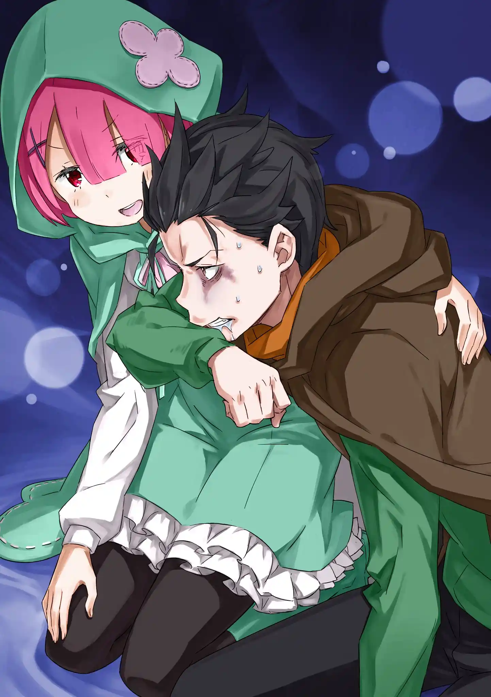

สุบารุตายแล้วกลับมาโดยที่เขายังไม่ทันเข้าใจว่าโดนอะไรตาย พอได้สติเขาก็ได้ยินเมลี่ทำเสียง "จุ๊ๆๆ" บวกกับกลิ่นหอมชวนคลื่นไส้ของดอกไม้ จุดเซฟอยู่ที่ทุ่งของหมีดอกไม้เมื่อไม่กี่นาทีก่อนนั่นเอง

สมองสุบารุประมวลไม่ทันว่าควรจะทำอะไรดี พอเขาจะเรียกยุลิอุส โจเซฟก็ส่งเสียงร้องเพราะทนความกดดันไม่ไหวอีกครั้ง เหตุการณ์ดำเนินเป็นแบบเดิมเหมือนเล่นหนังแผ่นซ้ำ

ถ้าเป็นแบบนี้ต่อไปพวกสุบารุจะตายฟรีแบบรอบก่อน แต่จุดเซฟมันก็ใกล้จนโหดร้าย เขาไม่มีเวลาคิดแผนรับมือเลย สุบารุเตือนให้แรมห้ามเข้าใกล้หอคอยและตัดสินใจสั่งให้ถอยกลับ คำพูดของเขาไม่มีมูลแรมเลยลังเล แต่ก็ได้เอมิเลียช่วยย้ำว่าให้เชื่อใจสุบารุ

แรมดริฟต์รถลากมังกรกลับขบวนโดยมีเอมิเลียสร้างทางน้ำแข็งช่วยให้ความเร็วไม่ตก ตอนนั้นเองร่างของหนอนทรายยักษ์ก็ถูกกระสุนแสงยิงแหกจนล้มมาคั่นกลาง แยกสุบารุกับเบียทริซบนหลังพาทรัชออกจากคนอื่น

สุบารุฟาดแส้สะกัดฝูงหมีที่กรูเข้ามาแล้วสั่งให้เบียทริซใช้มูรัคลดแรงโน้มถ่วงช่วยพาทรัชโดดข้ามหัวฝูงหมี แต่จังหวะเดียวกันนั้นกระสุนแสงก็กระหน่ำลงมาจากหอคอย พาทรัชถูกหมีข่วนจนเจ็บหนัก เธอล้มกองทันทีที่ลงจอด

เบียทริซใช้เวท "เอล ชามัค" สร้างหมอกดำมาขวางพวกเขาไว้ แต่ตอนที่ดูอาการพาทรัชอยู่กระสุนแสงก็เจาะหมอกดำเข้ามา ทะลุกระทั่งเวทโล่สะท้อนของเบียทริซ กระสุนปะทะเข้ากับหน้าท้องซีกขวาของสุบารุจนเขากระเด็น

เบียทริซ: สุบารุ! สุบารุไม่นะ...! ห้ามตายนะ....ห้ามตาย....อย่าทิ้งเบ็ตตี้ไว้คนเดียว....ฮือ ไม่นะ....

ก่อนตายเขาเหลือบไปเห็นศพของพาทรัชมีเข็มสีขาวปักอยู่ ร่างกายของเขาก็คงโดนอย่างเดียวกัน เบียทริซร้องไห้สะอึกสะอื้น สุบารุอยากปลอบเธอแต่ร่างขยับไม่ได้

เขาเลยใช้อินวิซิเบิล โพรวิเดนซ์ปาดน้ำตาให้เธอ ตอนนั้นเองกระสุนแสงอีกนัดก็เจาะทะลุร่างเบียทริซมาโดนอกของสุบารุอีกที ร่างวิญญาณของเบียทริซสลายหายไป ส่วนสุบารุก็ถูกปล่อยไว้ให้โดนฝูงหมีดอกไม้รุมทึ้ง

Death Counts: 2

สุบารุกลับจุดเซฟมาชีวิตที่ 3 รอบนี้เขาตั้งสติได้ เลยบอกรักเบียทริซแล้วใช้อินวิซิเบิล โพรวิเดนซ์ลูบคางโจเซฟจนมันสงบลง หลีกเลี่ยงหายนะแบบเดิมไปได้ จากนั้นเขาออกคำสั่งถอยชั่วคราว

พวกเขาออกห่างจากทุ่งดอกไม้มาประชุมด่วน สุบารุโม้ไปว่าเมื่อกี้เห็นแสงจากหอคอยท่าทางอันตราย แล้วเออออตามเอคิดน่าที่เดาว่าอาจจะเป็นกลไกป้องกันหอคอยอัตโนมัติที่นักปราชญ์ติดตั้งเอาไว้

พวกสุบารุตัดสินใจลองเดินวนรอบอาณาเขต หาดูมาว่ามีจุดไหนที่ไม่มีทุ่งดอกไม้รึเปล่า จะได้ระแวงแค่เรื่องกระสุนแสงอย่างเดียว ก่อนออกสำรวจเอมิเลียสร้างหอคอยน้ำแข็งไว้เป็นแลนมาร์คเหมือนเคย

ทันใดนั้นเองกระสุนแสงก็สอยหอคอยน้ำแข็งทิ้งแล้วเปิดฉากโจมตีต่อเนื่องใส่สุบารุ รอบนี้เขารับมือได้ทันด้วยเวทป้องกันสมบูรณ์แบบ EMM แต่เวทนี้มานาหมดเมื่อไหร่คือจบกัน แถมตอนใช้ยังขยับขาหนีไม่ได้อีก

เอมิเลียพยายามสร้างกำแพงน้ำแข็งช่วยสุบารุแต่กระสุนแสงก็ยังเจาะทะลุมาได้ กระสุนที่ร่วงอยู่บนพื้นมีรูปร่างเหมือนเหล็กใน สุบารุกับเบียทริซตัดสินใจปิด EMM ก่อนมานาหมด แต่คนบนหอคอยก็ยิงซ้ำเข้ามาทันที

เอมิเลียกางโล่น้ำแข็ง 6 ชั้นขึ้นมากันให้ กระสุนแสงยังทะลุผ่านเข้ามา แต่โล่ของเอมิเลียลดความแรงมันลงจนยุลิอุสใช้ดาบปัดกระสุนทิ้งได้ พอได้จังหวะสุบารุก็เปิดใช้เวทคิดค้นเองบทที่สอง "E · M · T"

EMT คือเวทหักล้างสมบูรณ์แบบ มันจะสร้างอาณาเขตทรงกลมที่เคลื่อนไหวตามตัวสุบารุขึ้นมา ภายในอาณาเขตนี้มานาทุกอย่างจะถูกหักล้างไป กระสุนแสงที่ผ่านทรงกลมเข้ามาจึงกลายเป็นแค่เข็มที่ร่วงลงพื้น

สุบารุออกคำสั่งถอยทัพกลับไปที่พายุทรายก่อนเพื่อคิดแผนรับมือใหม่ แต่กลายเป็นว่าพอขอบเขตของเวท EMT ไปชนเข้ากับพายุทราย มิติที่บิดเบี้ยวก็ถูกหักล้างจนจะคืนสู่สภาพเดิม

ตอนนั้นเองเนตรพันลี้ของแรมก็เชื่อมไปเจอดวงตาของนักปราชญ์บนหอคอยที่กำลังจ้องสุบารุอยู่ แรมได้รับผลสะท้อนกลับจนเลือดไหลออกตา แล้วมิติที่บิดเบี้ยวก็กลืนทุกคนเข้าไป

เหล่าคณะเดินทางไม่มีใครรู้ว่านักปราชญ์บนหอคอยแอบพึมพำว่า "เจอตัวแล้ว" อยู่คนเดียว

.

สุบารุได้สติขึ้นมาพบว่าตัวเขาอยู่ในถ้ำใต้ดิน มีแค่แรม เอคิดน่าและพาทรัชที่อยู่กับเขา เป็นกลุ่มที่ขาดกำลังต่อสู้อย่างแรง โชคดีที่เอคิดน่าหยิบอุปกรณ์ส่องสว่าง มีดและอาหารฉุกเฉินมาได้ทัน

สุบารุเป็นคนส่องไฟ ส่วนสองสาวนั่งอยู่บนพาทรัช ทั้ง 4 เดินคลำทางในถ้ำมืดมาซักพักจนมาพบทางแยกซ้ายขวา สุบารุเสนอสุภาษิตจีนว่าให้เลือกทางขวาและโน้มน้าวให้ทั้ง 4 ไปทางนั้นได้

ยิ่งเดินไปลึกอากาศยิ่งหนักขึ้น พอสุบารุพูดคนเดียวแก้เบื่อแรมก็สั่งให้เขาหุบปาก ทั้ง 4 เดินมาเจอกำแพงเหล็ก มีสุบารุคนเดียวที่มองว่ามันเป็น "ประตู" เมื่อเขาเอามือแตะดูบานประตูก็หายไป หลังเดินทางต่อพวกเขาก็เจอประตูที่สุบารุทำให้หายไปได้อีก 2 บาน

แต่พอไปถึงประตูบานที่ 4 การสัมผัสของสุบารุกลับทำให้มันหายไปไม่ได้แล้ว แรมกับสุบารุเริ่มหงุดหงิดทะเลาะกัน สุบารุไม่พอใจที่แรมเดาะลิ้นใส่เขา ส่วนแรมก็หาว่าสุบารุสนใจแต่เอมิเลียกับเบียทริซ ไม่แคร์เรมเลย

สุบารุที่หัวร้อนใช้อินวิซิเบิล โพรวิเดนซ์กระชากแรมตกหลังพาทรัชแล้วเริ่มบีบคอเธอด้วยสองมือของเขา แรมพยายามขัดขืนแต่ก็ถูกมือล่องหนยึดแขนขาไว้

สุบารุ: คิดว่าเป็นความผิดใครล่ะ? แกนั่นแหละ แก แก! ชั้นจะฉีกหล่อนเป็นชิ้นๆ นังบ้านี่! ...อย่ามามองมาชั้นด้วยหน้าตาเหมือนเรมแบบนั้นนะ อยากจะอ้วก!

แรมรอดตัวมาได้ด้วยการร่ายเวทฟูล่าเป่าพื้นจนทั้งสองคนปลิว ต่างฝ่ายต่างชักอาวุธมาเตรียมฆ่ากัน แต่เอคิดน่าก็มาสงบศึกไว้ก่อน.........ก่อนที่เธอจะเอามีดแทงหัวใจแรมจนล้มไปกองกับพื้น

เอคิดน่าเคลมว่าไม่อยากปล่อยให้ตายทั้งคู่ เดี๋ยวเธอจะลำบาก เธอเลยเลือกฆ่าแรมดีกว่าแล้วขอจับมือสงบศึกกับสุบารุด้วยใบหน้ายิ้มแย้ม โดยที่มืออีกข้างยังคงถือมีดที่แทงแรมอยู่

สุบารุเรียกมือล่องหนออกมาเตรียมก่อนจับมือเอคิดน่า มั่นใจว่ามือของเขาจะเร็วกว่ามีด แต่ตอนนั้นเองเวทสายลมก็พุ่งมาปาดเอคิดน่าจนขาดครึ่ง ท่อนล่างและเครื่องในไหลกองเต็มพื้น ของเสียกระจัดกระจายไปทั่ว

สุบารุยังจับมือกับท่อนบนของเธออยู่เลย สุบารุพยายามสะบัดเธอทิ้งแต่เอคิดน่าเอามีดปักไหล่เขา

สุบารุ: ปล่อยนะโว้ย! ปล่อยชั้น!

เอคิดน่า: ม่ายยยย! เราไม่อยากตาย...!

สุบารุ: แกตายไปแล้วโว้ย! ดูไม่ออกเหรอว่าแกไม่รอดแล้ว!?

สุบารุจับใบหน้าเธอแล้วขว้างร่างท่อนบนของเอคิดน่าทิ้ง แรมในสภาพเจียนตายลุกขึ้นมา เธอจะลากสุบารุไปตายด้วยกัน แขนข้างถนัดเจ็บจนใช้แส้ไม่ได้ สุบารุเลยจะพึ่งมือล่องหนอีกครั้ง แต่คราวนี้ค่าใช้จ่ายมันเจ็บปวดเหมือนสมองถูกเจาะ เลือดไหลออกมาจากตาและจมูกของเขา

แต่ก่อนที่แรมจะได้เผด็จศึกพาทรัชก็เขมือบหัวของเธอเข้าไป สุบารุนึกว่าแรมเสียเลือดตายไปเอง เลยเดินไปขอขึ้นหลังพาทรัช เพราะมัวแต่หัวร้อน กว่าเขาจะเห็นเส้นผมสีชมพูห้อยอยู่ที่ปากของมันก็สายไปเสียแล้ว

สุบารุจบชีวิตลงด้วยการถูกพาทรัชเขมือบหัวเข้าไป เส้นทางฝั่งขวาที่ถ้ำใต้ดินนี้แออัดไปด้วยกลิ่นสาบแม่มดที่มากพอจะทำให้พวกเขาฆ่ากันเอง

Death Counts: 3

จุดเซฟถูกย้ายตำแหน่ง "ตายแล้วกลับมา" พาสุบารุย้อนมาตอนที่เขาฟื้นขึ้นในถ้ำใต้ดินโดยมีแรมกำลังปลุก พอเห็นหน้าแรมสุบารุก็นึกสภาพการตายของเธอแล้วรู้สึกคลื่นไส้ทันที

สุบารุอยากอ้วกแต่อ้วกไม่ออก แรมเลยช่วยเอานิ้วล้วงคอและลูบหลังให้เขาสำรอกน้ำลายกับกรดในกระเพาะออกมาได้ เหตุการณ์ในลูปก่อนยังช้ำใจเขา แต่สุบารุจะถือว่ามันไม่ใช่เรื่องจริงไป

พอออกเดินทางต่อสุบารุก็เริ่มมีอาการหงุดหงิดง่าย แต่คราวนี้ก่อนที่เหตุการณ์จะเลยเถิด แรมกับเอคิดน่าก็เข้าใจถึงสาเหตุว่ามันคือกลิ่นสาบแม่มดที่ผสมมากับสายลมจากทางแยกฝั่งขวา พวกเธอเลยตัดสินใจไปทางซ้ายในรอบนี้

เอคิดน่าเล่าให้ฟังว่ากลิ่นสาบแม่มดคือมานาปนเปื้อนที่ผู้มีความเกี่ยวข้องกับแม่มดและสัตว์ปีศาจปล่อยออกมา แต่จริงๆแล้วพวกลัทธิกับสัตว์ปีศาจไม่ถูกกัน

สุบารุรู้เรื่องนี้ดี เพราะเขารู้ว่าแม่มดที่สร้างสัตว์ปีศาจคือดาฟเน่ไม่ใช่ซาเทล่าอย่างที่คนทั่วไปเข้าใจผิด แถมเวลาเขาใช้ข้อห้ามของ "ตายแล้วกลับมา" เพิ่มกลิ่นสาบ พวกสัตว์ปีศาจก็หัวร้อนจนอยากฆ่าเขา

ทั้ง 4 เดินมาถึงจุดที่ได้กลิ่นไหม้ ตอนนั้นเองหมีดอกไม้ตัวหนึ่งที่นอนอยู่ก็โผล่มาโจมตี แต่มันก็ถูกหอกของสัตว์ปีศาจหน้าตาคล้ายเซนทอร์อีกตัวแทงทะลุแล้วเผาเป็นถ่าน

อาณาบริเวณที่ไปด้วยกระดูกและซากถูกเผานี้คือถิ่นของสัตว์ปีศาจอีกชนิดที่พวกสุบารุต้องผ่านไปให้ได้
