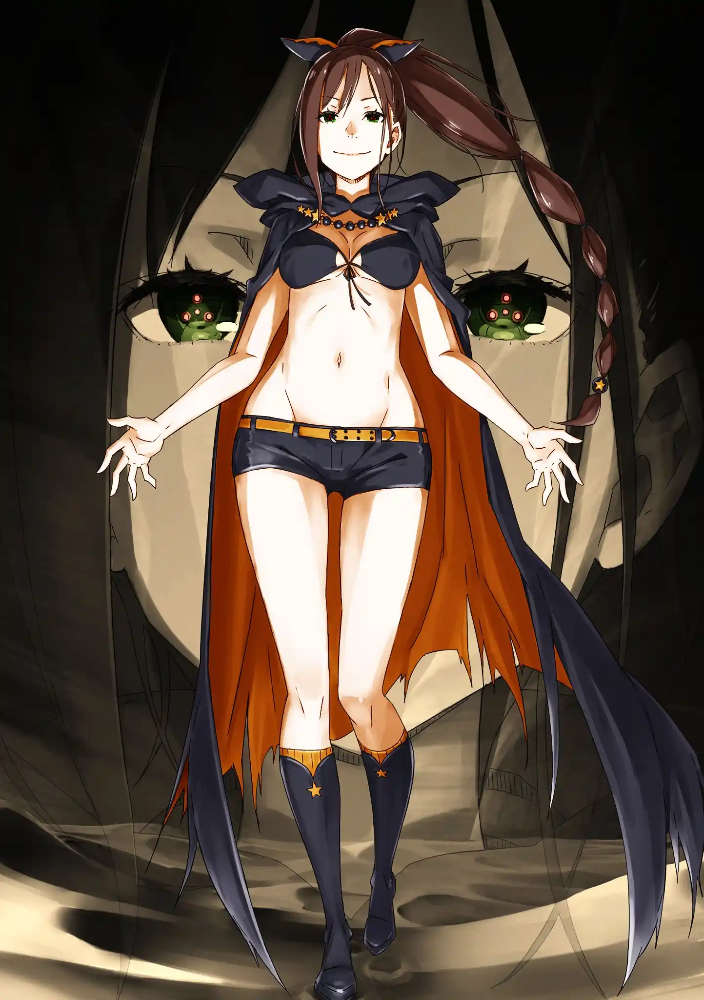
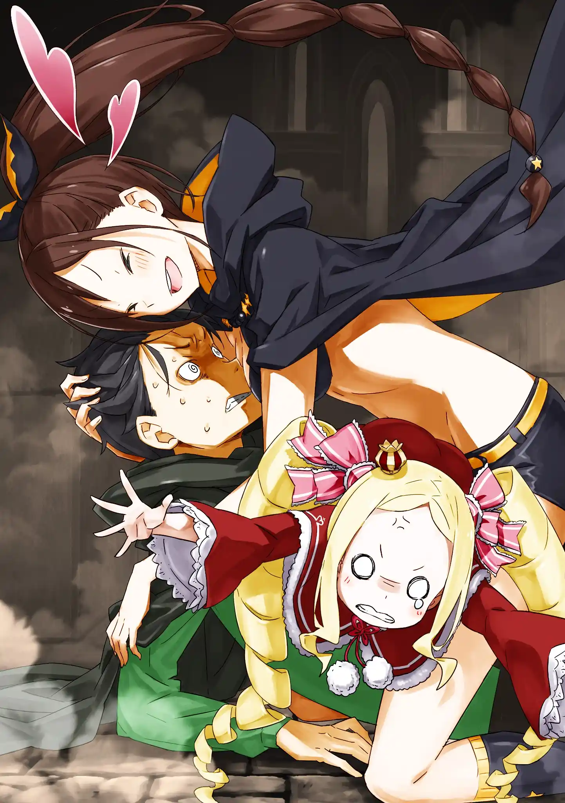

ราชันม้าผู้หิวโหย(กาบาโอ) เป็นสัตว์ปีศาจรูปร่างครึ่งคนครึ่งม้า มีหัวเป็นเขาขนาดใหญ่ ที่หน้าท้องมีปากและฟันแหลมคม บนหลังมีเพลิงลุกออกมาคล้ายแผงคอ สุบารุสังเกตได้ว่าจุดอ่อนของมันคือไม่มีดวงตา น่าจะเพราะอาศัยอยู่ใต้ดินมืดๆ

สุบารุออกอุบายย่องผ่านมันไปแล้วคอยเขวี้ยงขวดน้ำกับเหรียญทำเสียงล่อ แผนดำเนินไปด้วยดีจนกระทั่งกาบาโอเริ่มส่งเสียงร้องที่คล้ายเด็กทารกร้องไห้ เสียงนั้นทำหน้าที่เป็นเอคโค่โลเคชั่นเพื่อหาตำแหน่งเหยื่อได้

กาบาโอเขวี้ยงลูกไฟดักหน้าแล้ววิ่งเข้ามาหาพวกเขา สุบารุตวัดแส้ดึงดูดความสนใจให้คนอื่นหนีไป แล้วเปิดใช้อินวิซิเบิล โพรวิเดนซ์อีกครั้ง แต่ก่อนที่จะทันได้ลองหักเขามัน สุบารุก็เจ็บปวดเหมือนสมองถูกเจาะแบบในลูปก่อนหน้า

กาบาโอรวบรวมเปลวเพลิงจากหลังสร้างลูกไฟยักษ์ขึ้นมา แต่พาทรัชกัดแขนมันทิ้งก่อนจนลูกไฟระเบิดใส่ขาตัวเอง พาทรัชอาศัยจังหวะนั้นรีบเข้าไปคาบสุบารุออกมา

แต่กลายเป็นว่ากาบาโอมีฮีลลิ่งแฟคเตอร์ มันรักษาแผลและงอกแขนขึ้นมาใหม่เหมือนไม่มีอะไรเกิดขึ้น แถมยังหยิบหอกเพลิงที่สร้างขึ้นมาจากกระดูกของสัตว์ที่มันฆ่าไปออกมาใช้

กาบาโอไล่ตามไปกระทืบพาทรัชจนเจ็บหนัก แรมกับเอคิดน่าต้องยิงเวทฟูล่ากับซิวัลด์มาสะกัดไว้ สุบารุฝืนใช้มือล่องหนต่อยเขามันจนหัก แต่มันก็งอกเขาใหม่พร้อมอาละวาดหนักยิ่งกว่าเก่า

ตอนที่สถานการณ์สิ้นหวังนั้นเอง ใครบางคนก็ยิงกระสุนแสงเข้าทำลายร่างกายท่อนบนของกาบาโอ แต่ฮีลลิ่งแฟคเตอร์ของมันก็ฟื้นฟูร่างขึ้นมาใหม่ มันวิวัฒนาการตัวขึ้นเพื่อจะต่อกรกับศัตรูตรงหน้า

เท้าเพิ่มเป็น 8 ข้าง ฟันแหลมคมที่หน้าท้องยาวขึ้น แขนเพิ่มเป็น 4 ข้าง แต่ละข้างถืออาวุธที่สร้างจากเปลวเพลิงและกระดูก แต่กระนั้นมันก็ไม่ใช่คู่ต่อสู้ของอีกฝ่ายที่ทำแค่รัวกระสุนแสงใส่จนร่างกายของมันรีเจนไม่ทันและระเหิดหายไป

ข้างตัวเขามีแรมที่สลบไป สุบารุเงยหน้ามองดูผู้ช่วยชีวิต เธอเป็นหญิงสาวสวมผ้าคลุมที่แต่งตัวโชว์เนื้อหนังไม่เข้ากับสถานที่ คำพูดแรกที่หญิงสาวผมดำทรงหางแมงป่องพูดกับสุบารุก่อนเขาจะหมดสติไปก็คือ

"เจอตัวแล้ว"

.

ช่วงที่หมดสติสุบารุได้เข้าไปใน "สวนแห่งเงา" สถานที่ที่เขาได้เจอกับซาเทล่าเป็นประจำ แต่คราวนี้กลับมีแขกใหม่เพิ่มขึ้นมา ซึ่งก็คือเพเทลกีสกับเรกุลุส ดูเหมือนว่าปัจจัยแม่มดในตัวสุบารุจะมีนิสัยเหมือนเจ้าของคนก่อน

ซาเทล่าปรากฏตัวขึ้นมาบอกรักเขาก่อนก่อนจากลา รอบนี้สุบารุเห็นเธอเป็นรูปเป็นร่าง มีแค่ส่วนใบหน้าที่มองไม่เห็น สุบารุตื่นมาพบเอมิเลียกับเบียทริซที่เฝ้าเขาอยู่ในรถลากมังกร

ปรากฏว่าสุบารุสลบไปถึงสองวัน พอเธอดีใจที่สุบารุตื่น เอมิเลียที่อดหลับอดนอนก็ฟุบตัวสลบไป สุบารุลูบไล้แก้มเอมิเลียกับกอดเบียทริซให้หายคิดถึง เขาดีใจที่ความรักต่อทั้งคู่ยังรุนแรง จิตใจไม่มีผลตกค้างของกลิ่นสาบแม่มดแล้ว

ตอนนี้พวกเขาอยู่ในหอสังเกตการณ์เพลอาเดสแล้ว รถลากมังกรและโจเซฟจอดอยู่ที่ชั้น 6 ของหอคอย ถึงจะเป็นชั้นเดียวกับถ้ำใต้ดินที่พวกสุบารุไปหลงมา แต่ที่นี่มีแสงสว่างจากหินเวทอยู่

เบียทริซเล่าให้ฟังว่าชั้น 5 คือทางเข้าประตูหลัก ส่วนชั้น 4 มีห้องรักษาที่พาทรัชกับสองพี่น้องโอนิไปพักอยู่ ส่วนคนอื่นๆก็กำลังเข้ารับ "การทดสอบ" ที่ชั้น 3 อยู่ตอนนี้ ในระหว่างที่กำลังขึ้นบันไดไปชั้น 5 หญิงสาวสวมผ้าคลุมก็พุ่งตัวชนทั้งสองคนจนร่วงไปชั้นล่าง โชคดีที่มีโจเซฟรองรับแรงกระแทกให้

สุบารุถามว่าเธอใช่นักปราชญ์หรือเปล่า แต่อีกฝ่ายเอาแต่จ้องเขาและพึมพำคำว่า "สาม" ขึ้นมา เธอดูแอบผิดหวังแต่ก็บอกต่อว่าแค่หาเขาเจอก็พอใจแล้ว หญิงสาวเรียกสุบารุว่า "ท่านอาจารย์" แล้วพุ่งเข้ามากอดเขาโดยมีเบียทริซโดนอัดเป็นไส้แซนด์วิชอยู่ตรงกลาง

หญิงสาวทำท่าเหมือนคิดถึงและบอกว่าสุบารุคือคนที่สั่งให้เธอเฝ้าหอคอยแห่งนี้ สุบารุพยายามปัดเธอออก ปฏิเสธว่าจำคนผิดแล้ว

ชอล่า: พูดอะไรน่ะ!? นี่ชอล่าไงคะ! ผู้พิทักษ์ดวงดาราแห่งหอสังเกตการณ์เพลอาเดส ลูกศิษย์ผู้น่ารักของท่านอาจารย์ ชอล่าเองค่าาา!

หญิงสาวแนะนำตัวว่าเธอชื่อชอล่า นามของหนึ่งในสามวีรบุรุษที่ผนึกแม่มดริษยาได้ เพียงแต่เพศของเธอดูจะผิดจากตำนานไป ในตอนนั้นเองเอมิเลียก็ออกจากรถลากมังกรมาในสภาพสะลึมสะลือแล้วเห็นทั้งสามคนอยู่ในสภาพตามรูปพอดี

เอมิเลีย: นี่แน่ะ!

สุบารุ: โอ๊ย! เอมิเลียตันเตะชั้นทำไมเนี่ย!?

เอมิเลีย: ฉันก็ไม่เข้าใจเหมือนกัน รู้แต่ว่าไม่พอใจมากเลยล่ะ!

.
จบ