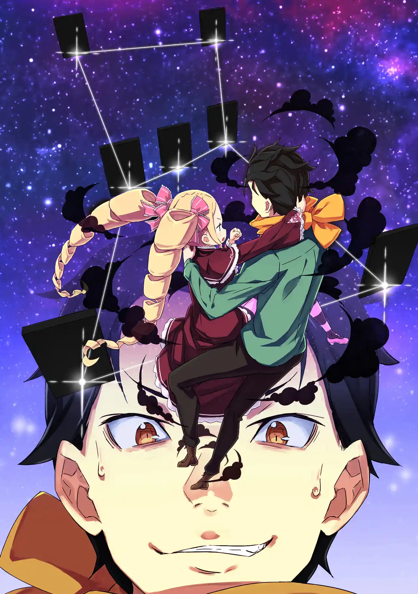
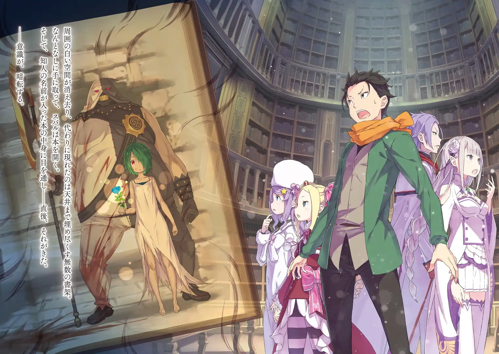
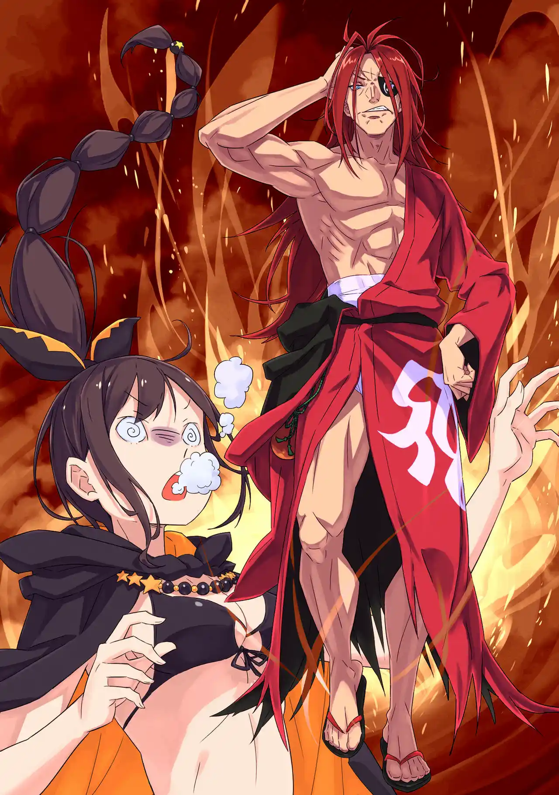
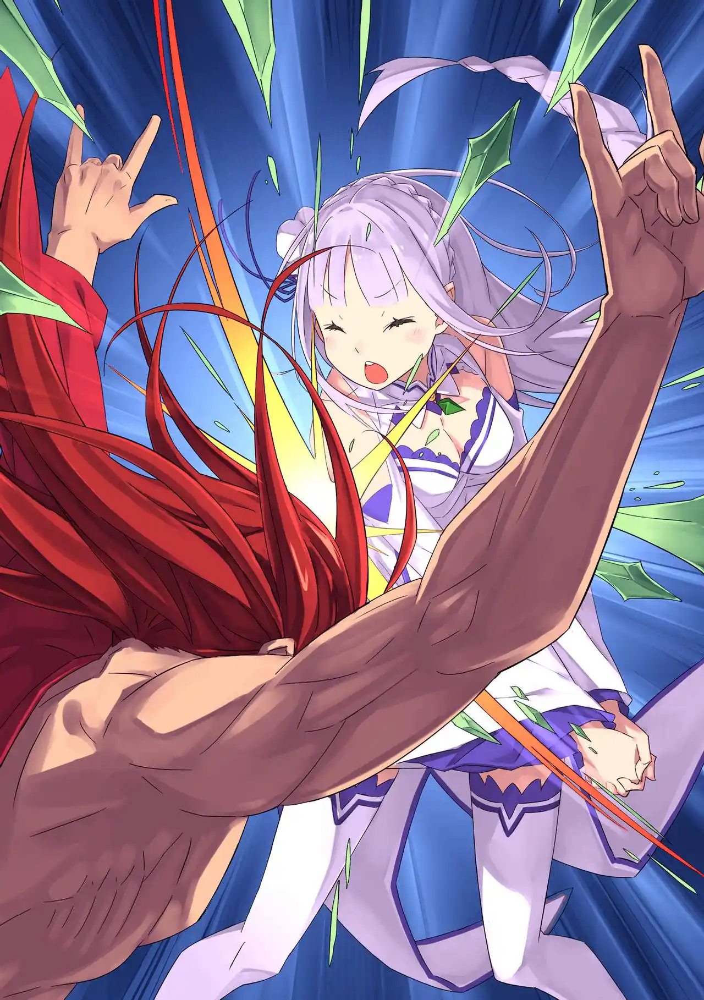

ชอล่ายอมรับว่าเป็นคนโจมตีพวกสุบารุจากบนหอคอยด้วยกระสุนแสงที่เธอเรียกว่า "เฮลส์ สไนป์" มันคือท่าที่ฟลูเกลคิดค้นขึ้นมา ใช้วิธีเชื่อมต่อกระสุนเข้ากับเกทของเป้าหมาย ถึงได้แม่นยำเหมือนมี Aim Bot

สุบารุเห็นด้วยกับเบียทริซว่าถึงชอล่าจะเอ๋อแบบนี้แต่ก็อันตราย ถ้าเธอรู้ว่าสุบารุไม่ใช่ฟลูเกลเมื่อไหร่อาจได้ตายกันหมด เพื่อความชัวร์เขาเลยออกคำสั่งห้ามโจมตีพวกพ้องทุกคนไว้ก่อน หลังชอล่ารับคำสั่งไปก็มีจุดสีแดงกะพริบในดวงตาของเธอ

สุบารุค่อนข้างมั่นใจแล้วว่าฟลูเกลเป็นคนจากต่างโลกเช่นเดียวกับตัวเขา อัลเดบารันและโฮชิน ถ้าฟลูเกลเป็นชื่อจริง เขาก็อาจจะเป็นคนเยอรมัน (ฟลูเกลแปลว่าปีกในภาษาเยอรมัน)

พวกเขาเดินขึ้นบันไดวนจากชั้น 6 มาที่ชั้น 4 เพื่อมาเยี่ยม "ห้องเขียว" ที่เรมกับพาทรัชพักอยู่ ในห้องเต็มไปด้วยรากไม้และพืชพันธุ์ตามชื่อ มีวิญญาณประจำห้องอยู่ 1 ตนที่คอยฮีลคนที่อยู่ในห้องนี้ แต่มันจำกัดให้เข้าแค่ครั้งละ 4 คนเท่านั้น

แรมขออยู่เฝ้าเรม สุบารุเลยมุ่งหน้าขึ้นชั้น 3 กับชาวคณะต่อ เขาขึ้นมาเจอห้องสีขาวโพลนที่กว้างสุดลูกหูลูกตา นอกจากบันไดที่ขึ้นมาแล้ว อีกอย่างเดียวในห้องโล่งๆนี้ก็คือแผ่นศิลาสีดำที่ลอยเคว้งอยู่

พอสุบารุแตะแผ่นศิลาดู มันก็เปล่งแสงขึ้นแล้วเริ่มสร้างแผ่นศิลาหลากหลายขนาดขึ้นมา จากนั้นก็ส่งแผ่นศิลาทั้งหลายกระจายไปอยู่ทั่วห้อง ตามมาด้วยเสียงที่ดังในหัวทุกคนเป็นสัญญาณเริ่มต้นการทดสอบว่า....

"จงสัมผัสวีรบุรุษผู้ถูกชอล่าทำลายและเจิดจรัสที่สุด"

การทดสอบของนักปราชญ์ประจำชั้นไทเกต้าเริ่มต้นขึ้นแล้ว

แผ่นศิลาที่กระจายอยู่ทั่วห้องนั้นเป็นเหมือน "ตัวเลือกคำตอบ" พอมีใครไปแตะคำตอบที่ผิดเข้า แผ่นศิลาที่กระจายอยู่ก็จะกลับมารวมเป็นแผ่นเดียวกันที่หน้าบันไดจนต้องเริ่มใหม่

ระหว่างที่สุบารุหลับไป พวกเอมิเลียลองสุ่มแตะแผ่นศิลาไปหลายรอบแล้วแต่ก็ไม่ผ่านซักที เหมือนกับว่าผู้สร้างข้อสอบไม่อยากให้โกงด้วยวิธีสุ่ม สุบารุเลยถามชอล่าดูว่าจำได้ไหมว่าฆ่าวีรบุรุษคนไหนไปบ้าง แต่ความจำของเธอก็แย่จนน่าปวดหัว

สุบารุลองถามว่าใช่ "เรด แอสเทรีย" ไหม แต่ชอล่ากลัวชื่อนั้นจนหัวหด แถมยังบอกว่าเรดเป็น "ขยะสังคม" ทำเอาเด็กเนิร์ดประวัติศาสตร์ผู้คลั่งไคล้วีรบุรุษในอดีตอย่างยุลิอุสฝันสลาย

ระหว่างที่ฝากให้ยุลิอุสกับเบียทริซไล่ชื่อถามชอล่า พวกสุบารุก็มาสำรวจรอบๆ เขาพบว่ามีแผ่นศิลาแผ่นใหญ่อยู่ทั้งหมด 7-8 แผ่น เอมิเลียเปรียบเปรยว่า "การทดสอบ" ของที่นี่มันคล้ายกับ "บททดสอบ" ที่ดินแดนศักดิ์สิทธิ์เลย

สุบารุได้ไอเดียว่า "ชอล่า" ในโจทย์อาจจะไม่ใช่ชอล่าที่อยู่กับพวกเขาจึงเรียกเบียทริซมาใช้เวทมูรัคเพื่อกระโดดขึ้นไปดูจากมุมสูง แล้วพอมองลงมาเขาก็เห็นแผ่นศิลาแผ่นใหญ่เรียงตัวกันเป็นกลุ่มดาวนายพราน

สุบารุ: อย่างที่คิดเลย--- ให้ตายสิ ที่นี่มันเลวร้ายจริงๆแฮะ

วีรบุรุษผู้ถูกชอล่าทำลายก็คือ "โอไรอ้อน" จากปกรณัมกรีก ตามตำนานเขาถูกแมงป่องฆ่าตายและชื่อ "ชอล่า" นั้นก็เป็นภาษาอาหรับแปลว่า "เหล็กในของแมงป่อง"

หลังจากที่โอไรอ้อนตายเขาก็กลายเป็นกลุ่มดาวนายพรานและแมงป่องที่ฆ่าเขาเองก็กลายเป็นกลุ่มดาวแมงป่อง(ชอล่าเป็นชื่อดาวในกลุ่มดาวนี้เช่นกัน) คนที่จะทราบเรื่องแบบนี้ได้มีแต่คนจากต่างโลกอย่างสุบารุ เขาถึงได้มองว่าการทดสอบนี้มันเอาเปรียบกันเกินไป

โจทย์อีกส่วนที่ต้องแก้ก็คือการสัมผัสดวงดาวที่ "เจิดจรัสที่สุด" จากกลุ่มดาวนายพราน สุบารุมีสองตัวเลือกอยู่ในหัว "ไรเจลและเบเทลกีส" ปกติแล้วไรเจลเป็นดาวที่สว่างที่สุด แต่ก็มีบางช่วงเวลาที่เบเทลกีสสว่างกว่าเช่นกัน

แต่เพราะชื่อเบเทลกีสมันฟังดูคล้ายชื่อของโจทก์เก่าบิชอป "เพเทลกีส" เกินไป สุบารุเลยเลือกแตะแผ่นศิลาไรเจลที่อยู่บริเวณเข่าซ้ายของกลุ่มดาวนายพรานแทน

ไรเจลเป็นคำตอบที่ถูกต้อง สุบารุเคลียร์การทดสอบของนักปราชญ์ประจำชั้นไทเกต้าได้สำเร็จ จากนั้นห้องโล่งสีขาวก็กลายสภาพเป็นห้องสมุดขนาดใหญ่แทน

ภายในห้องสมุดเต็มไปด้วยหนังสือที่มีชื่อบุคคลอยู่บนปกและสัน พวกเขาเจอหนังสือชื่อ "โนอาห์ ลิเบอร์ตัส / เอกอน วอลเลอร์ / พาลม่า เออูเล / โคโยเต้" ภายในหนังสือก็เป็นแค่ชีวประวัติของบุคคลที่พวกเขาไม่รู้จัก

สุบารุสุ่มไปเจอหนังสือชื่อ "ทิวฟอน" ที่พอเปิดอ่านสติของเขาก็ถูกดูดเข้าไป สุบารุได้รับรู้ประสบการณ์ชีวิตของเด็กสาวผู้เป็นลูกของเพชฌฆาต เด็กสาวผู้เติบโตมาเป็นศาลเตี้ยที่เดินทางพิพากษาคนบาปไปทั่ว เธอคือแม่มดแห่งความเย่อหยิ่งที่เขารู้จัก

พอเอมิเลียตบหนังสือหล่นไปสุบารุถึงได้สติคืนมา สติของยุลิอุสเองก็เองโดนดูดเข้าไปในหนังสือชื่อ "บัลรอย เทเมกริฟ" จนเอคิดน่าต้องแย่งหนังสือมา ยุลิอุสสารภาพว่ารู้จักบัลรอยผู้เป็นอดีตแม่ทัพของวอลลาเคีย แถมยุลิอุสยังเป็นคนฆ่าเขาเองกับมือ

พวกเขาจึงได้ข้อสรุปว่าห้องสมุดแห่งนี้มีไว้เก็บ "หนังสือคนตาย" ถ้าหากเปิดอ่านหนังสือของคนที่รู้จัก สติของผู้อ่านก็ถูกดึงไปให้สัมผัสประสบการณ์ชีวิตของเจ้าของเหมือนได้เล่นซิมูเลเตอร์

ระหว่างที่ทั้งกลุ่มสำรวจหาหนังสือและบันไดขึ้นชั้น 2 สุบารุก็แวะไปคุยกับเมลี่ เธอเล่าประวัติให้ฟังนิดหน่อยว่าถูกพ่อแม่ทิ้ง โตมาในฝูงสัตว์ปีศาจและทำงานเป็นนักฆ่ามา 5-6 ปีแล้ว เมลี่ไม่สนใจหนังสือคนตายของพ่อแม่ แต่เธอแอบคิดถึงหนังสือคนตายของเอลซ่าอยู่เงียบๆคนเดียว

เอคิดน่าเดาทางออกว่าหอคอยแห่งนี้น่าจะมีกฏเหล็กอยู่ 4-5 ข้อที่ชอล่าแอบปิดไว้ ชอล่าจนมุมเลยยอมบอกว่ามีกฏอยู่ 4 ข้อที่ถ้ามีคนแหกขึ้นมาเธอจะกลายเป็นเครื่องจักรสังหารแล้วฆ่าทุกคนทิ้ง

1. ห้ามออกจากหอคอยก่อนที่จะเคลียร์การทดสอบครบ

2. ห้ามแหกกฏของการทดสอบ

3. ห้ามลบหลู่ห้องสมุด (ประมาณหยิบหนังสือมาอ่านแล้วไม่เก็บ กองไว้กับพื้น)

4. ห้ามทำลายหอคอยให้เสียหาย

แผนการที่ว่าจะพาคนนอกเข้ามาช่วยค้นหนังสือต้องพับเก็บไป แต่อย่างน้อยเอมิเลียก็คิดออกแล้วว่าบันไดไปชั้นสองอยู่ที่ไหน เธอพาทุกคนกลับลงมาชั้น 4 แล้วพบว่าที่ข้างๆห้องเขียวมีบันไดอันใหม่โผล่ออกมา

พื้นที่ข้างห้องเขียวเคยเป็นห้องธรรมดาที่มีเวทส่งผลให้ทุกคนไม่สนใจ ตอนนี้มันกลายเป็นบันไดขนาดใหญ่ที่ตรงไปสู่ชั้นอิเล็กตร้า เบียทริซสังเกตว่าพื้นที่ในหอคอยนี้ไม่เมคเซนส์กับรูปลักษณ์ภายนอก คงเป็นผลจากเวทบิดมิติบางอย่าง

พอขึ้นมาสุดบันไดพวกเขาก็เจอเข้ากับห้องสีขาวโพลนเหมือนชั้นไทเกต้า แต่รอบนี้มีดาบหนึ่งเล่มปักอยู่บนพื้นแทน เอมิเลียนับขั้นบันไดมาเลยช่วยยืนยันให้ว่านี่ไม่ใช่ชั้นเดียวกันแน่นอน

ดาบที่ปักอยู่ทำให้สุบารุนึกถึง "ดาบแห่งการคัดเลือก" จากตำนานคิงอาเธอร์ พอสุบารุดึงดาบขึ้นมาโจทย์ประจำการทดสอบก็ดังขึ้นในหัวของทุกคน

"จงได้รับความยินยอมจากคนเขลาผู้ไปถึงวิถีดาบแห่งสวรรค์"

ทันใดนั้นก็มีชายผมแดงสวมผ้าปิดตาคนหนึ่งโผล่มากลางห้อง เขาพูดย้ำโจทย์ซ้ำๆเหมือนหุ่นยนต์ พอชอล่าเห็นชายผมแดงเธอก็กลัวจนถึงกับสลบไป แล้วจู่ๆชายผมแดงก็แหกปากตะโกนแล้วได้สติคืนมา

ทีแรกชายผมแดงดูมึนๆว่าที่นี่ที่ไหน แต่อยู่ดีๆก็ตามสถานการณ์ทันว่าตัวเขาคือผู้คุมสอบและสั่งว่าถ้าอยากคุยก็ลองทำให้เขาขยับซักก้าวดู ยุลิอุสจึงอาสาเข้าท้าทายกับชายที่แนะนำตัวว่า "ผู้แกว่งไม้"

ชายผมแดงปฏิเสธดาบที่ยุลิอุสโยนให้ แล้วใช้แค่ตะเกียบไม้รับดาบและฟันยุลิอุสจนยับ เอคิดน่าพยายามยิงเวทซิวัลด์ช่วยจากวงนอก แต่ชายผมแดงก็เอาตะเกียบฟันลำแสงทิ้งอย่างง่ายดาย

เอคิดน่าเพิ่มระดับยิงเวทลำแสงออกจาก 10 นิ้ว แต่ชายผมแดงก็เอาตะเกียบคีบยุลิอุสและวิ่งหลบไปมาชิวๆจนเอคิดน่าถึงขีดจำกัดแล้วสลบไปเอง จากนั้นเขาก็ใช้ตะเกียบฟันดาบอัศวินของยุลิอุสจนหักแล้วต่อยเขากระเด็นไปกองอยู่ข้างร่างของเจ้านาย

เอมิเลียเข้ามาดวลต่อ เธอหว่านล้อมให้ชายผมแดงตั้งกติกาให้พวกเธอมีสิทธิ์ชนะ ซึ่งก็คือทำให้เขาขยับซักก้าว พอเขาตกลงเอมิเลียก็เปิดฉากด้วยเวท "ไอซ์ แบรนด์ อาร์ตส์: ไอซิเคิลไลน์" สร้างอาวุธน้ำแข็งจากอากาศรอบตัวศัตรูแล้วกระหน่ำยิง

ชายผมแดงใช้ตะเกียบปัดห่าฝนอาวุธน้ำแข็งได้หมด เอมิเลียเลยเปลี่ยนสไตล์เข้าไปลุยระยะประชิดแทน เธอสลับอาวุธน้ำแข็งร่ายรำอย่างต่อเนื่อง แต่พอเอมิเลียฟันพลาดชายผมแดงก็ลวนลามเธอด้วยการใช้ตะเกียบจิ้มหน้าอก

แต่แทนที่เธอจะเขินอายอย่างที่เขาคาดการณ์ไว้ เอมิเลียกลับหวดหัวชายหื่นด้วยกำปั้นน้ำแข็งแบบ No สน No แคร์ ชายผมแดงพ่ายแพ้ตามกติกาเพราะเขาขยับจากจุดที่ยืนอยู่ไปซะไกล

เขาแอบบ่นสุบารุว่าดูแลผู้หญิงของแกยังไงวะถึงอ่อนต่อโลกแบบนี้ แต่เขาก็ยอมรับความพ่ายแพ้และให้เอมิเลียผ่านการทดสอบ แต่ปัญหาก็คือเขาให้เอมิเลียผ่านแค่คนเดียว อีก 6 คนที่เหลือยังผ่านขึ้นชั้นต่อไปไม่ได้ถ้ายังไม่ชนะเขา