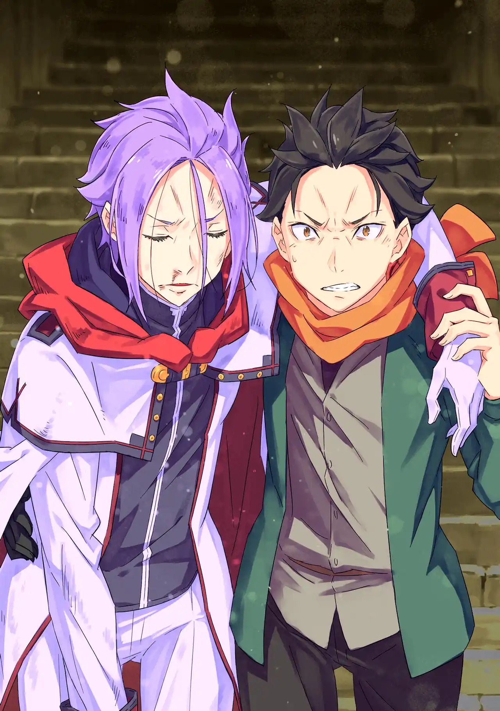

จะให้เอมิเลียขึ้นไปชั้น 1 คนเดียวน่าจะเสี่ยงพวกสุบารุเลยยอมแพ้และตัดสินใจถอยทัพกันก่อน สุบารุแบกยุลิอุสขึ้นหลัง ส่วนเอมิเลียก็อุ้มชอล่ากับเอคิดน่าพาดบ่าสองข้างสบายๆ พวกเขาลงบันไดกลับไปที่ชั้น 4

หลังเอาคนเจ็บไปพักที่ห้องเขียวพวกเขาก็ประชุมหารือกันเรื่องตัวจริงของชายผมแดง พอได้ยินว่าเขาแข็งแกร่งระดับไรน์ฮาร์ต แรมก็ไล่ชื่อยอดฝีมือจากประเทศอื่นๆที่ลือกันว่ามีฝีมือทัดเทียมไรน์ฮาร์ตขึ้นมา

1. อัสนีสีฟ้า "เซซิลุส เซ็กมุนต์" จากจักรวรรดิวอลลาเคีย

2. จอมพิสมัย "ฮาริเบล" จากนครรัฐคารารากิ

3. เจ้าชายคลั่ง จากราชอาณาจักรศักดิ์สิทธิ์กุสเทโก้

แต่ในสามคนที่ว่าก็ไม่มีใครหน้าตาเข้าเค้าเลย ตอนนั้นเองชอล่าก็ได้สติคืนมา พอเธอจำเหตุการณ์ได้ก็แตกตื่นและเฉลยว่าชื่อของชายผมแดงคือ "เรด แอสเทรีย" ดาบศักดิ์สิทธิ์รุ่นแรก บรรพบุรุษของไรน์ฮาร์ต หนึ่งในสามวีรบุรุษผู้ผนึกแม่มดริษยา และเป็นชายที่ควรจะตายไปนานแล้ว

แต่พอสุบารุแวะไปดูห้องเขียวยุลิอุสก็หายตัวไป อัศวินผู้ดื้อด้านฝืนสังขารตัวเองกลับขึ้นไปดวลกับเรดอีกครั้งที่ชั้น 2 เขาหยิบดาบแห่งการคัดเลือกที่ปักอยู่บนพื้นขึ้นมาใช้แทนดาบของตัวเองที่หักไป

ดาบก็ไม่คุ้นมือ ใช้เวทก็ไม่ได้แล้ว รู้อยู่แก่ใจว่าศัตรูเป็นใครและฝีมือห่างชั้นกันแค่ไหน แต่ยุลิอุส ยูคริอุสก็ยังฝืนสู้อย่างดื้อด้าน ไร้เหตุผล ไม่ต่างจากอัศวินขี้แพ้คนนึงที่เขารู้จัก

เรดกระทืบยับแบบไม่ต้องลุ้น เขาบอกว่าสไตล์การต่อสู้ของยุลิอุสน่าเบื่อแล้วเอาตะเกียบแทงซ้ำแล้วซ้ำเล่าจนยุลิอุสอ้วกออกมา ถูกเตะจนคว่ำ ถูกแทงอกจนหายใจไม่ออก ถูกดึงผมมาเหวี่ยง ถูกตีเข่าใส่หน้า

ยุลิอุสเสียชื่อของตัวเองไป เสียความสัมพันธ์กับเพื่อนฝูงและครอบครัว เสียความสัมพันธ์กับเหล่าวิญญาณ และในตอนนี้แม้แต่สัญญาที่ว่าจะเป็นกำลังให้ "เพื่อน" คนเดียวในโลกที่จำเขาได้ก็กำลังจะเสียมันไป

สุบารุ: ยุลิอุส!!

เรดใช้แค่ตะเกียบไม้ฟันวิชาดาบสร้างประกายแสงขึ้นมา พอยุลิอุสได้ยินเสียงคนเรียกชื่อเขาก็ยิ้มออกมาและได้แต่คิดในใจว่าตัวเองยังเหมาะสมกับชื่อนั้นอีกไหมก่อนจะถูกประกายแสงกลืนเข้าไป

เรดจงใจไม่ฆ่ายุลิอุสเพราะปล่อยให้รอดไปจะอับอายกว่า สุบารุเลยต้องพยุงร่างเขาเดินลงบันไดกลับไป ยุลิอุสฟื้นขึ้นมากลางทาง สองหนุ่มเลยได้พูดคุยปรับทุกข์กัน

ยุลิอุสรู้สึกว่าเรดคนนี้ดูหนุ่มกว่าในตำนานแถมยังไม่รู้จักชอล่าด้วย คุยไปคุยมายุลิอุสเริ่มดื้อเพราะรู้สึกผิดและอยากเดินลงบันไดต่อเอง แต่สุบารุไม่ยอมแล้วเข้าไปพยุงแขนใหม่

สุบารุ : หุบปากไปเลย! ดูก็รู้แล้วว่าแค่ยืนให้ตรงนายก็ยังทำไม่ได้! จะให้ชั้นทำเป็นเมินแล้วทิ้งคนสภาพแบบนายไว้ได้ยังไง! ถ้าเป็นแบบนั้นชั้นนี่แหละคงรังเกียจตัวเองก่อนที่จะโดนเอมิเลียด่าอีก ถ้าไม่อยากยืมกำลังชั้นก็เลิกทำตัวน่าสมเพชได้แล้ว เห็นแล้วทนไม่ได้โว้ย!

สุบารุเห็นยุลิอุสไม่ต่างกับตัวเองเมื่อตอนที่เขาดวลดาบแพ้อย่างน่าสมเพชที่เมืองหลวง เขาเลยไม่อยากปล่อยยุลิอุสไว้คนเดียวเหมือนที่ตัวเองในตอนนั้นต้องประสบเด็ดขาด ได้ยินดังนั้นยุลิอุสเลยต้องจำยอมให้สุบารุช่วยแบกไป

ยุลิอุส: สุบารุ...

สุบารุ: อะไรอีกล่ะ?

ยุลิอุส: ขอโทษด้วยนะ...

สุบารุ: หนวกหูน่า

.
