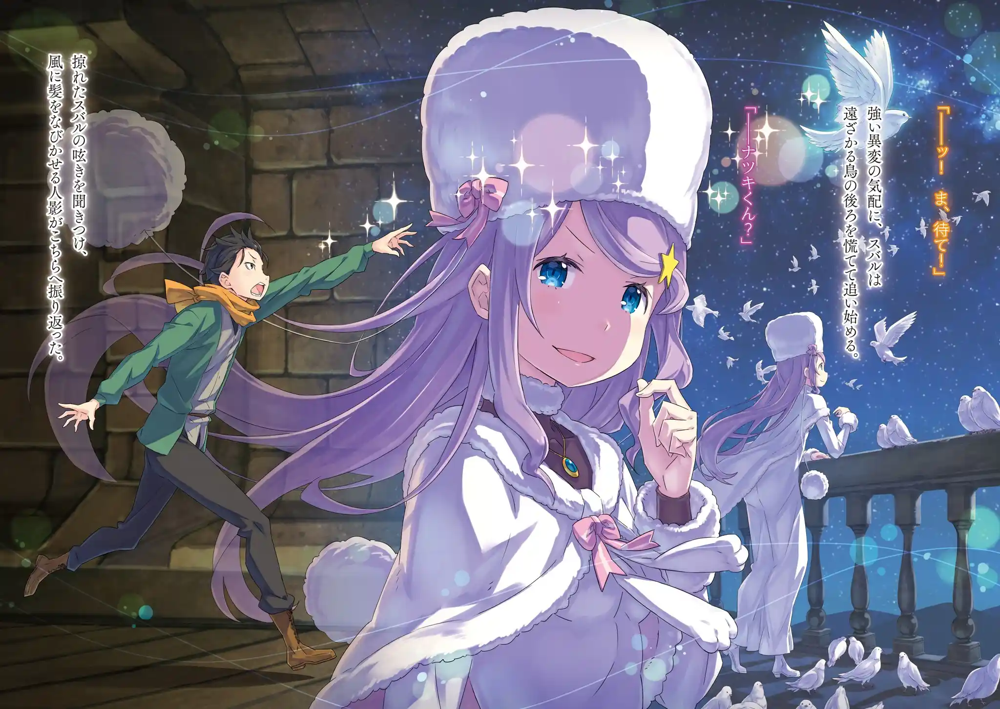

ยุลิอุสถูกสั่งให้ยอมพักในห้องเขียวแต่โดยดี เขาพูดเล่นว่าดีใจที่มาสาวสวยอยู่รอบกายเต็มไปหมด สุบารุเลยบอกว่านอกจากอนาสตาเซียแล้วสาวคนอื่นในห้องนี้เป็นของเขา (เอมิเลีย เรม พาทรัช) แต่เอมิเลียกลับบอกเธอยังไม่ใช่ของสุบารุซักหน่อย สุบารุต่างหากเป็นของเธอ เพราะเขาเป็นอัศวินของเอมิเลีย

หลังออกห้องมาเอมิเลียมีแอบคิดว่าแช่แข็งประตูห้องเลยดีไหมถ้ายุลิอุสดื้อนัก จากนั้นบรรดาคนที่ไม่บาดเจ็บก็มาประชุมหารือกันเพื่อหาทางผ่านการทดสอบที่ชั้นอิเล็กตร้า

ถึงจะถามจุดอ่อนเรดจากชอล่านางก็ไม่รู้อะไรเช่นเคย ทุกคนเลยคิดว่าต้องเสนอเงื่อนไขการผ่านที่เรดพอใจ แล้วเอาชนะตอนที่เขาประมาท แต่พูดน่ะมันง่าย การทดสอบของชั้นอิเล็กตร้านี้เองก็โหดหินไม่เป็นธรรมเหมือนชั้นไทเกต้า

และตอนนั้นเองชอล่าก็พูดขึ้นมา

ชอล่า: ไม่เห็นเป็นไรเลยค่ะ จะรีบไปทำไมกัน ท่านอาจารย์กับทุกคนจะอยู่ที่นี่ด้วยกันไปนานแสนนานแค่ไหนก็ได้นะคะ ในเมื่อทางฉันอุตส่าห์รอท่านอาจารย์มาหลายร้อยปี ดังนั้นพวกคุณจะใช้เวลาในการผ่าน "การทดสอบ" นานแค่ไหนก็ได้ค่ะ ฉันจะคอยเฝ้ามองทุกคนเอง ---ต่อให้ต้องใช้เวลากี่วัน กี่ปี หรือกี่ร้อยปีก็ตาม

รอยยิ้มของชอล่าตอนพูดประโยคนั้นทำให้บรรยากาศเปลี่ยนไป เพราะเธอทำตัวเป็นมิตรอยู่ตลอดตั้งแต่เข้ามาที่หอคอย พวกเขาเลยเกือบลืมไปแล้วว่าชอล่าเองก็เป็นหนึ่งในอุปสรรคของหอคอยนี้เช่นกัน

ชาวคณะตัดสินใจพักกินข้าวกันก่อน ปกติน้ำดื่มไม่ใช่ปัญหาในโลกนี้ ผู้ใช้เวทน้ำสามารถเปลี่ยนมานาเป็นน้ำดื่มได้สบาย ติดตรงที่ว่ามานาบริเวณหอคอยนี้ปนเปื้อนเพราะกลิ่นสาบแม่มด พวกเขาเลยใช้วิธีตักน้ำพุใต้ดินมาแล้วเอาไปให้วิญญาณในห้องเขียวชำระล้างแทน

ส่วนของกินก็มีเสบียงที่พวกเขาตุนมาก่อนเข้าทะเลทราย นับดูแล้วน่าจะอยู่ได้ไม่ถึง 1 เดือน นั่นคือไทม์ลิมิตของพวกเขา หลังสุบารุสำรวจชั้น 4 กับเบียทริซเสร็จทุกคนก็มารวมตัวกินอาหารที่เอมิเลียกับแรมเป็นคนเตรียม

อาหารส่วนใหญ่เป็นพวกเนื้อตากแห้งหรือรมควันที่เหมาะแก่การเดินทาง แต่เพราะมีเอมิเลียใช้เวทน้ำแข็งสร้างตู้เย็นจำลองขึ้นมา พวกเขาถึงเอาผลไม้สดติดรถมาด้วยได้

ชอล่าสวาปามอาหารอย่างตะกละตะกลาม เธอบอกว่าไม่เคยกินอะไรดีๆแบบนี้มาก่อน ปกติเธอแค่สอยสัตว์ปีศาจจากบนหอคอยแล้วจับมาปิ้งกิน คืนนั้นหลังจากอาบน้ำเสร็จสุบารุก็แวะมาเยี่ยมเรมก่อนเข้านอน

เขาเจอยุลิอุสที่จะมาเยี่ยมอนาสตาเซียอยู่หน้าห้อง แต่ยุลิอุสก็สละให้สุบารุใช้ห้องก่อน พอสุบารุเข้าไปเยี่ยมเรมซักพักเขาก็เผลอหลับไปและตื่นขึ้นมาพบว่าอนาสตาเซีย(เอคิดน่า)หายไปจากห้องเขียว

ระหว่างที่ตามหาตัวเอคิดน่าเขาก็เจอนกบินอยู่ในหอคอย เขาสงสัยว่ามันเข้ามาทางไหนในเมื่อที่นี่ไม่มีหน้าต่างจึงเดินตามไป แต่อยู่ดีๆนกที่ตามอยู่หายตัวไปกลางโถงทางเดิน

เขาเจอขนนกตกอยู่และพอสำรวจกำแพงดูก็พบว่ามันมีกำแพงลวงตาที่สูงระดับเอวของเขาอยู่ (คล้ายกับกำแพงลวงตาที่พวกลัทธิใช้ที่ถ้ำตอน Arc 3) สุบารุก้มหัวแล้วทะลุผ่านกำแพงลวงตาเข้าไป เขาเจอเข้ากับระเบียงลับที่เต็มไปด้วยนกและพบเอคิดน่าที่หายตัวไปยืนพิงขอบระเบียงอยู่คนเดียว

ระเบียงลับที่ทั้งสองมาเจอกันนี้คือจุดที่ชอล่าใช้ในการยิงสังหารผู้บุกรุก ท้องฟ้าจากระเบียงนี้มองเห็นดวงดาวต่างจากตอนที่พวกเขาเดินทาง อาจจะเพราะที่นี่อยู่สูงกว่าม่านหมอกจากกลิ่นสาบแม่มด

ตอนนี้สถานการณ์ตึงเครียดเพราะต่างฝ่ายต่างสงสัยกันเอง สุบารุสงสัยว่าเอคิดน่ารู้จักที่นี่ได้ยังไงและทำไมเธอถึงสบายใจปล่อยให้นกรุมเกาะได้แบบนี้ เอคิดน่าเลยเลิกสวมบทอนาสตาเซียเป็นครั้งแรกตลอดการเดินทาง แล้วพูดจาสมเป็นตัวเองอีกครั้ง

ทางเอคิดน่าเองก็สงสัยสุบารุกลับว่าเขาล่อเธอออกมาที่ระเบียงนี้รึเปล่า? เขาเนียนทำเป็นไม่รู้จักชอล่าแต่ที่จริงคือฟลูเกลรึเปล่า?

เอคิดน่า: นัตสึกิ สุบารุ นายเป็นใครกันแน่?

ตั้งแต่หลังงานเลี้ยงฉลองการกำจัดวาฬขาวและบิชอปเกียจคร้าน อนาสตาเซียก็แอบขุดคุ้ยข้อมูลเกี่ยวกับสุบารุแต่กลับแทบไม่เจอที่มาที่ไปของเขาเลย สุบารุแอบสงสัยว่ามีฝ่ายเดียวกันอย่างรอสวาลกับออตโต้คอยปิดข้อมูลเรื่องเขาให้รึเปล่า?

สุบารุเป็นบุคคลที่ไม่รู้หัวนอนปลายเท้า แต่สร้างผลงานใหญ่ๆรอบแล้วรอบเล่า ผ่านการทดสอบที่ชั้น 3 ได้ง่ายๆและเหมือนจะรู้จักกับชอล่า ในมุมของเอคิดน่าเธอรู้สึกกลัวสุบารุจากใจจริง

หลังความตึงเครียดจางลง เอคิดน่าก็เปิดใจเล่าความกังวลออกมา เธอห่วงว่าถ้ายังใช้ร่างอนาสตาเซียต่อไป โอโดของเธอจะถูกริดรอนไปเรื่อยๆจนอายุขัยสั้นลง แต่ถึงอนาสตาเซียจะอายุขัยสั้นจนครองราชย์ได้ไม่นาน เอคิดน่าก็มั่นใจว่าเธอจะใช้เวลาอย่างคุ้มค่ายิ่งกว่าใคร

ตอนนั้นเองยุลิอุสก็โผล่มาเป็นแขกไม่ได้รับเชิญในการประชุมลับ เขาได้ยินเป็นครั้งแรกว่าเจ้านายของตนถูกบางสิ่งบางอย่างยึดร่างไปโดยที่ผ่านมาเขาไม่รู้ตัวเลย